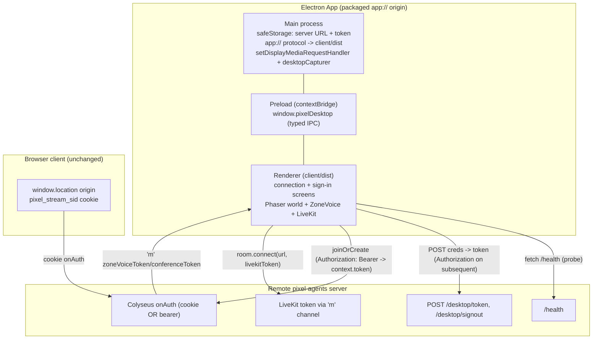
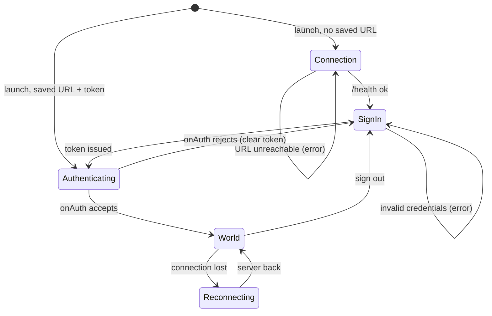

# Desktop Application (Electron) Design Document

## Overview

Package the existing pixel-agents web client (Phaser 3 + Vite + TypeScript) as an installable Electron desktop app that connects to a **user-configured remote server**. The client's network target derivation and authentication are parameterized so the desktop build reaches Colyseus `onAuth` with a server-issued bearer token (over HTTP `Authorization` and Colyseus join options), while the same-origin browser cookie flow is preserved byte-for-byte. Voice/WebGL parity is delivered by bundled Chromium; media APIs run in a stable custom-protocol secure-context origin.

### Referenced UI Spec (when feature includes frontend)

- No separate UI Spec exists for this feature (fullstack, no UI Spec). The connection-screen and in-app sign-in UI design is included directly in this Design Doc under [New UI Surface Design](#new-ui-surface-design), reusing the existing DOM-overlay pixel-menu aesthetic.

## Design Summary (Meta)

```yaml
design_type: "extension"
risk_level: "high"
complexity_level: "high"
complexity_rationale: >
  (1) FR-2/FR-3 require an additive second credential path through Colyseus onAuth
  (AC-005, AC-010..012) that must be cryptographically equivalent to the existing
  cookie session without altering it; (2) FR-1/FR-4 require parameterizing all five
  window.location-derived network targets and running the media stack (getUserMedia,
  getDisplayMedia, LiveKit WebRTC) in a stable secure-context Electron origin, which
  demands a custom protocol, main-process desktopCapturer wiring, and typed preload
  IPC across the contextIsolation boundary; (3) coordinating an Electron main/preload
  process, a token-issuance server endpoint, and CORS changes across three trust
  boundaries (renderer, main, server) is inherently multi-component.
main_constraints:
  - "Same-origin browser cookie flow (server-rendered login, pixel_stream_sid HttpOnly SameSite=Lax cookie, cookie onAuth) MUST stay unchanged — hard constraint (FR-3)."
  - "Desktop token MUST be validated equivalently to the cookie session (same session store, same 7-day TTL, constant-time comparison); auth must not be weakened."
  - "Secrets (bearer token, admin token) MUST stay out of the public Vite bundle and off plaintext disk; token reaches the renderer only via typed preload IPC (contextIsolation on, nodeIntegration off)."
  - "Desktop build consumes the existing client/dist Vite output as the single UI source (AC-018); no forked UI."
  - "Renderer origin MUST be stable across launches so pa-zv-* localStorage voice settings persist (FR-7 boundary)."
biggest_risks:
  - "A CORS/onAuth change inadvertently regresses the same-origin browser cookie path (AC-010..012)."
  - "getDisplayMedia screen-share on Electron Linux requires desktopCapturer + portal/PipeWire handling that differs from a plain browser (AC-021)."
unknowns:
  - "Measured Electron AppImage bundle size / memory on target Linux desktops (ADR Known Unknown A; not gating this design)."
  - "Wayland vs X11 screen-capture portal behavior differences on target Linux distros (validated during FR-4 parity testing)."
```

## Background and Context

### Prerequisite ADRs

- `docs/adr/ADR-0001-desktop-shell-and-cross-origin-auth.md` (**Accepted**): Decision A — adopt Electron (bundled Chromium) as an additional monorepo build target reusing the client Vite output; Decision B — adopt bearer-token transport (Option B1) issued from the existing session store, carried via Colyseus join options + HTTP `Authorization: Bearer`, keeping the cookie path unchanged. This Design Doc implements both decisions and discharges ADR Known Unknown B (see [Early Verification Point](#early-verification-point)).
- Common ADRs (`docs/adr/ADR-COMMON-*`): none exist. Searched `docs/adr/`; only `ADR-0001` is present. No common ADR is created here — the logging, error-handling, and auth conventions used are the repo's existing patterns (constant-time `tokenEquals`, cookie session store), not new cross-component conventions. Recorded per Common ADR Process (Gate 2).

### External Resources Used

No external design source, design system, or hosted API schema applies. LiveKit and Colyseus are code dependencies (versions resolved from repo state: `@colyseus/core@0.16.24`, `colyseus.js@0.16.22`, `livekit-client@^2.20.0`), consulted from `node_modules` rather than an external resource endpoint.

| Resource (project-tier label) | Feature-specific identifier | Notes |
|-------------------------------|-----------------------------|-------|
| — | — | No external hosted resources; all dependencies are in-repo code / node_modules. |

### Agreement Checklist

#### Scope
- [x] Add a 4th pnpm workspace member `desktop/` (Electron main + preload) that loads the existing `client/dist` output.
- [x] Parameterize the five `window.location`-derived functions in `client/src/net/room.ts` (`endpoint`, `serverHttpOrigin`, `isServerUp`, `redirectToLogin`, `gotoLogout`) via an injected origin source (configured URL for desktop, `window.location` for browser).
- [x] Add a bearer token to `connect()` — as `client.auth.token` (drives both `Authorization` header and `_authToken` join option) — desktop build only.
- [x] Add an **additive** bearer branch to `SimRoom.onAuth` resolving to the same `AuthInfo`; keep the cookie branch byte-for-byte.
- [x] Add a token-issuance endpoint + bearer-validation helper in `server/src/auth.ts` reusing `appStore.createSession` / `getSession` / `deleteSession`.
- [x] Add narrowly-scoped CORS for the token endpoint (`Authorization` header, no credentialed cookies).
- [x] Build the connection-screen + in-app sign-in screen as DOM overlays reusing `.pa-ui`/`.pa-panel` pixel aesthetic.
- [x] Re-map `isAuthError` / disconnect handling to in-app screens on desktop; leave browser `window.location` redirects intact.
- [x] Wire `desktopCapturer` + `setDisplayMediaRequestHandler` in Electron main for screen-share (AC-021).
- [x] electron-builder AppImage (Linux, unsigned), `safeStorage` credential path, typed preload IPC, created placeholder app icon, root script wiring.

#### Non-Scope (Explicitly not changing)
- [x] Browser same-origin login UX, `loginHtml`, `pixel_stream_sid` cookie set/clear, `SameSite=Lax`, HTML auth gate (`server/src/auth.ts:48-137`) — unchanged.
- [x] Cookie branch of `onAuth` (`SimRoom.ts:191-197`) — preserved verbatim.
- [x] Session model (opaque sid, 7-day TTL, `tokenEquals`) — reused, not modified.
- [x] Bundled local server — out of scope (PRD Won't Have); app connects to a remote server only.
- [x] Auto-update, mobile, new gameplay/editor features — out of scope.
- [x] LiveKit token retrieval path — voice tokens continue arriving over the authenticated Colyseus `'m'` channel; no new HTTP endpoint (scope reducer).

#### Constraints
- [x] Parallel operation: **Yes** — desktop bearer path and browser cookie path run side by side against the same server.
- [x] Backward compatibility: **Required** — browser non-regression (AC-010..012) is a release gate.
- [x] Performance measurement: **Not required** at CI (no perf ACs; parity is manual per PRD). Bundle/memory measured at packaging (ADR Known Unknown A).

#### Applicable Standards
- [x] TypeScript strict across the monorepo `[explicit]` — Source: `tsconfig.base.json` (referenced by all workspaces). Reflected: all new `desktop/` code and client/server edits compile under strict.
- [x] Verification = `tsc --noEmit` + `vite build` (no client test framework) `[explicit]` — Source: `client/package.json` build script `"tsc --noEmit && vite build"`. Reflected in Verification Strategy.
- [x] pnpm workspace membership (`shared`/`server`/`client`) `[explicit]` — Source: `package.json`, workspace config. New `desktop/` follows the same `@pixel/*` naming and workspace protocol.
- [x] DOM-overlay UI over the Phaser canvas, `.pa-*` id/class naming, rem-based pixel aesthetic `[implicit]` — Evidence: `client/index.html:20-25` (`#status`), `client/src/ui/dialog.ts:8-27` (`#pa-modal`), `OfficeScene.ts:1124-1339` (`#pa-menubar` CSS at :1124, `.pa-panel` CSS at :1146). Confirmed: **Yes** (via PRD UI facts). New screens follow this pattern rather than introducing a framework.
- [x] Electron security baseline (`contextIsolation:true`, `nodeIntegration:false`, typed preload IPC) `[explicit]` — Source: ADR-0001 Implementation Guidance. Reflected in [Electron Package Structure](#electron-package-structure).

#### Quality Assurance Mechanisms
- [x] `tsc --noEmit` (strict) — Enforces: type correctness across new desktop main/preload, client edits, server edits — Config: `tsconfig.base.json`, per-workspace `tsconfig.json` — Covers: project-wide — Status: `adopted`.
- [x] `vite build` — Enforces: client bundle builds and is emitted to `client/dist` (the desktop UI source) — Config: `client/vite.config.ts` — Covers: `client/` — Status: `adopted`.
- [x] Server auth/CORS automated tests (new) — Enforces: cookie path still authorizes, bearer path authorizes equivalently, invalid/expired token rejected, CORS does not enable credentialed cross-origin cookies — Config: to be added under `server/` (no framework yet; add a minimal Node test runner) — Covers: `server/src/auth.ts`, `SimRoom.onAuth`, `server/src/index.ts` CORS — Status: `adopted` (ADR: "server auth changes get automated tests").
- [x] Dockerfile release build — Enforces: server + client release image still builds after edits — Config: `Dockerfile` — Covers: server/client release — Status: `noted` (desktop artifact is built by electron-builder, not Docker; the Docker path only needs non-regression of the existing server/client build).
- [x] ESLint / CI pipeline — Status: `noted` (none present in repo; not introduced by this feature).

### Problem to Solve

A packaged desktop app loads from its own bundle origin, so (a) there is no server origin to derive from `window.location`, and (b) a `SameSite=Lax` same-origin session cookie set by a browser navigation does not exist in, and is not sent from, the packaged renderer talking cross-origin. The desktop app must nonetheless authenticate to a user-chosen remote server, reach and be accepted by Colyseus `onAuth`, and deliver full voice/WebGL parity — without regressing the existing browser client.

### Current Challenges

- `endpoint()` / `serverHttpOrigin()` hard-derive targets from `window.location` (`client/src/net/room.ts:6-18`); a packaged origin cannot use them.
- `onAuth` reads only `context.headers.cookie` (`SimRoom.ts:190-198`); a cross-origin packaged app has no such cookie.
- CORS is fully open (`app.use(cors())`, `index.ts:82`) but was never exercised cross-origin with an `Authorization` header from a non-web origin.
- getUserMedia / getDisplayMedia / WebRTC require a secure context and (for persistence of `pa-zv-*` settings) a stable origin — a plain `file://` origin is opaque/unstable for these purposes.

### Requirements

#### Functional Requirements
- FR-1: User-configurable server URL + connection screen; targets derived from the configured URL (desktop) or `window.location` (browser).
- FR-2: Cross-origin authentication from the packaged app, accepted by `onAuth`; credential persisted across restarts.
- FR-3 (hard): Preserve the browser cookie flow unchanged; desktop path is strictly additive.
- FR-4: Zone + conference voice and WebGL parity in a secure context (incl. screen-share, AC-021).
- FR-5: Installable Linux artifact (AppImage) reusing the client Vite output.
- FR-6 (P2): Reconnect / server-down handling in-app.
- FR-7 (P2): Secure credential storage (OS-level, `safeStorage`).

#### Non-Functional Requirements
- **Performance**: No perceptible rendering/voice regression vs browser; measured manually at release, not in CI.
- **Scalability**: Desktop client is one more client of the same server; no new server scaling concern.
- **Reliability**: A rejected/expired stored token deterministically returns to the in-app sign-in screen (AC-009), never a blank world or infinite loop.
- **Maintainability**: Single UI source (AC-018); additive server auth branch kept in sync with cookie branch and covered by tests.
- **Security**: Token equivalent to cookie session; secrets off the bundle and off plaintext disk; secure context for media; narrow CORS.

## Acceptance Criteria (AC) - EARS Format

AC IDs are inherited from the PRD (AC-001..AC-021) for traceability. Each is restated in EARS form and mapped to a design element in the [AC Traceability](#ac-traceability-prd-to-design) table.

### FR-1 — Configurable server URL + connection screen
- [ ] **When** the app launches with no saved server URL, the system shall show the connection screen before any world/game screen. (AC-001)
- [ ] **When** the user submits a server URL, the system shall probe `/health` at that origin; **if** it responds OK **then** proceed to sign-in, **else** show an error and stay on the connection screen. (AC-002)
- [ ] **When** the app launches with a previously saved server URL, the system shall use it without re-prompting unless the user opens settings. (AC-003)
- [ ] **While** the desktop build is connecting, the system shall derive Colyseus (ws/wss) and HTTP origins from the configured URL and make no server request to the packaged app origin. (AC-004)

### FR-2 — Cross-origin authentication
- [ ] **When** the user submits valid credentials on the desktop sign-in screen, the system shall obtain a bearer token accepted by `onAuth` and land in the world. (AC-005)
- [ ] **If** credentials are invalid, **then** the system shall show an authentication error and not connect. (AC-006)
- [ ] **When** the app restarts with a valid stored token, the system shall reconnect without prompting for credentials. (AC-007)
- [ ] **When** the user confirms sign-out, the system shall call the server sign-out endpoint (delete the session), clear the stored token, and return to the sign-in screen. (AC-008)
- [ ] **If** a stored token is rejected on connect (auth error), **then** the system shall return to the in-app sign-in screen rather than loop or show a blank world. (AC-009)

### FR-3 — Browser non-regression (hard)
- [ ] **When** a browser user on the server's origin signs in, plays, and signs out, the system shall behave identically to before this change (cookie set/validated/cleared, cookie `onAuth` join). (AC-010)
- [ ] **When** a browser user with only the session cookie connects, the system shall still authorize the room join via the cookie path. (AC-011)
- [ ] **When** the server CORS/auth changes are deployed and the same-origin browser client operates, the system shall raise no new cross-origin prompt, CORS failure, or login regression. (AC-012)

### FR-4 — Voice + rendering parity
- [ ] **When** the user unmutes in zone voice on desktop, the system shall capture the mic via getUserMedia and publish a track other participants hear. (AC-013)
- [ ] **While** remote participants speak, the system shall play incoming audio through the Web Audio graph with master/per-peer/proximity behaving as in the browser. (AC-014)
- [ ] **When** the user opens device pickers, the system shall enumerate mics/speakers and apply selection and `setSinkId` output routing. (AC-015)
- [ ] **When** the pixel world loads, the system shall render via WebGL (or documented fallback) visually equivalent to the browser. (AC-016)
- [ ] **When** the user enables camera/mic/screen-share in a conference monitor, the system shall publish video/audio and render remote tiles, matching the browser. (AC-021)

### FR-5 — Packaging
- [ ] **When** the packaged Linux AppImage is installed and launched, the system shall open a window, reach the connection screen, and support connect/sign-in/render/voice against a running remote server. (AC-017)
- [ ] **When** the desktop build is built, the system shall reuse the existing client Vite output rather than a separate UI codebase. (AC-018)

### FR-6 / FR-7
- [ ] **When** the configured server restarts while the app is open, the system shall reconnect without re-entering server URL or credentials. (AC-019)
- [ ] **When** a credential is stored after sign-in, the system shall store it via OS secure storage such that on-disk inspection shows no plaintext credential. (AC-020)

## Existing Codebase Analysis

### Implementation Path Mapping
| Type | Path | Description |
|------|------|-------------|
| Existing | `server/src/rooms/SimRoom.ts:190-198` | `onAuth` cookie branch — add additive bearer branch, keep cookie branch verbatim. |
| Existing | `server/src/auth.ts` | Cookie session, `tokenEquals`, HTML gate, `userIdFromCookie`/`hasValidSession` — add token issuance + bearer-validation helper. |
| Existing | `server/src/appStore.ts:42-70` | `createSession`/`getSession`/`deleteSession` — reused by the token path. |
| Existing | `server/src/index.ts:82,85,89-104,109-111` | Open `cors()`, `registerAuth` mount, static serving, TLS, 8 MB maxPayload — add narrow CORS for token endpoint; mount token routes with `registerAuth`. |
| Existing | `client/src/net/room.ts:6-54` | `endpoint`/`serverHttpOrigin`/`isServerUp`/`isAuthError`/`redirectToLogin`/`gotoLogout`/`connect` — parameterize origin source; add bearer token to `connect`. |
| Existing | `client/src/scenes/OfficeScene.ts:427-533,2345,2463-2484` | connect, onLeave→handleDisconnect, isAuthError→redirectToLogin, logout→gotoLogout, reload-based reconnect — re-map to in-app screens on desktop; thread token via preload IPC (survives reload). |
| Existing | `client/src/voice/ZoneVoice.ts:135-144,232,315-326` | `pa-zv-*` localStorage, `room.connect(url,token)` — requires stable renderer origin; no token-transport change. |
| Existing | `client/src/conference/LiveKitConference.ts:43-60,177-206` | `connect(url,token)`, `setScreenShareEnabled` (getDisplayMedia), device enumeration, `setSinkId` — needs Electron desktopCapturer wiring for screen-share. |
| Existing | `client/index.html`, `client/src/main.ts:14-24` | Phaser boot, `#status`, pixel font — desktop renderer loads this same output. |
| New | `desktop/src/main.ts` | Electron main: window, custom `app://` protocol registration, safeStorage IPC handlers, setDisplayMediaRequestHandler. |
| New | `desktop/src/preload.ts` | Typed contextBridge IPC: server URL get/set, token get/set/clear, screen-source picker. |
| New | `desktop/src/ipc.ts` (shared types) | Typed IPC contract shared between main and preload/renderer. |
| New | `client/src/desktop/bridge.ts` | Renderer-side accessor for the injected `window.pixelDesktop` API + `isDesktop()` discriminator. |
| New | `client/src/screens/connection.ts`, `client/src/screens/signin.ts` | DOM-overlay connection + sign-in screens (pixel aesthetic). |
| New | `desktop/build/icon.png` (+ platform variants) | Created placeholder pixel-art app icon (no existing icon asset in repo). |
| New | `desktop/electron-builder.yml` | AppImage (Linux) packaging config. |

### Integration Points (Include even for new implementations)
- **Integration Target**: Colyseus `onAuth` (`SimRoom.ts`) — **Invocation Method**: bearer token in `client.auth.token` → `Authorization: Bearer` on matchmake POST → `AuthContext.token` (verified below) → new bearer branch.
- **Integration Target**: `appStore` session store — **Invocation Method**: token issuance calls `createSession`; validation calls `getSession`; sign-out calls `deleteSession`.
- **Integration Target**: client `connect()` — **Invocation Method**: desktop build sets the configured origin + token via the injected preload API before `new Client(endpoint())` and `joinOrCreate`.
- **Integration Target**: `LiveKitConference.setScreenShareEnabled` (getDisplayMedia) — **Invocation Method**: Electron main `setDisplayMediaRequestHandler` + `desktopCapturer.getSources`.

### Code Inspection Evidence

| File/Function | Relevance |
|---------------|-----------|
| `@colyseus/core@0.16.24 build/Server.mjs:206-208` | integration point — matchmake HTTP route sets `AuthContext = { token: getBearerToken(req.headers["authorization"]), headers: req.headers, ip, req }`. Confirms `context.token` is the first-class bearer carrier. |
| `@colyseus/core build/Room.mjs:499` | integration point — `client.auth = await this.onAuth(client, joinOptions, authContext)`; `onAuth` receives matchmake `joinOptions` as arg 2 and `authContext` (with `.token`) as arg 3. |
| `@colyseus/core build/utils/Utils.mjs:getBearerToken` | pattern reference — extracts token from `Authorization: Bearer <t>`; returns `undefined` otherwise. |
| `colyseus.js@0.16.22 build/cjs/HTTP.js:60-61`, `Auth.js:23`, `Client.js:184-186` | integration point — setting `client.auth.token` sets `http.authToken`, adding `Authorization: Bearer` to the matchmake POST and injecting `options['_authToken']` into the WS join query. |
| `server/src/rooms/SimRoom.ts:190-198` | integration point — `onAuth` current cookie-only logic; site of the additive branch. |
| `server/src/auth.ts:19-46,74-122` | pattern reference + integration point — `tokenEquals`, `userIdFromCookie`, `hasValidSession`, `setSession` (uses `createSession`), `/logout` (uses `deleteSession`). |
| `server/src/appStore.ts:42-70` | integration point — `createSession`/`getSession`/`deleteSession` reused for the token. |
| `server/src/index.ts:82,85,89-104` | integration point — open `cors()`, conditional `registerAuth`, static serving, TLS-when-cert. |
| `client/src/net/room.ts:6-54` | integration point — all five target-resolution functions + `connect`. |
| `client/src/scenes/OfficeScene.ts:427,431-437,447-448,477,523-529,2345,2463-2484` | integration point — connect/auth/reconnect/voice-token/logout sites to re-map on desktop. |
| `client/src/voice/ZoneVoice.ts:135-144,232` | integration point — `pa-zv-*` per-origin persistence, `room.connect(url,token)`. |
| `client/src/conference/LiveKitConference.ts:177-206` | integration point — screen-share + device enumeration for Electron parity. |
| `client/index.html:6,20-25`, `main.ts:5-12` | pattern reference — empty-data-URI favicon (no icon asset), `#status`, pixel font `FS Pixel Sans`. |
| `client/src/ui/dialog.ts:8-27` | pattern reference — `.pa-*` modal aesthetic reused by the new screens. |

### Fact Disposition Table

| Fact ID | Focus Area | Disposition | Rationale | Evidence |
|---------|------------|-------------|-----------|----------|
| 1 | `SimRoom.ts:onAuth` | transform | New outcome: add an additive bearer branch that reads `context.token`, validates it via the new bearer helper, and resolves to the **same** `AuthInfo{userId,username,isAdmin}` as the cookie branch; the `authRequired=false` short-circuit (line 191) and the cookie branch (192-197) are preserved verbatim. `_options` remains unused (token is read from `context.token`, not join options). | `onAuth(_client,_options,context)` reads only `context.headers.cookie`; returns anonymous when `authRequired=false`; AuthInfo consumed at SimRoom.ts:161,288,351,436,446,448,737. |
| 2 | `auth.ts:session-model` | transform | New outcome: **reuse the opaque `sid` as the bearer token** (decision below) — a token issuance endpoint calls `createSession` (same store/TTL), so a desktop token IS a session row; add `userIdFromBearer`/`hasValidBearerSession` helpers mirroring the cookie helpers; sign-out calls `deleteSession`. No new token table. `tokenEquals` reused for constant-time comparison of the admin token; session lookup is by primary-key `sid` (opaque, high-entropy). | opaque `sid=randomBytes(32).base64url` in sessions table (sid,user_id,expires), TTL 7 days; `userIdFromCookie`/`hasValidSession`; `tokenEquals`; `createSession`/`getSession`/`deleteSession`; `registerAuth` mounts only when ADMIN_TOKEN set. |
| 3 | `index.ts:cors-and-serving` | transform | New outcome: keep open `cors()` for existing routes; add explicit CORS response headers (`Access-Control-Allow-Origin` echoing/allowing the packaged origin, `Access-Control-Allow-Headers: Authorization`, **no** `Access-Control-Allow-Credentials`) on the token-issuance + sign-out endpoints and ensure `/health` answers cross-origin GET with `Authorization`. Same-origin static serving + TLS-when-cert unchanged. | `app.use(cors())` fully open; `express.static client/dist` same-origin; TLS only when cert.pem+key.pem present; HTTPS/WSS required for media secure context. |
| 4 | `room.ts:target-resolution` | transform | New outcome: introduce a parameterized origin source — `getServerHttpOrigin()` returns the configured URL on desktop (from preload IPC) or `window.location`-derived on browser; feed it to all five functions; `connect()` sets `client.auth.token` (desktop) before `joinOrCreate`; `redirectToLogin`/`gotoLogout` route to in-app screens on desktop, `window.location` on browser. | `endpoint()`+`serverHttpOrigin()` derive from `window.location` (dev :5173→:2567); `connect()` does `new Client(endpoint())`; `isServerUp()` fetch `/health`; `redirectToLogin`/`gotoLogout` via `window.location`. |
| 5 | `OfficeScene.ts:connect-auth-reconnect` | transform | New outcome: on desktop, thread the stored token into `connect()` (fetched via preload IPC, surviving a renderer reload — NOT localStorage, per FR-7); re-map the `isAuthError` branch and the `handleDisconnect` reload path to in-app sign-in/reconnect screens; browser keeps `redirectToLogin`/reload. Voice-token `'m'` handling (447-448) and `zoneVoice.start()` (477) unchanged. | connect at 427; onLeave→handleDisconnect waits isServerUp then reloads; catch→isAuthError→redirectToLogin; logout→gotoLogout; voice tokens via 'm'; zoneVoice.start() on viewerIdentity. |
| 6 | `ZoneVoice.ts:media-and-settings` | preserve | Confirmed: no code change to ZoneVoice. Requirement satisfied structurally — the stable `app://` renderer origin makes `pa-zv-*` localStorage persist across launches, and the custom protocol yields a secure context for getUserMedia. No new token transport for voice. | getUserMedia, getLocalDevices, setSinkId, Web Audio graph, exactly 10 distinct `pa-zv-*` settings (`pa-zv-deaf`, `-enabled`, `-master`, `-mic`, `-micgain`, `-micon`, `-micthresh`, `-peervol`, `-proximity`, `-speaker`); token via onToken 'm' then room.connect(url,token). |
| 7 | `LiveKitConference.ts:conference-media` | transform | New outcome: no client code change to LiveKitConference itself; enable its existing `setScreenShareEnabled`/getDisplayMedia path on Electron Linux by wiring `setDisplayMediaRequestHandler` + `desktopCapturer` in Electron main (AC-021). Camera/mic/device enumeration/`setSinkId` work in the secure context with no change. | connect(url,token); camera/mic/screen-share; getLocalDevices videoinput/audioinput/audiooutput; setSinkId. Parity area most likely to differ from a browser. |
| 8 | `package.json:monorepo-build-and-electron-target` | transform | New outcome: add a 4th workspace member `desktop/` (main/preload; contextIsolation:true, nodeIntegration:false) that consumes `client/dist` via a custom `app://` protocol (decision below); wire electron-builder AppImage, safeStorage, typed preload IPC; create a placeholder icon; extend root scripts (`dev:desktop`, `build:desktop`, `dist:desktop`). No fork of the client. | pnpm workspace shared/server/client; client entry index.html→/src/main.ts; build `tsc --noEmit && vite build`→client/dist; no electron deps; no lint/CI. |
| 9 | `feedServer.ts:ws-upgrade-token-precedent` | out-of-scope | Excluded by the transport decision: the ADR/this design carry the bearer token via `context.token` (matchmake `Authorization` header), which Colyseus 0.16.24 populates directly — verified in `Server.mjs:206`. The `/feed` `sec-websocket-protocol` precedent is not needed and `/feed` is not a desktop-auth boundary. Referenced only as evidence the repo already carries credentials on WS. | `server/src/ingest/feedServer.ts` reads a token from `sec-websocket-protocol` on WS upgrade → `userStore.getByAgentToken`; Colyseus 0.16.5 manages its own upgrade handling separately. |

## Design

### Change Impact Map

```yaml
Change Target: Desktop Electron client + additive cross-origin bearer auth
Direct Impact:
  - server/src/auth.ts (add token-issuance route + userIdFromBearer/hasValidBearerSession helpers; cookie path unchanged)
  - server/src/rooms/SimRoom.ts:onAuth (add additive bearer branch reading context.token)
  - server/src/index.ts (narrow CORS for token/sign-out/health cross-origin; mount token routes)
  - client/src/net/room.ts (parameterize origin source; add bearer token to connect())
  - client/src/scenes/OfficeScene.ts (re-map isAuthError + handleDisconnect to in-app screens on desktop)
  - client/index.html or main.ts (mount connection/sign-in screens when isDesktop())
  - desktop/ (new workspace: main, preload, ipc types, electron-builder config, icon)
  - client/src/desktop/bridge.ts, client/src/screens/connection.ts, client/src/screens/signin.ts (new)
  - package.json (root scripts: dev:desktop, build:desktop, dist:desktop)
Indirect Impact:
  - client/src/voice/ZoneVoice.ts (no code change; depends on stable app:// origin for pa-zv-* persistence + secure context)
  - client/src/conference/LiveKitConference.ts (no code change; depends on Electron desktopCapturer wiring for getDisplayMedia)
  - server sessions table (no schema change; token IS a session row via createSession)
No Ripple Effect:
  - Browser same-origin login (loginHtml, /login, /logout, pixel_stream_sid cookie, SameSite=Lax) — unchanged
  - Cookie branch of onAuth — preserved verbatim
  - Colyseus 'm' voice-token channel (zone + conference) — unchanged (scope reducer)
  - Session model / TTL / tokenEquals — reused, not modified
  - Phaser world rendering, game logic, editors — unchanged (packaged as-is)
  - /feed agent ingest — unchanged
```

### Interface Change Matrix

| Existing | New | Conversion Required | Adapter Required | Compatibility Method |
|----------|-----|--------------------|------------------|--------------------|
| `SimRoom.onAuth(_client,_options,context)` reads `context.headers.cookie` | `onAuth(_client,_options,context)` reads cookie **or** `context.token` | No (same signature) | No | Additive branch; cookie branch first and unchanged, bearer branch appended |
| `endpoint()` from `window.location` | `endpoint()` from `getServerHttpOrigin()` (configured URL on desktop, `window.location` on browser) | Yes | Yes — `getServerHttpOrigin()` origin-source shim | Browser branch returns identical value to today; desktop branch reads preload IPC |
| `serverHttpOrigin()` from `window.location` | via `getServerHttpOrigin()` | Yes | Yes (same shim) | Same as above |
| `connect(zone,arrive)` → `new Client(endpoint()); joinOrCreate(...)` | `connect(zone,arrive)` sets `client.auth.token` (desktop) then `joinOrCreate(...)` | Yes | No | Browser: no token set (path identical to today); desktop: token from preload IPC |
| `redirectToLogin()` / `gotoLogout()` via `window.location` | Route to in-app screens on desktop; `window.location` on browser | Yes | Yes — `isDesktop()` branch | Browser branch byte-for-byte unchanged |
| n/a (no token endpoint) | `POST /desktop/token` (issue), `POST /desktop/signout` (revoke) | n/a (new) | No | New endpoints, mounted only when `ADMIN_TOKEN` set (same gate as `registerAuth`) |
| n/a (no preload) | `window.pixelDesktop` typed API (getServerUrl/setServerUrl/getToken/setToken/clearToken/isDesktop) | n/a (new) | No | Absent in browser → `isDesktop()` returns false → browser code paths |

### Architecture Overview

Three trust boundaries: (1) the **renderer** (packaged `app://` origin) runs the unmodified Phaser/voice UI plus new sign-in screens, and holds no long-lived secret; (2) the **Electron main process** owns the configured server URL and the bearer token in `safeStorage`, exposes them to the renderer only through a minimal typed preload bridge, and handles screen-source selection; (3) the **remote server** issues/validates the token as a session equivalent to the cookie and accepts it in `onAuth`.



### Data Flow

```
First launch (no saved server):
  main reads safeStorage -> no URL -> renderer shows Connection screen
  user enters URL -> renderer calls window.pixelDesktop.probe(url)
     -> main/renderer fetch `${url}/health` -> ok? proceed : error, stay
  main persists URL (safeStorage, plaintext URL is fine; not a secret)
  renderer shows Sign-in screen
  user enters loginId + password (+ optional admin token)
     -> renderer POST `${url}/desktop/token` {loginId,password,token}
     -> server verifies (same logic as /login), createSession(sid), returns { token: sid }
  main stores token via safeStorage.encryptString -> disk (ciphertext)
  renderer sets client.auth.token = token; connect() -> joinOrCreate
     -> Authorization: Bearer <sid> on matchmake POST
     -> onAuth reads context.token -> hasValidBearerSession -> AuthInfo -> join OK
  world renders; zoneVoice.start() as today; LiveKit tokens via 'm' channel (unchanged)

Returning launch (saved URL + token):
  main reads URL + decrypts token from safeStorage
  renderer skips screens -> connect() with token -> world

Auth error on connect (expired/invalid token):
  onAuth throws 'unauthorized' -> Colyseus AUTH_FAILED (4215)
  isAuthError(err) true -> desktop: clear stored token, show Sign-in screen (AC-009)

Sign-out:
  renderer POST `${url}/desktop/signout` with Authorization: Bearer <sid>
     -> server deleteSession(sid)
  main clearToken(); renderer -> Sign-in screen (AC-008)

Server down / disconnect (code != 1000, not kick):
  desktop: show in-app reconnect overlay; poll `${url}/health`; on OK reload renderer
  (token re-read from safeStorage after reload -> survives; AC-019)
```

### Integration Points List

| Integration Point | Location | Old Implementation | New Implementation | Switching Method | Verification Method |
|-------------------|----------|-------------------|-------------------|------------------|---------------------|
| onAuth credential | `SimRoom.onAuth` | cookie only | cookie OR `context.token` bearer | additive branch (cookie checked first) | Server test: cookie join authorizes; bearer join authorizes; invalid token rejected 4215 |
| Token issuance | `server/src/auth.ts` new route | n/a | `POST /desktop/token` → `createSession` | mounted in `registerAuth` (only when ADMIN_TOKEN set) | Server test: valid creds → 200 {token}; bad creds → 401 |
| Token revoke | `server/src/auth.ts` new route | n/a | `POST /desktop/signout` → `deleteSession` | same mount | Server test: token invalid after signout |
| CORS for token/health | `server/src/index.ts` | open `cors()` | + `Authorization` header allowed cross-origin, no credentials | route-level headers | Server test: preflight allows Authorization, does not set Allow-Credentials; browser same-origin unaffected |
| Origin source | `client/src/net/room.ts` | `window.location` | `getServerHttpOrigin()` (configured on desktop) | `isDesktop()` branch | Manual: desktop connects to configured URL; browser unchanged (`tsc`+`vite build`+manual) |
| Bearer on connect | `client/src/net/room.ts connect()` | none | `client.auth.token = <sid>` | `isDesktop()` branch | Manual: desktop room join succeeds; browser has no token set |
| Auth-error routing | `OfficeScene.ts:523-529` | `redirectToLogin()` | in-app sign-in on desktop | `isDesktop()` branch | Manual: expired token → sign-in screen, not blank world |
| Reconnect routing | `OfficeScene.ts:2463-2484` | reload after `isServerUp()` | in-app reconnect overlay + reload on desktop | `isDesktop()` branch | Manual: restart server → reconnect without re-entry |
| Screen-share | Electron main | browser getDisplayMedia | `setDisplayMediaRequestHandler` + `desktopCapturer` | Electron main registration | Manual (AC-021): screen-share publishes on Linux |
| Renderer load | Electron main | n/a | `app://` protocol → `client/dist` | protocol registration in main | Manual: window loads world from bundled assets, stable origin, `pa-zv-*` persists |

### Main Components

#### Electron main (`desktop/src/main.ts`)
- **Responsibility**: Create the `BrowserWindow` (`contextIsolation:true`, `nodeIntegration:false`, `sandbox` per Electron baseline); register the custom `app://` protocol serving `client/dist`; own `safeStorage` for server URL + token; register `setDisplayMediaRequestHandler` using `desktopCapturer`; open external links in the system browser; single-instance lock (P3).
- **Interface**: IPC handlers for the preload contract (below); protocol handler mapping `app://…` → files in `client/dist`.
- **Dependencies**: `electron`, `client/dist` output (build dependency), `safeStorage`.

#### Preload (`desktop/src/preload.ts`)
- **Responsibility**: Expose a minimal typed `window.pixelDesktop` via `contextBridge.exposeInMainWorld`; no Node globals leak to the renderer.
- **Interface** (typed IPC contract, shared via `desktop/src/ipc.ts`):
  ```ts
  interface PixelDesktopApi {
    isDesktop: true;                            // presence => desktop build
    getServerUrl(): Promise<string | null>;
    setServerUrl(url: string): Promise<void>;
    probeServer(url: string): Promise<boolean>; // main performs the /health fetch (avoids CORS/mixed-content quirks in renderer)
    getToken(): Promise<string | null>;         // decrypts from safeStorage
    setToken(token: string): Promise<void>;     // encrypts to safeStorage
    clearToken(): Promise<void>;
    pickScreenSource(): Promise<{ id: string } | null>; // optional explicit picker (see AC-021)
  }
  ```
- **Dependencies**: Electron `contextBridge`, `ipcRenderer`.

#### Renderer desktop bridge (`client/src/desktop/bridge.ts`)
- **Responsibility**: `isDesktop()` = `typeof window.pixelDesktop !== 'undefined' && window.pixelDesktop.isDesktop === true`; typed accessor to the injected API; single import point so `room.ts`/`OfficeScene.ts`/screens branch on it.
- **Interface**: `isDesktop()`, `desktop()` (returns the typed API or throws if not desktop).
- **Dependencies**: the preload-injected global; falls back to browser behavior when absent.

#### Connection + Sign-in screens (`client/src/screens/*.ts`)
- **Responsibility**: DOM overlays (see [New UI Surface Design](#new-ui-surface-design)) for URL entry + reachability probe and credential entry; call the preload API and the server token endpoint; hand the token to `connect()`.
- **Interface**: `showConnectionScreen()`, `showSignInScreen()`, resolved when the user proceeds/authenticates.
- **Dependencies**: `bridge.ts`, `room.ts` (probe/connect), shared `.pa-ui` CSS.

#### Server token path (`server/src/auth.ts`)
- **Responsibility**: Issue a bearer token (reusing `createSession`) after verifying credentials with the **same** logic as `/login`; validate a bearer token (`userIdFromBearer`/`hasValidBearerSession` via `getSession`); revoke on sign-out (`deleteSession`).
- **Interface**: `POST /desktop/token`, `POST /desktop/signout`, exported `userIdFromBearer(authHeader)`, `hasValidBearerSession(authHeader)`.
- **Dependencies**: `appStore` session store, `userStore`, `tokenEquals` (admin token), existing credential verification helpers.

### Data Representation Decision

The bearer token: reuse the existing opaque session `sid` as the token value (no new structure/table).

| Criterion | Assessment | Reason |
|-----------|-----------|--------|
| Semantic Fit | Yes | A desktop token means "an authenticated session for this user" — exactly the cookie `sid`'s meaning. |
| Responsibility Fit | Yes | Same bounded context (auth/session), owned by `appStore` sessions table. |
| Lifecycle Fit | Yes | Created on sign-in (`createSession`), 7-day TTL, deleted on sign-out (`deleteSession`) — identical to the cookie session. |
| Boundary/Interop Cost | Low | Carried as `Authorization: Bearer <sid>`; validated by primary-key lookup; no new serialization. |

**Decision**: **reuse** the opaque `sid` as the bearer token — a desktop token IS a session row. Rationale: all four criteria pass; a distinct token table would duplicate the session lifecycle and validation for no requirement it uniquely covers (see Minimal Surface Alternatives, Element 1).

**Note (D004 advisory)**: The `appStore.ts:43` comment `// opaque, never the token` refers to the `ADMIN_TOKEN` (the admin secret, which the session `sid` must never equal) — it is a warning that the generated `sid` must not collide with / be derived from the admin token, enforced by the constant-time `tokenEquals` check. Reusing the opaque session `sid` as a session-equivalent bearer token does **not** violate that comment: the `sid` remains distinct from `ADMIN_TOKEN`, is high-entropy (`randomBytes(32).base64url`), and is validated by primary-key session lookup, not by admin-token comparison.

### Minimal Surface Alternatives

#### Element 1: Desktop bearer credential (persistent state + cross-boundary field + public-contract at `onAuth`)

**Step 1 — Fixed Requirements**
- AC-005: reach and be accepted by `onAuth`.
- AC-007, AC-020: survive restart from OS secure storage.
- AC-011, AC-012: leave the cookie path valid and add no credentialed cross-origin cookie.
- Security NFR: validated equivalently to the cookie session (same store, TTL, constant-time comparison); auth not weakened.

**Steps 2–3 — Alternatives Compared**

| Alternative | Current requirements covered | New persistent state (count) | New concept / mode / flag (count) | Crosses component boundary (yes/no) | Breaking change or migration (yes/no) | Subjective cost notes |
|---|---|---|---|---|---|---|
| Reuse `sid` as bearer token (issue via `createSession`) | AC-005/007/011/012/020 + Security NFR | 0 (reuses sessions table) | 1 (a second accepted credential branch in onAuth) | yes (renderer→server) | no | Smallest delta; token lookup is existing primary-key `getSession` |
| Distinct desktop-token table (separate schema + validation) | AC-005/007/011/012/020 + Security NFR | 1 (new table + migration) | 2 (new table + new validation path) | yes | yes (migration) | "cleaner separation" — value-only |
| Credentialed cross-origin cookie (`SameSite=None`) | fails AC-011/012 risk, weakens posture | 0 | 1 (SameSite=None + credentialed CORS allowlist) | yes | no schema, but posture change | Rejected by ADR-0001 (fragile from packaged origin, enlarges surface) |

**Step 4 — Selected Alternative and Rationale**
- **Selected**: Reuse `sid` as bearer token.
- **Rationale**: smallest alternative considered that covers all fixed requirements; no further reduction available (the credential must persist and cross to the server). The distinct-table and SameSite=None alternatives add state/mode or weaken posture without covering any requirement the reuse misses.

**Step 5 — Rejected Alternatives Log**
- Distinct desktop-token table: a parallel table + validation path; rejected — duplicates the session lifecycle/validation for no unique requirement (YAGNI + surface).
- Credentialed cross-origin cookie (`SameSite=None`): rejected per ADR-0001 — fragile from a packaged origin, forces credentialed CORS, risks the same-origin flow (against AC-011/012).

#### Element 2: `isDesktop()` build/runtime discriminator (behavioral mode)

**Step 1 — Fixed Requirements**
- AC-004: desktop derives targets from configured URL; browser keeps `window.location`.
- AC-010/012: browser code paths byte-for-byte unchanged.
- ADR constraint: secrets not baked into the public Vite bundle.

**Steps 2–3 — Alternatives Compared**

| Alternative | Current requirements covered | New persistent state | New concept / mode / flag | Crosses component boundary | Breaking change or migration | Subjective cost notes |
|---|---|---|---|---|---|---|
| Presence of preload-injected `window.pixelDesktop` global | AC-004/010/012 + ADR | 0 | 1 (runtime discriminator) | no (in-process global) | no | Single UI bundle serves both; no build-time fork |
| Separate desktop-only Vite build / env flag baked at build | AC-004/010/012 | 0 | 1 (build variant) | no | no | Two build outputs; risks bundle divergence, breaks AC-018 single-source |
| `navigator.userAgent` sniff for "Electron" | AC-004/010 | 0 | 1 (UA sniff) | no | no | Fragile; does not provide the token/URL, only detection |

**Step 4 — Selected Alternative and Rationale**
- **Selected**: presence of the preload-injected `window.pixelDesktop` global.
- **Rationale**: smallest alternative that both discriminates **and** supplies the URL/token via the same typed bridge, keeping one Vite output (AC-018) and secrets out of the bundle. UA-sniff detects but cannot deliver the credential; a build variant duplicates the UI output.

**Step 5 — Rejected Alternatives Log**
- Build-time env flag / separate build: rejected — produces two UI outputs, risks divergence, violates AC-018 single UI source.
- UA sniff: rejected — fragile and provides only detection, not the configured URL/token transport.

### Data Contracts

#### Token issuance endpoint

```yaml
Contract: POST /desktop/token
Input:
  Type: application/json { username: string; password: string; token?: string }
  Preconditions: mounted only when ADMIN_TOKEN configured (same gate as registerAuth)
  Validation: same as /login — normalizeLoginId(username); token path requires tokenEquals(token, ADMIN_TOKEN) and creates/marks-admin; normal path requires existing user + verifyPassword; no self-registration
Output:
  Type: application/json { token: string }  # the opaque session sid
  Guarantees: token is a live session row (createSession); 7-day TTL; equivalent to a cookie session
  On Error: 401 application/json { error: "Invalid login id or password." } | { error: "Invalid admin token." }
Invariants:
  - No token/secret is logged
  - The endpoint sets NO Set-Cookie (distinct from /login) and requires NO cookie
  - CORS: Access-Control-Allow-Headers includes Authorization; Access-Control-Allow-Credentials is NOT set
```

```yaml
Contract: POST /desktop/signout
Input:
  Type: header Authorization: Bearer <sid>
  Validation: extract sid via getBearerToken-equivalent; deleteSession(sid) (idempotent)
Output:
  Type: 204 No Content
  Guarantees: the session sid is removed; subsequent onAuth with it fails
  On Error: 204 even if sid absent (idempotent revoke); never leaks whether the sid existed
Invariants:
  - Does not touch the cookie session store entries other than by sid
```

#### onAuth (additive bearer branch)

```yaml
Contract: SimRoom.onAuth(_client, _options, context)
Input:
  Type: AuthContext { token?: string; headers: IncomingHttpHeaders; ip; req }
  Preconditions: token (when present) is context.token, populated by Colyseus from `Authorization: Bearer` on the matchmake POST (verified: @colyseus/core Server.mjs:206)
  Validation:
    1. if (!authRequired) return anonymous AuthInfo   # unchanged, line 191
    2. if valid cookie session (hasValidSession) -> resolve AuthInfo   # unchanged branch
    3. else if context.token and hasValidBearerSession(context.token) -> resolve SAME AuthInfo via getSession -> userStore.get -> displayName
    4. else throw new Error('unauthorized')
Output:
  Type: AuthInfo { userId: string; username: string; isAdmin: boolean }
  Guarantees: bearer branch resolves byte-identical AuthInfo shape to the cookie branch; consumed unchanged at SimRoom.ts:161,288,351,436,446,448,737
  On Error: throw 'unauthorized' -> Colyseus AUTH_FAILED (4215)
Invariants:
  - Cookie branch evaluated before bearer branch; cookie behavior unchanged
  - Bearer session validated by the SAME store/TTL as the cookie (getSession)
```

### Field Propagation Map

| Field | Boundary | Status | Serialized Format | Consumer Parse Rule | Detail |
|-------|----------|--------|-------------------|---------------------|--------|
| server URL | main safeStorage → renderer (preload IPC) | preserved | plaintext string via IPC (not a secret) | `getServerUrl()` returns string \| null | Drives `getServerHttpOrigin()`; validated scheme/host before use |
| bearer token (`sid`) | server response → renderer → main safeStorage | preserved | JSON `{ token: string }` on the wire; `safeStorage.encryptString` (ciphertext) at rest | `getToken()` decrypts; renderer sets `client.auth.token` | Never in localStorage, never logged |
| bearer token (`sid`) | renderer/colyseus.js → server matchmake | transformed | HTTP header `Authorization: Bearer <sid>` (colyseus.js HTTP.js:60-61) + `_authToken=<sid>` WS query param (Client.js:184-186) | server: `getBearerToken(req.headers.authorization)` → `AuthContext.token` (Server.mjs:206) | onAuth reads `context.token` |
| LiveKit token | server → renderer (Colyseus 'm' channel) | preserved | existing `'m'` message `{type:'zoneVoiceToken'\|'conferenceToken', token}` | existing `onToken`/`onConferenceToken` handlers | Unchanged; scope reducer — no new transport |

### State Transitions and Invariants

```yaml
State Definition:
  - Initial State: no saved server URL, no token -> Connection screen
  - Possible States: Connection, ProbingHealth, SignIn, Authenticating, Connected, Reconnecting, AuthError
State Transitions:
  Connection --submit URL--> ProbingHealth
  ProbingHealth --/health ok--> SignIn
  ProbingHealth --/health fail--> Connection (error shown, AC-002)
  SignIn --valid creds (token issued + stored)--> Authenticating
  SignIn --invalid creds--> SignIn (auth error shown, AC-006)
  Authenticating --onAuth accepts--> Connected (AC-005)
  Authenticating --onAuth rejects--> AuthError --clear token--> SignIn (AC-009)
  Connected --onLeave code!=1000 & !kick--> Reconnecting
  Reconnecting --/health ok--> Connected (reload, token from safeStorage; AC-019)
  Connected --sign out (signout + clearToken)--> SignIn (AC-008)
  (any launch with saved URL + token) --> Authenticating (skip Connection/SignIn; AC-003, AC-007)
System Invariants:
  - The bearer token is only ever in memory (renderer, at connect time) or ciphertext (safeStorage); never localStorage, never a log
  - A rejected token always transitions to SignIn, never to a blank Connected (AC-009 reliability NFR)
  - Browser build never enters these states (isDesktop() false); it keeps window.location redirect behavior
```

### New UI Surface Design

Both screens are **DOM overlays** layered over the Phaser canvas (consistent with `#pa-menubar`, `.pa-panel`, `#pa-modal`, `#status`), not Phaser scenes. They reuse the shared `.pa-ui`/`.pa-panel` pixel CSS (font `FS Pixel Sans`; palette canvas `#14161c`, panel `#0f1220`, border `#05060b`, text `#eef1f6`, primary `#2f66b0`, success `#2f7d3f`, danger `#7c2634`; chunky beveled buttons, `border-radius` 0.4–0.6rem, rem-based spacing). They mount only when `isDesktop()` is true and before the world connect flow.

Screen transitions:



Component × state matrix:

| Component / Screen | Default | Loading | Empty | Error | Partial |
|-------------------|---------|---------|-------|-------|---------|
| Connection screen (`#pa-connect`) | URL input + "Connect" button, hint text | button shows "Checking…", input disabled while probing | first launch: input blank, focused | inline error under input ("Server unreachable" AC-002); stays on screen | saved URL prefilled when opened from settings |
| Sign-in screen (`#pa-signin`) | login id + password + optional admin-token inputs + "Sign in" (mirrors `loginHtml` fields) | button "Signing in…", inputs disabled | fresh: blank inputs, login id focused | inline error ("Invalid login id or password." AC-006 / "Invalid admin token.") | n/a |
| Reconnect overlay (`#pa-reconnect`, reused) | hidden | "Connection lost — reconnecting…" (existing overlay, z-index 200) | n/a | n/a | n/a |
| Status line (`#status`, reused) | "connecting…" | "connected · <version>" | n/a | "session expired — redirecting…" replaced on desktop by transitioning to SignIn | n/a |

Interaction table (EARS-linked):

| UI Action | Trigger | Behavior | AC |
|-----------|---------|----------|-----|
| Submit server URL | click "Connect" / Enter | validate scheme+host; `probeServer(url)`; on ok persist + go SignIn; on fail show error | AC-002 |
| Submit credentials | click "Sign in" / Enter | `POST /desktop/token`; on 200 store token + connect; on 401 show error | AC-005, AC-006 |
| Sign out | settings menu "Sign out" | `POST /desktop/signout`; `clearToken()`; show SignIn | AC-008 |
| Auto-reconnect | disconnect (code!=1000) | show reconnect overlay; poll `/health`; reload on ok | AC-019 |

Accessibility (WCAG 2.1 AA target, per PRD): every input has a `<label>`; tab order top-to-bottom; Enter submits; visible focus ring; error text associated via `aria-describedby`; contrast meets AA on the stated palette.

App icon: no icon asset exists in the repo (favicon is an empty data URI, `client/index.html:6`). "Reuse existing web assets" means reuse the **font + visual style**; a simple pixel-art placeholder icon (`desktop/build/icon.png` + platform variants) MUST be **created** from the aesthetic (canvas `#14161c` bg, primary `#2f66b0`). This is an explicit deviation from the "reuse existing assets" phrasing and is called out here so it is not treated as pre-existing.

### UI Error State Design

| Component / Screen | Loading | Empty | Error | Partial |
|-------------------|---------|-------|-------|---------|
| Connection screen | "Checking…" button, disabled input | blank focused input | "Server unreachable — check the URL" inline (AC-002) | prefilled saved URL |
| Sign-in screen | "Signing in…" button | blank inputs | "Invalid login id or password." / "Invalid admin token." inline (AC-006) | n/a |
| World connect | `#status` "connecting…" | n/a | auth error → transition to SignIn (not blank world, AC-009) | reconnect overlay on drop |

### Client State Design

| State Category | State | Management Method | Sync Strategy | Reset/Clear Behavior |
|---------------|-------|-------------------|---------------|----------------------|
| Server state | room/world state | Colyseus room (existing) | WebSocket | cleared on disconnect (existing) |
| Persistent (secure) | bearer token | Electron `safeStorage` via preload IPC | manual (set on sign-in, read on connect) | cleared on sign-out (AC-008) and on auth error (AC-009) — token stays unused after clear |
| Persistent (plain) | server URL | Electron `safeStorage`/store via preload | manual | cleared/overwritten only via settings "change server" |
| Persistent (per-origin) | `pa-zv-*` voice settings | renderer `localStorage` (existing) | manual | preserved across launches via stable `app://` origin (FR-7) |
| Local UI state | current screen (Connection/SignIn/World) | in-renderer state machine | - | reset to Connection on "change server" |

The token's Reset/Clear behavior is a state-lifecycle negative to verify: after sign-out or an auth error, `getToken()` returns null and the next launch shows SignIn — not a silent reuse of a stale token.

### Error Handling

| Error Category | Example | Detection | Recovery Strategy | User Impact |
|---------------|---------|-----------|-------------------|-------------|
| Validation | malformed server URL | scheme/host check before probe | reject, inline error | stays on Connection screen |
| Infrastructure | server unreachable at `/health` | `probeServer` returns false / fetch throws | inline error; retry allowed | "Server unreachable" (AC-002) |
| Auth (issuance) | bad credentials | `POST /desktop/token` → 401 | inline error; re-enter | "Invalid login id or password." (AC-006) |
| Auth (connect) | expired/invalid token | `isAuthError(err)` after join throws (4215) | clear token, show SignIn | returns to sign-in (AC-009) |
| Infrastructure | connection dropped mid-session | `onLeave` code!=1000, not kick | reconnect overlay + `/health` poll + reload | "reconnecting…" then resumes (AC-019) |
| Media | screen-share picker cancelled/denied | `setScreenShareEnabled` throws (existing catch) | revert `screenOn=false` (existing) | no share; no crash |

Fail-fast: the server token endpoint and `onAuth` bearer branch propagate errors (401 / throw) with no silent fallback; the desktop client's only fallbacks are the explicitly-designed reconnect and auth-error transitions above (Design-Doc-approved per ai-development-guide).

### Logging and Monitoring

- **Log events**: token issuance success/failure (userId, never the token), sign-out, onAuth bearer accept/reject (reason), connection state transitions (renderer console).
- **Log levels**: INFO for issuance/sign-out; WARN for rejected bearer/expired; ERROR for unexpected exceptions.
- **Sensitive data**: the bearer token (`sid`), password, and admin token MUST NOT appear in any log (server or renderer) — mask/omit. Server error responses return only the generic messages above.
- **Monitoring**: none new required (single-server, manual test matrix per PRD).

## Implementation Plan

### Implementation Approach

**Selected Approach**: **Hybrid** — a thin horizontal foundation (Colyseus token-carrier verification spike + server token path + client origin-source parameterization) followed by vertical slices (sign-in flow end-to-end, then parity validation, then packaging).

**Selection Reason** (metacognitive summary):
- *Phase 1 (current state)*: the auth transport is a shared foundation that both the sign-in slice and every subsequent slice depend on; it cannot be validated per-feature until the token reaches `onAuth`. This argues for a horizontal foundation first.
- *Phase 2 (strategy)*: an early spike (Strangler-like additive branch) de-risks ADR Known Unknown B before building the endpoint; then value is delivered vertically (sign-in → world, parity, packaging) so each slice is manually verifiable against a running server.
- *Phase 3 (risk)*: the top risk (browser regression, AC-010..012) is controlled by keeping the cookie branch first and unchanged and covering both paths with server tests; the media-parity risk (AC-021) is isolated to a late slice on real Linux hardware.
- *Phase 4 (constraints)*: no client test framework (manual + `tsc` + `vite build`), strict TS, single UI source (AC-018), pnpm workspace — all satisfied by adding one workspace and reusing `client/dist`.

Verification levels: L1 (functional) for sign-in/parity slices; L2 (server auth tests) for the token path; L3 (build) for packaging. **Integration point** (whole system first operational): completion of the sign-in slice — desktop app connects to a running server via bearer token and renders the world.

### Technical Dependencies and Implementation Order

#### Required Implementation Order

1. **Colyseus token-carrier verification spike** (Early Verification Point)
   - Technical Reason: ADR Known Unknown B — must confirm the token is observable in `onAuth` before building the endpoint. (Already evidenced by reading `@colyseus/core` Server.mjs:206 / Room.mjs:499; the spike is the runtime confirmation.)
   - Prerequisites: none. Blocks all downstream auth work.
2. **Server token path** (`/desktop/token`, `/desktop/signout`, `userIdFromBearer`/`hasValidBearerSession`, onAuth bearer branch, CORS headers)
   - Technical Reason: the credential foundation every desktop connect depends on; independently testable server-side.
   - Prerequisites: step 1. Depends on `appStore`, `userStore`, `tokenEquals` (existing).
3. **Client origin-source parameterization + bearer on connect** (`room.ts`, `bridge.ts`)
   - Technical Reason: the desktop build cannot connect until targets derive from the configured URL and the token is attached.
   - Prerequisites: step 2 (endpoint exists to obtain the token). Must keep browser branch unchanged.
4. **Electron package** (main, preload, `app://` protocol, safeStorage, typed IPC)
   - Technical Reason: provides the stable secure-context origin + the token/URL source the client branches consume.
   - Prerequisites: step 3 (renderer expects `window.pixelDesktop`).
5. **Connection + sign-in screens + auth-error/reconnect re-mapping** (`screens/*`, `OfficeScene.ts` desktop branches)
   - Technical Reason: makes the whole flow user-operable (integration point / first L1).
   - Prerequisites: steps 2–4.
6. **Screen-share (desktopCapturer) + parity validation** (Electron main handler; manual FR-4/AC-021)
   - Technical Reason: the parity area most likely to differ; validated on real Linux after the app runs.
   - Prerequisites: step 4.
7. **electron-builder AppImage + icon + root scripts** (packaging)
   - Technical Reason: produces the installable artifact (AC-017); last because it packages the working app.
   - Prerequisites: steps 4–6.

### Migration Strategy

No data migration (the token reuses the existing sessions table with no schema change). The auth change is additive and gated by `ADMIN_TOKEN` exactly like the cookie path. Rollback = remove the desktop routes + onAuth bearer branch; the cookie path is untouched, so removal cannot regress browser auth. Deploy order: server (additive, backward-compatible) before shipping the desktop artifact.

## Security Considerations

- **Authentication & Authorization**: New entry points `POST /desktop/token` (verifies credentials with the same logic as `/login`, including constant-time admin-token comparison and no self-registration) and `POST /desktop/signout` (revokes by `sid`). `onAuth` gains a bearer branch validated by the same session store/TTL as the cookie — no weaker path. Both routes mounted only when `ADMIN_TOKEN` is set.
- **Input Validation**: The user-supplied server URL is validated (scheme in {https, http-for-dev}, host present) before any fetch/connect; credentials are validated server-side; `getBearerToken` rejects non-`Bearer` headers.
- **Sensitive Data Handling**: The bearer token is stored via `safeStorage.encryptString` (OS keychain-backed; AC-020), held in the renderer only transiently at connect time, reached only via typed preload IPC (contextIsolation on, nodeIntegration off), and never written to localStorage or logs. Admin token never leaves memory / is never persisted by the desktop app. CORS enables the `Authorization` header cross-origin but does NOT set `Access-Control-Allow-Credentials`, so no cross-origin cookie surface is opened (protects AC-012).
- **Electron origin allowlisting**: the renderer may load only the `app://` bundle origin; `will-navigate`/`setWindowOpenHandler` deny navigation to arbitrary origins (external links open in the system browser).

## Test Boundaries

### Mock Boundary Decisions

| Component/Dependency | Mock? | Rationale |
|---------------------|-------|-----------|
| `appStore` session store (SQLite) | No | Data-layer correctness (session create/get/delete by `sid`) is the subject; use a real in-memory/temp SQLite so token issuance/validation is verified against the real schema. |
| `userStore` credential verification | No | Same credential logic as `/login`; verify against the real store to catch schema/verification drift. |
| Colyseus transport in onAuth test | Yes (construct `AuthContext` directly) | onAuth is a pure function of `(client, options, context)`; call it with a crafted `AuthContext{ token }` / `{ headers.cookie }` — no need to spin the full transport. |
| Electron `safeStorage` | Yes (in unit) / No (manual AC-020) | Encrypt/decrypt is OS-backed; unit-mock the boundary, verify plaintext-absence manually on disk (AC-020). |
| LiveKit / getUserMedia / getDisplayMedia | Yes (contract only) / manual | Real media needs hardware + a running LiveKit; verify by contract (calls made) and manual FR-4/AC-021 on Linux. |

### Data Layer Testing Strategy

- **Schema dependencies**: `sessions(sid, user_id, expires)` — `server/src/appStore.ts:42-70`; `users` — `server/src/userStore.ts`. The token path reads/writes only `sessions` (via `createSession`/`getSession`/`deleteSession`); no schema change.
- **Test data approach**: real temp SQLite seeded with a known user (via `userStore.createUser`); issue a token, assert `getSession` resolves, assert onAuth bearer branch returns the expected `AuthInfo`, assert `deleteSession` invalidates.
- **Mock limitations acknowledged**: mocks cannot verify the real session lookup or that the bearer token IS a valid session row — hence real-SQLite tests for the token path.

### Integration Verification Points

- Server: cookie join authorizes (AC-010/011); bearer join authorizes equivalently (AC-005); expired/invalid token rejected (AC-009); signout invalidates; CORS preflight allows `Authorization` without `Allow-Credentials` (AC-012).
- Desktop (manual, against a running server): first-launch connect+sign-in→world (AC-001,002,005); restart→auto-connect (AC-003,007); sign-out→SignIn (AC-008); expired token→SignIn (AC-009); zone voice + conference + screen-share on Linux (AC-013..016,021); server restart→reconnect (AC-019); on-disk token is ciphertext (AC-020).

## Verification Strategy

### Correctness Proof Method

- **Correctness definition**: (1) the **browser** build still authenticates via the same-origin cookie exactly as before (no regression); AND (2) the **desktop** build authenticates cross-origin via a server-issued bearer token accepted by `onAuth`, resolving to the same `AuthInfo` as the cookie path. Both credential forms are accepted simultaneously by one server.
- **Verification method**: server-side automated tests exercising `onAuth` with (a) a valid cookie header, (b) a valid bearer `context.token`, (c) an invalid/expired token, plus token issuance/signout against real SQLite; client/desktop correctness via `tsc --noEmit` + `vite build` + manual functional runs against a running server per the PRD test matrix.
- **Verification timing**: server tests run on every change to `auth.ts`/`onAuth`/CORS (release gate for AC-010..012); the desktop manual matrix runs per release candidate.

### Early Verification Point

- **First verification target**: prove the desktop bearer token is observable in Colyseus 0.16 `onAuth` and determine its carrier — **before** building the token-issuance endpoint (ADR Known Unknown B).
- **Evidence already gathered (code inspection, discharges the "which carrier" question)**:
  - `@colyseus/core@0.16.24` `build/Server.mjs:206-208`: the matchmake HTTP route builds `AuthContext = { token: getBearerToken(req.headers["authorization"]), headers: req.headers, ip, req }`.
  - `build/Room.mjs:499`: `client.auth = await this.onAuth(client, joinOptions, authContext)` — `onAuth` arg 3 is that `AuthContext` (with `.token`).
  - `colyseus.js@0.16.22` `build/cjs/HTTP.js:60-61`, `Auth.js:23`, `Client.js:184-186`: setting `client.auth.token` adds `Authorization: Bearer <t>` to the matchmake POST and injects `_authToken` into the WS query.
  - **Conclusion**: the token arrives via **`context.token`** (matchmake `Authorization` header), a first-class field — not `_options` and not a manual WS-upgrade header parse. `onAuth`'s `_options` stays unused.
- **Success criteria (runtime spike)**: a minimal SimRoom logs `context.token` on join; a `joinOrCreate` from a colyseus.js client with `client.auth.token = "spike"` shows `context.token === "spike"` in `onAuth`. This confirms the code-inspection conclusion at runtime.
- **Failure response**: if the runtime spike contradicts the inspection (token not surfaced via `context.token`), do NOT build the endpoint; fall back to reading the token from `context.headers` (the raw `authorization`/`_authToken`) and, if neither is observable, escalate — reconsider the transport plumbing (ADR reversal trigger for Decision B) before proceeding.

### Output Comparison (When Replacing or Modifying Existing Behavior)

- **Comparison input**: the same room-join attempt with (a) a valid cookie header only, and (b) a valid bearer `context.token` only, for the same user, against the same server/session store.
- **Expected output fields**: `onAuth` returns `AuthInfo{userId, username, isAdmin}` — assert byte-identical field values for the same user across both credential forms; assert the anonymous short-circuit (`authRequired=false`) still returns `{userId:'', username:'', isAdmin:false}`.
- **Diff method**: field-by-field equality of the returned `AuthInfo` (cookie vs bearer for the same seeded user); assert the cookie-only case is unchanged from a pre-change baseline (regression check for AC-010/011).
- **Transformation pipeline coverage**: no `dataTransformationPipelines` were provided in the codebase analysis; the only transformation is credential → `AuthInfo`, covered above for both branches.

## Future Extensibility

- **Deferred possibilities**: token refresh/rotation (would serve long-lived sessions beyond the 7-day TTL — deferred; current requirement is only restart-survival within TTL, AC-007); Windows/macOS artifacts (serve FR-5 secondary platforms — deferred to Work Plan timing, not an MVP gate); auto-update (speculative for MVP; PRD Won't Have); loopback/OAuth flow (speculative — only if an external IdP enters scope, per ADR reversal trigger).
- **Intentional limitations**: single accepted bearer form (opaque `sid`), no distinct token table, one Vite UI output, screen-share via the OS portal picker — each kept small to satisfy exactly the current ACs.
- **Extension points (existing, with current consumers)**: the Colyseus `'m'` channel already delivers LiveKit tokens to current consumers `OfficeScene.onConferenceToken`/`ZoneVoice.onToken` — reused unchanged (no new transport).

## Alternative Solutions

| Alternative | Overview | Advantages | Disadvantages | Reason for Rejection |
|---|---|---|---|---|
| `file://` renderer origin | Load `client/dist` over `file://` | No custom protocol code | Opaque/unstable origin — breaks secure-context media guarantees and `pa-zv-*` localStorage persistence across launches | Fails FR-4 secure context + FR-7 persistence; `app://` chosen for a stable secure origin |
| Credentialed cross-origin cookie (`SameSite=None`) | Reuse cookie `onAuth` cross-origin | One conceptual credential | Fragile from packaged origin; forces credentialed CORS; risks AC-010..012 | Rejected in ADR-0001 (Option B2) |
| Separate desktop Vite build | Build a desktop-specific bundle | Compile-time desktop detection | Two UI outputs; divergence risk | Violates AC-018 single UI source |
| Distinct desktop-token table | New table + validation path | "clean separation" | Duplicates session lifecycle; migration | No requirement it uniquely covers (Minimal Surface Element 1) |

## Risks and Mitigation

| Risk | Impact | Probability | Mitigation |
|------|--------|-------------|------------|
| CORS/onAuth change regresses browser cookie flow | High | Medium | Cookie branch first and unchanged; no `Allow-Credentials`; server tests for AC-010..012 as a release gate |
| getDisplayMedia screen-share differs on Electron Linux (Wayland/X11 portal) | Medium | Medium | Wire `setDisplayMediaRequestHandler` + `desktopCapturer`; validate AC-021 on real Linux early in step 6; PipeWire/portal noted |
| Token leaks (bundle/disk/log) | High | Low | Not in Vite bundle; `safeStorage` ciphertext at rest; preload-only exposure; masked from all logs |
| Colyseus carrier differs at runtime from inspection | Medium | Low | Early runtime spike (step 1) before building the endpoint; fallback to `context.headers`; escalate per ADR reversal trigger |
| Bundle size/memory on Linux (ADR Known Unknown A) | Medium | Medium | Measured at packaging (step 7); accepted trade-off per ADR-0001 |

## References

- `docs/adr/ADR-0001-desktop-shell-and-cross-origin-auth.md`
- `docs/prd/desktop-application-prd.md`
- Colyseus 0.16.24 core: `@colyseus/core build/Server.mjs:206-208`, `build/Room.mjs:499`, `build/Transport.d.ts:13-18` (AuthContext), `build/utils/Utils.mjs:getBearerToken`
- colyseus.js 0.16.22: `build/cjs/HTTP.js:60-61`, `build/cjs/Auth.js:23`, `build/cjs/Client.js:184-186`
- Existing code: `server/src/auth.ts`, `server/src/appStore.ts:42-70`, `server/src/index.ts:82-111`, `server/src/rooms/SimRoom.ts:190-198`, `client/src/net/room.ts:6-54`, `client/src/scenes/OfficeScene.ts:427-533,2463-2484`, `client/src/voice/ZoneVoice.ts:135-144,232`, `client/src/conference/LiveKitConference.ts:177-206`, `client/index.html`, `client/src/main.ts`
- Electron: `safeStorage`, `desktopCapturer`, `session.setDisplayMediaRequestHandler`, custom-protocol (`protocol.handle`), electron-builder AppImage

## Update History

| Date | Version | Changes | Author |
|------|---------|---------|--------|
| 2026-07-01 | 1.0 | Initial Design Doc for the Electron desktop application (fullstack; connection + sign-in UI included). | eric.stampa@uponu.com |
| 2026-07-01 | 1.1 | Text-only reviewer fixes (no design rework): D001 corrected the pixel-aesthetic citation to the CSS definitions `OfficeScene.ts:1124-1339` (:1124 `#pa-menubar`, :1146 `.pa-panel`) in Applicable Standards and Fact 6 evidence; D002 corrected the `pa-zv-*` count in Fact 6 to exactly 10 with the keys enumerated; D003 recorded the full path `server/src/ingest/feedServer.ts` in Fact 9 evidence; D004 added a clarifying note in the Data Representation Decision explaining that `appStore.ts:43`'s "opaque, never the token" refers to `ADMIN_TOKEN` and that reusing the session `sid` as a bearer token does not violate it. | eric.stampa@uponu.com |

---

## AC Traceability (PRD to Design)

| AC | Design element |
|----|----------------|
| AC-001 | Connection screen mounts before world when no saved URL (New UI Surface Design; state machine initial state) |
| AC-002 | `probeServer(url)` → `/health`; error stays on Connection (Error Handling; Interaction table) |
| AC-003 | Saved URL from safeStorage → skip Connection (State Transitions; Client State Design) |
| AC-004 | `getServerHttpOrigin()` derives targets from configured URL; no request to packaged origin (room.ts parameterization; Fact 4) |
| AC-005 | Token issuance + onAuth bearer branch (`context.token`) → world (Data Contracts; Early Verification Point) |
| AC-006 | `/desktop/token` 401 on bad creds → inline error (Data Contracts; Error Handling) |
| AC-007 | Token in safeStorage → auto-connect on restart (Client State Design; State Transitions) |
| AC-008 | `/desktop/signout` + `clearToken()` → SignIn (Data Contracts; Interaction table) |
| AC-009 | `isAuthError` → clear token → SignIn (desktop branch) (Error Handling; State Transitions) |
| AC-010 | Cookie branch of onAuth + `/login` unchanged; server regression tests (Change Impact No-Ripple; Output Comparison) |
| AC-011 | Cookie-only join still authorizes (onAuth cookie branch first; server test) |
| AC-012 | CORS adds `Authorization` without `Allow-Credentials`; same-origin unaffected (Fact 3; Security) |
| AC-013 | getUserMedia mic publish in `app://` secure context (Fact 6; ZoneVoice preserved) |
| AC-014 | Web Audio graph unchanged; stable origin (Fact 6) |
| AC-015 | Device enumeration + `setSinkId` in secure context (Fact 6/7) |
| AC-016 | Phaser WebGL via bundled Chromium (ADR Decision A; renderer loads client/dist) |
| AC-017 | electron-builder AppImage, Linux (Implementation Order step 7) |
| AC-018 | `app://` serves existing `client/dist`; single UI source (Fact 8; Minimal Surface Element 2) |
| AC-019 | In-app reconnect overlay + `/health` poll + reload; token survives via safeStorage (State Transitions; Error Handling) |
| AC-020 | `safeStorage.encryptString` ciphertext at rest (Security; Field Propagation) |
| AC-021 | `setDisplayMediaRequestHandler` + `desktopCapturer` for getDisplayMedia (Fact 7; Implementation Order step 6) |
