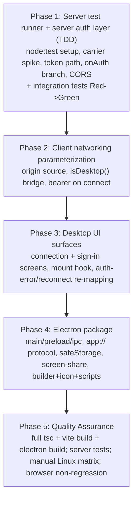
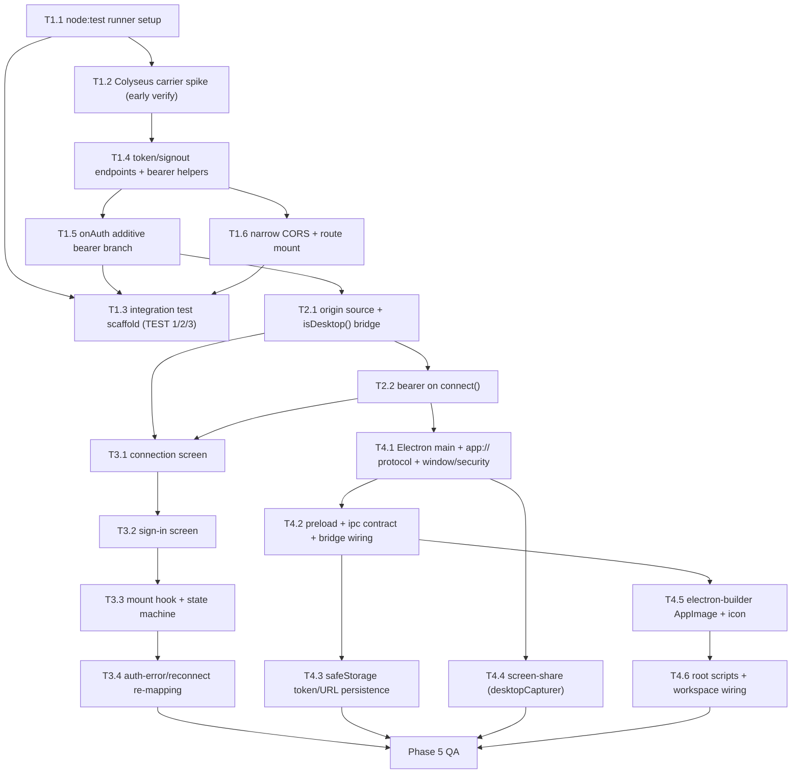

# Work Plan: Desktop Application (Electron)

- **Status**: Not started
- **Mode**: create
- **Date**: 2026-07-01
- **Owner**: eric.stampa@uponu.com
- **Design Doc**: `docs/design/desktop-application-design.md`
- **PRD**: `docs/prd/desktop-application-prd.md`
- **ADR**: `docs/adr/ADR-0001-desktop-shell-and-cross-origin-auth.md`
- **Test skeletons (integration)**: `server/src/auth.desktop.int.test.ts` (comment-only; implemented in Phase 1)

## Implementation Strategy

**Strategy A (Test-Driven for the server auth layer) + implementation-first for renderer/Electron/packaging.**
The only automatable test lane is the server integration skeleton (`server/src/auth.desktop.int.test.ts`, real SQLite). All renderer/media/packaging ACs are manual-only in this environment (no browser/Electron headless harness — recorded below as an intentional E2E absence). The plan therefore:
- Introduces a minimal server test runner FIRST (blocking prerequisite; no framework exists in the repo).
- Implements the integration tests Red→Green **alongside** the server auth-layer implementation (Phase 1).
- Covers renderer/media/packaging ACs with a **manual verification matrix** in the final QA phase.

**Approach (from Design Doc)**: Hybrid — a thin horizontal foundation (Colyseus token-carrier spike + server token path + client origin-source parameterization) followed by vertical slices (sign-in flow end-to-end, parity validation, packaging). Never break the working browser cookie flow.

## Verification Strategy (from Design Doc)

- **Correctness definition**: (1) the browser build still authenticates via the same-origin cookie exactly as before (no regression); AND (2) the desktop build authenticates cross-origin via a server-issued bearer token accepted by `onAuth`, resolving to the same `AuthInfo` as the cookie path. Both credential forms accepted simultaneously by one server.
- **Verification method**: server-side automated tests exercising `onAuth` with (a) valid cookie header, (b) valid bearer `context.token`, (c) invalid/expired token, plus token issuance/signout against real SQLite; client/desktop correctness via `tsc --noEmit` + `vite build` + manual functional runs against a running server per the PRD test matrix.
- **Verification timing**: server tests run on every change to `auth.ts`/`onAuth`/CORS (release gate for AC-010..012); the desktop manual matrix runs per release candidate.
- **Early verification point (Phase 1, first target)**: prove the desktop bearer token is observable in Colyseus 0.16 `onAuth` and determine its carrier — **before** building the token-issuance endpoint (ADR Known Unknown B). Success: a minimal SimRoom logs `context.token === "spike"` when a colyseus.js client sets `client.auth.token = "spike"`. Failure response: do NOT build the endpoint; fall back to reading `context.headers` (raw `authorization`/`_authToken`); if neither is observable, escalate (ADR reversal trigger for Decision B).

## Proof Strategy

- **Proof obligation source**: the annotated Proof obligations and Primary failure modes in the integration skeleton `server/src/auth.desktop.int.test.ts` (TEST 1/2/3) for AC-005/006/008/009/010/011/012; for manual-only ACs, each AC's Primary failure mode in the Design Doc Error Handling / Integration Verification Points / manual matrix.
- **Per-task rule**: every claim-implementing task records its Proof Obligations (the observable it must produce and the failure mode it guards) for downstream review. Server-auth tasks cite the matching TEST N VP; manual-matrix tasks cite the AC and the observable checked on Linux.

## Review Scope

- **Fresh pre-implementation plan.** Planned-files scope derived from the Design Doc Change Impact Map + task target files:
  - Server: `server/src/auth.ts`, `server/src/rooms/SimRoom.ts` (`onAuth`), `server/src/index.ts` (CORS/mount), `server/src/auth.desktop.int.test.ts`, `server/package.json` (test script).
  - Client: `client/src/net/room.ts`, `client/src/scenes/OfficeScene.ts`, `client/src/desktop/bridge.ts` (new), `client/src/screens/connection.ts` + `client/src/screens/signin.ts` (new), `client/index.html`/`client/src/main.ts` (mount hook).
  - Desktop (new workspace): `desktop/src/main.ts`, `desktop/src/preload.ts`, `desktop/src/ipc.ts`, `desktop/electron-builder.yml`, `desktop/build/icon.png` (+ variants), `desktop/package.json`.
  - Root: `package.json` (scripts), workspace config.
  - **Preserved unchanged (no-ripple, release gate)**: `server/src/auth.ts` cookie helpers + HTML gate + `/login`/`/logout`, `SimRoom.onAuth` cookie branch, `pixel_stream_sid` cookie, `client/src/voice/ZoneVoice.ts`, `client/src/conference/LiveKitConference.ts` (code), Colyseus `'m'` channel.

## Adopted Quality Assurance Mechanisms (from Design Doc)

| Mechanism | Enforces | Config | Covers | Status |
|-----------|----------|--------|--------|--------|
| `tsc --noEmit` (strict) | Type correctness across new desktop main/preload, client edits, server edits | `tsconfig.base.json`, per-workspace `tsconfig.json` | project-wide | adopted |
| `vite build` | Client bundle builds and is emitted to `client/dist` (the desktop UI source) | `client/vite.config.ts` | `client/` | adopted |
| Server auth/CORS automated tests (new) | Cookie path still authorizes; bearer path authorizes equivalently; invalid/expired token rejected; CORS does not enable credentialed cross-origin cookies | New minimal Node test runner under `server/` (`node:test` + `node:assert/strict`, wired to `server` package.json `"test"` script) | `server/src/auth.ts`, `SimRoom.onAuth`, `server/src/index.ts` CORS | adopted |
| Dockerfile release build | Server + client release image still builds after edits | `Dockerfile` | server/client release | noted (desktop artifact built by electron-builder, not Docker; Docker path only needs non-regression) |
| ESLint / CI pipeline | — | — | — | noted (none present in repo; not introduced by this feature) |

## E2E Gap Check

- **fixture-e2e**: absent — `e2eAbsenceReason.fixtureE2e` communicated: the user-facing connection→sign-in→world journey exists but is **not automatable in this environment** (no browser/Electron headless harness; renderer/safeStorage/getUserMedia/getDisplayMedia are manual-only per the Design Doc). MVP uses manual test-matrix coverage (accepted). **Gap check skipped for this lane** (reason carries a value).
- **service-integration-e2e**: absent — `e2eAbsenceReason.serviceE2e` communicated: `no_real_service_dependency`; the auth journey's cross-service correctness is fully covered in-process by the integration tests against real SQLite. **Gap check skipped for this lane** (reason carries a value).

No E2E gap warning is raised: both absences are intentional and communicated.

## Failure Mode Checklist

| Category | Applies? | Covering task(s) | Notes |
|----------|----------|------------------|-------|
| same-value (operation with identical before/after) | Yes | T1.4, T1.5 | Bearer branch must resolve the SAME AuthInfo as the cookie branch for the same user (field-identical); guards auth divergence/privilege drift. |
| no-op (action produces no observable change) | Yes | T1.6 | Sign-out is idempotent: repeat / absent-sid returns 204 and never reveals whether the sid existed. |
| empty input | Yes | T3.1, T1.3 | Empty/absent server URL → Connection screen (first launch); absent cookie AND absent token with authRequired=true → onAuth throws. |
| invalid option | Yes | T1.3, T1.6, T3.1 | Bad credentials → 401 no session; malformed server URL → rejected before probe; never-issued token → onAuth throws. |
| missing config | Yes | T1.4 | Endpoints mounted only when `ADMIN_TOKEN` is set (same gate as `registerAuth`); absent → routes not mounted. |
| unavailable boundary | Yes | T3.3, T4.4 | Server unreachable at `/health` → inline error, stay on Connection; screen-share picker cancelled/denied → revert `screenOn=false`, no crash. |
| shared-state dependency | Yes | T1.1 | Each server test creates its own seeded user + fresh SQLite, cleans up, no order dependency (no shared session rows). |
| rollback-only visibility | Yes | T1.5 | Bearer session validated by the same store/TTL as cookie; expired session lazy-deleted by `getSession` then onAuth throws — invalidation observable only through the store, not a cached value. |
| missing-sort-key ordering | No | — | No ordered/sorted collection is introduced by this feature. |

## Design-to-Plan Traceability

Source DD path for every row: `docs/design/desktop-application-design.md`.

### Technical Requirements (DD sections)

| # | DD Item | Category | Design Doc | Covering Task | Gap Status |
|---|---------|----------|------------|---------------|------------|
| 1 | Minimal Node server test runner (`node:test`, `server` package.json `"test"` script) — QA Mechanisms `adopted` + skeleton BLOCKING PREREQUISITE | prerequisite | `docs/design/desktop-application-design.md` (Quality Assurance Mechanisms) | T1.1 | covered |
| 2 | Colyseus token-carrier runtime spike (Early Verification Point / Implementation Order step 1) | verification | `docs/design/desktop-application-design.md` (Verification Strategy → Early Verification Point) | T1.2 | covered |
| 3 | `userIdFromBearer` / `hasValidBearerSession` helpers reusing `getSession` | implementation-target | `docs/design/desktop-application-design.md` (Main Components → Server token path) | T1.4 | covered |
| 4 | `POST /desktop/token` issuance via `createSession` (same creds logic as `/login`) | implementation-target | `docs/design/desktop-application-design.md` (Data Contracts → Token issuance) | T1.4 | covered |
| 5 | `POST /desktop/signout` revoke via `deleteSession` (idempotent, 204) | implementation-target | `docs/design/desktop-application-design.md` (Data Contracts → signout) | T1.4 | covered |
| 6 | Additive `onAuth` bearer branch reading `context.token`; cookie branch verbatim | contract-change | `docs/design/desktop-application-design.md` (Data Contracts → onAuth; Interface Change Matrix) | T1.5 | covered |
| 7 | Narrow CORS: `Authorization` header, NO `Access-Control-Allow-Credentials`; mount token routes | connection/setup | `docs/design/desktop-application-design.md` (Integration Points List; Fact 3) | T1.6 | covered |
| 8 | Parameterized origin source `getServerHttpOrigin()` feeding `endpoint`/`serverHttpOrigin`/`isServerUp`/`redirectToLogin`/`gotoLogout` | contract-change | `docs/design/desktop-application-design.md` (Interface Change Matrix; Fact 4) | T2.1 | covered |
| 9 | `isDesktop()` discriminator via preload-injected `window.pixelDesktop` (`client/src/desktop/bridge.ts`) | implementation-target | `docs/design/desktop-application-design.md` (Minimal Surface Element 2; Main Components → bridge) | T2.1 | covered |
| 10 | Bearer token on `connect()` (`client.auth.token`) desktop-only; browser unchanged | contract-change | `docs/design/desktop-application-design.md` (Interface Change Matrix; Integration Points List) | T2.2 | covered |
| 11 | `isAuthError`→in-app sign-in, `handleDisconnect`→in-app reconnect (desktop branch) in `OfficeScene.ts` | contract-change | `docs/design/desktop-application-design.md` (Fact 5; Integration Points List) | T3.4 | covered |
| 12 | Electron main: `BrowserWindow` (`contextIsolation:true`, `nodeIntegration:false`), custom `app://` protocol → `client/dist` | implementation-target | `docs/design/desktop-application-design.md` (Electron Package Structure; Main Components → Electron main) | T4.1, T4.2 | covered |
| 13 | Preload typed `window.pixelDesktop` IPC + `desktop/src/ipc.ts` shared contract | implementation-target | `docs/design/desktop-application-design.md` (Main Components → Preload) | T4.2 | covered |
| 14 | `safeStorage` token persistence (encryptString ciphertext at rest) + plaintext server URL | prerequisite | `docs/design/desktop-application-design.md` (Field Propagation Map; Security Considerations) | T4.3 | covered |
| 15 | `setDisplayMediaRequestHandler` + `desktopCapturer` for screen-share (Linux) | implementation-target | `docs/design/desktop-application-design.md` (Fact 7; Implementation Order step 6) | T4.4 | covered |
| 16 | Connection screen (`#pa-connect`) DOM overlay reusing `.pa-panel` aesthetic | implementation-target | `docs/design/desktop-application-design.md` (New UI Surface Design) | T3.1 | covered |
| 17 | Sign-in screen (`#pa-signin`) DOM overlay | implementation-target | `docs/design/desktop-application-design.md` (New UI Surface Design) | T3.2 | covered |
| 18 | Screen mount hook when `isDesktop()` before world connect (`main.ts`/`index.html`) | connection/setup | `docs/design/desktop-application-design.md` (Change Impact Map) | T3.3 | covered |
| 19 | electron-builder AppImage (Linux, unsigned) + placeholder icon | prerequisite | `docs/design/desktop-application-design.md` (Implementation Order step 7) | T4.5, T4.6 | covered |
| 20 | Root scripts `dev:desktop`/`build:desktop`/`dist:desktop`; new `desktop/` workspace member | connection/setup | `docs/design/desktop-application-design.md` (Fact 8) | T4.1, T4.6 | covered |
| 21 | Security Considerations: origin allowlisting (`will-navigate`/`setWindowOpenHandler` deny), server-URL scheme/host validation | verification | `docs/design/desktop-application-design.md` (Security Considerations) | T4.1, T3.1 | covered |
| 22 | State Transitions and Invariants (Connection→...→Connected/SignIn/Reconnecting state machine) | verification | `docs/design/desktop-application-design.md` (State Transitions and Invariants) | T3.3, T3.4 | covered |
| 23 | Field Propagation Map (server URL, bearer token, LiveKit token boundaries) | contract-change | `docs/design/desktop-application-design.md` (Field Propagation Map) | see Connection Map | covered |
| 24 | Security Considerations: token never logged/localStorage; masked from all logs | verification | `docs/design/desktop-application-design.md` (Logging and Monitoring; Security) | T1.4, T4.3 | covered |
| 25 | Error Handling matrix (validation/infra/auth/media recovery paths) | verification | `docs/design/desktop-application-design.md` (Error Handling) | T3.1, T3.4, T4.4 | covered |
| 26 | Logging and Monitoring sensitive-data rule (no token/password/admin token in logs) | verification | `docs/design/desktop-application-design.md` (Logging and Monitoring) | T1.4, T1.6 | covered |
| 27 | Minimal Surface Alternatives (selected: reuse `sid` as bearer token; `window.pixelDesktop` discriminator) | verification | `docs/design/desktop-application-design.md` (Minimal Surface Alternatives) | T1.4, T2.1 | covered |
| 28 | Deploy order: server (additive, backward-compatible) before shipping desktop artifact | prerequisite | `docs/design/desktop-application-design.md` (Migration Strategy) | T5.5 | covered |

### Acceptance Criteria (AC-001..AC-021)

| AC | Verification lane | Covering Task | Gap Status |
|----|-------------------|---------------|------------|
| AC-001 (connection screen before world, no saved URL) | manual | T3.1, T3.3 / T5.3 | covered |
| AC-002 (probe `/health`; error stays on Connection) | manual | T3.1 / T5.3 | covered |
| AC-003 (saved URL → skip Connection) | manual | T3.3, T4.3 / T5.3 | covered |
| AC-004 (targets from configured URL; no request to packaged origin) | manual (`tsc`+`vite build`+run) | T2.1 / T5.3 | covered |
| AC-005 (valid creds → token accepted by onAuth → world) | integration (TEST 2) + manual | T1.4, T1.5, T3.2 / T5.2, T5.3 | covered |
| AC-006 (invalid creds → 401, no connect) | integration (TEST 2 VP4) + manual | T1.4, T3.2 / T5.2 | covered |
| AC-007 (restart with valid token → no prompt) | manual | T4.3, T3.3 / T5.3 | covered |
| AC-008 (sign-out → deleteSession + clear + SignIn) | integration (TEST 3A) + manual | T1.4, T4.3, T3.4 / T5.2, T5.3 | covered |
| AC-009 (rejected token → SignIn, no loop/blank) | integration (TEST 3A) + manual | T1.5, T3.4 / T5.2, T5.3 | covered |
| AC-010 (browser sign-in/play/sign-out identical) | integration (TEST 1) | T1.5 / T5.2 | covered |
| AC-011 (cookie-only join still authorizes) | integration (TEST 1) | T1.5 / T5.2 | covered |
| AC-012 (CORS: no new prompt/failure/regression) | integration (TEST 3B) | T1.6 / T5.2 | covered |
| AC-013 (zone voice mic publish, getUserMedia) | manual (Linux) | T4.2 (secure origin) / T5.3 | covered |
| AC-014 (Web Audio master/per-peer/proximity) | manual (Linux) | T4.2 / T5.3 | covered |
| AC-015 (device pickers + setSinkId) | manual (Linux) | T4.2 / T5.3 | covered |
| AC-016 (Phaser WebGL parity) | manual (Linux) | T4.1 / T5.3 | covered |
| AC-017 (packaged AppImage installs, reaches connection, works) | manual (Linux) + L3 build | T4.5, T4.6 / T5.1, T5.3 | covered |
| AC-018 (reuse existing client Vite output; single UI source) | `tsc`+`vite build` + L3 | T4.2 / T5.1 | covered |
| AC-019 (server restart → reconnect, no re-entry) | manual (Linux) | T3.4, T4.3 / T5.3 | covered |
| AC-020 (stored credential not plaintext on disk) | manual on-disk inspection | T4.3 / T5.3 | covered |
| AC-021 (conference camera/mic/screen-share parity) | manual (Linux) | T4.4 / T5.3 | covered |

No uncovered items. All ACs and DD technical requirements map to at least one task.

## Reference Contract Values

Binding observable values copied verbatim from the Design Doc, one row per value.

| # | Reference Contract Value (verbatim) | Type | DD Source | Covering Task |
|---|-------------------------------------|------|-----------|---------------|
| 1 | `onAuth` returns `AuthInfo{userId, username, isAdmin}` — assert byte-identical field values for the same user across both credential forms (cookie vs bearer) | derived-display / equivalence | Output Comparison; onAuth Data Contract | T1.5 |
| 2 | the anonymous short-circuit (`authRequired=false`) still returns `{userId:'', username:'', isAdmin:false}` | derived-display | Output Comparison; onAuth Data Contract (validation step 1) | T1.5 |
| 3 | Output `{ token: string }` (the opaque session sid); `/desktop/token` sets NO `Set-Cookie` and requires NO cookie | contract value | Data Contracts → Token issuance | T1.4 |
| 4 | On Error: `401` `{ error: "Invalid login id or password." }` or `{ error: "Invalid admin token." }` | contract value | Data Contracts → Token issuance | T1.4 |
| 5 | `/desktop/signout` → `204 No Content`; returns 204 even if sid absent (idempotent revoke); never leaks whether the sid existed | contract value / no-op negative | Data Contracts → signout | T1.6 |
| 6 | CORS: `Access-Control-Allow-Headers` includes `Authorization`; `Access-Control-Allow-Credentials` is NOT set | contract value | Data Contracts → Token issuance Invariants; Fact 3 | T1.6 |
| 7 | Cookie branch evaluated before bearer branch; cookie behavior unchanged (cookie branch first and byte-for-byte unchanged) | ordering/state invariant | onAuth Data Contract Invariants | T1.5 |
| 8 | The bearer token is only ever in memory (renderer, at connect time) or ciphertext (safeStorage); never localStorage, never a log | state-lifecycle negative | State Transitions and Invariants | T4.3, T1.4 |
| 9 | after sign-out or an auth error, `getToken()` returns null and the next launch shows SignIn — not a silent reuse of a stale token (token stays unused after clear) | state-lifecycle negative | Client State Design | T3.4, T4.3 |
| 10 | `pa-zv-*` voice settings preserved across launches via stable `app://` origin | state-lifecycle (persistence) | Client State Design | T4.2 |

## Connection Map

Serialized/cross-boundary contracts. Source: Field Propagation Map + Data Contracts.

| # | Boundary | Producer (owner) | Consumer (owner) | Serialized Format | Consumer Parse Rule | Expected Signal | Covering Task(s) |
|---|----------|------------------|------------------|-------------------|---------------------|-----------------|------------------|
| 1 | renderer → server (token issuance) | connection/sign-in screens (`client/src/screens/signin.ts`) | `POST /desktop/token` (`server/src/auth.ts`) | JSON `{ username, password, token? }` | verify same as `/login`; `createSession` → respond `{ token: sid }` | 200 `{ token }` on valid creds; 401 generic message on bad creds | T3.2, T1.4 |
| 2 | server → renderer → main safeStorage (token at rest) | `POST /desktop/token` (`server/src/auth.ts`) | preload `setToken` → main `safeStorage.encryptString` (`desktop/src/main.ts`) | JSON `{ token: string }` on wire; `safeStorage.encryptString` ciphertext at rest | `getToken()` decrypts; renderer sets `client.auth.token` | on-disk value is ciphertext (AC-020); `getToken()` returns the same sid | T1.4, T4.3 |
| 3 | renderer/colyseus.js → server matchmake (bearer on connect) | `connect()` sets `client.auth.token` (`client/src/net/room.ts`) | `SimRoom.onAuth` via `AuthContext.token` (`server/src/rooms/SimRoom.ts`) | HTTP header `Authorization: Bearer <sid>` (+ `_authToken=<sid>` WS query) | server `getBearerToken(req.headers.authorization)` → `AuthContext.token`; onAuth bearer branch | onAuth resolves AuthInfo → join OK; invalid → AUTH_FAILED 4215 | T2.2, T1.5 |
| 4 | renderer → server (sign-out) | sign-out action (`OfficeScene.ts` desktop branch) | `POST /desktop/signout` (`server/src/auth.ts`) | HTTP header `Authorization: Bearer <sid>` | extract sid; `deleteSession(sid)` (idempotent) | 204; session removed; subsequent onAuth with sid throws | T3.4, T1.6 |
| 5 | main safeStorage → renderer (server URL) | main `safeStorage` (`desktop/src/main.ts`) | `getServerHttpOrigin()` (`client/src/net/room.ts`) via preload | plaintext string via IPC (`getServerUrl(): string \| null`) | scheme/host validated before use | configured origin drives all five target functions on desktop | T4.3, T2.1 |
| 6 | main ↔ renderer (typed IPC contract) | preload `window.pixelDesktop` (`desktop/src/preload.ts`) | renderer bridge (`client/src/desktop/bridge.ts`) | `PixelDesktopApi` typed contract (`desktop/src/ipc.ts`) | `isDesktop()` = presence of `window.pixelDesktop`; typed accessors | browser: API absent → `isDesktop()` false → browser code paths | T4.2, T2.1 |
| 7 | server → renderer (LiveKit token, unchanged) | Colyseus `'m'` channel | `OfficeScene.onConferenceToken` / `ZoneVoice.onToken` | existing `'m'` message `{type:'zoneVoiceToken'|'conferenceToken', token}` | existing handlers | preserved; no new transport (scope reducer) | no code change (T4.2 secure origin enables media) |

## ADR Bindings

Source: `docs/adr/ADR-0001-desktop-shell-and-cross-origin-auth.md` (resolved from Prerequisite ADRs).

| # | Binding Decision | Axis | Source Section | Covering Task(s) |
|---|------------------|------|----------------|------------------|
| 1 | Adopt Electron (bundled Chromium) as an additional monorepo build target reusing the client Vite output; no forked UI | placement | Decision | T4.1, T4.2 |
| 2 | Bearer-token transport (B1): server issues opaque token via `joinOrCreate` matchmake options + HTTP `Authorization: Bearer`; cookie path unchanged | data_flow | Decision | T1.4, T1.5, T2.2 |
| 3 | Back the desktop token with the same session store, TTL, and identity resolution as the cookie; constant-time comparison (`tokenEquals` pattern) — no divergent validation | persistence | Implementation Guidance | T1.4, T1.5 |
| 4 | Additive, never subtractive auth: cookie flow, HTML gate, and cookie branch of `onAuth` preserved verbatim; browser non-regression is a release gate | contract_schema | Implementation Guidance | T1.5 |
| 5 | Scope CORS narrowly: enable desktop origin + `Authorization` header without credentialed cross-origin cookies; no wildcard credentialed origin | contract_schema | Implementation Guidance | T1.6 |
| 6 | Keep secrets out of the Vite bundle and off plaintext disk; persist via `safeStorage`; expose to renderer only via typed preload IPC | placement | Implementation Guidance | T4.2, T4.3 |
| 7 | Electron security baseline: `contextIsolation: true`, `nodeIntegration: false`, minimal typed preload IPC, origin allowlisting of loadable/navigable origins | placement | Implementation Guidance | T4.1, T4.2 |
| 8 | Single UI source: the desktop build consumes the existing client Vite output; do not fork the client UI | placement | Implementation Guidance | T4.2 |

## Phase Structure Diagram

## Task Dependency Diagram

---

## Phase 1: Server test runner + server auth layer (TDD)

Foundation. Browser cookie path must stay byte-for-byte unchanged (release gate). Integration tests implemented Red→Green alongside implementation.

- [x] **T1.1 — Introduce minimal Node server test runner and wire `server` test script**
  - Add `node:test` + `node:assert/strict` runner (zero new deps; repo already uses `node:sqlite`/`node:crypto`); wire `server/package.json` `"test": "node --test"` (or `--test` glob for `*.int.test.ts` via the project's TS execution path).
  - **Proof Obligations**: a trivial passing test runs via the new script; tests can create their own fresh/temp SQLite and clean up (no shared session rows, no order dependency — shared-state failure mode).
  - **Completion**: Implementation — runner executes; Quality — sample test green under the script; Integration — script discoverable from repo root. (BLOCKING PREREQUISITE for all other Phase 1 tasks.)

- [x] **T1.2 — Colyseus token-carrier runtime spike (Early Verification Point)**
  - Minimal SimRoom logs `context.token`; a colyseus.js client with `client.auth.token = "spike"` must show `context.token === "spike"` in `onAuth`.
  - **Proof Obligations**: runtime confirms the code-inspection conclusion (`Server.mjs:206` → `context.token`). Success criterion met before building the endpoint.
  - **Failure response**: if not surfaced via `context.token`, fall back to `context.headers` (raw `authorization`/`_authToken`); if neither observable, escalate (ADR reversal trigger, Decision B).
  - **Completion**: L1 — spike prints `context.token === "spike"`; result recorded; blocks T1.4.

- [ ] **T1.3 — Implement integration test scaffold `server/src/auth.desktop.int.test.ts` (TEST 1/2/3, real SQLite)**
  - Convert the comment-only skeleton into executable `node:test` blocks with real temp/in-memory SQLite + real `userStore.createUser` seeding; construct `AuthContext` directly (Colyseus transport mocked). Independent per test; deterministic clock for expiry (no wall-clock sleep).
  - Implemented incrementally alongside T1.4/T1.5/T1.6 (Red→Green within the implementing commits).
  - **Proof Obligations**: all VPs in TEST 1 (AC-010/011), TEST 2 (AC-005/006), TEST 3A (AC-008/009), TEST 3B (AC-012) hold; literal expected values computed independently of code under test.
  - **Completion**: L2 — all three tests green; no order dependency; no token/password/admin-token in output.

- [x] **T1.4 — `POST /desktop/token` + `POST /desktop/signout` + `userIdFromBearer`/`hasValidBearerSession`**
  - `/desktop/token`: same creds logic as `/login` (`normalizeLoginId`, `verifyPassword`, `tokenEquals(token, ADMIN_TOKEN)` for admin path, no self-registration) → `createSession` → `{ token: sid }`; sets NO `Set-Cookie`. Bad creds → 401 generic message, no session row. `/desktop/signout`: extract sid → `deleteSession` (idempotent) → 204. Helpers reuse `getSession`. Mounted only when `ADMIN_TOKEN` set. Token/password/admin token never logged.
  - **Reference Contract Values**: #3, #4, #8 (token never logged).
  - **Proof Obligations**: TEST 2 VP1/VP3/VP4/VP5; missing-config (routes absent without `ADMIN_TOKEN`); no-op idempotent signout (with T1.6).
  - **Completion**: L2 — TEST 2 issuance + revoke VPs green; L3 — `tsc --noEmit` passes.

- [x] **T1.5 — Additive `onAuth` bearer branch (cookie branch verbatim)**
  - Append bearer branch after the cookie branch in `SimRoom.onAuth`: `authRequired=false` short-circuit unchanged (line 191); cookie branch (192-197) byte-for-byte unchanged and evaluated FIRST; else `context.token && hasValidBearerSession` → resolve SAME `AuthInfo` via `getSession → userStore.get → displayName`; else `throw 'unauthorized'`. `_options` stays unused.
  - **Reference Contract Values**: #1, #2, #7.
  - **Proof Obligations**: TEST 1 VP1-VP4 (cookie non-regression + anonymous short-circuit + unknown-cookie throw); TEST 2 VP2 (bearer AuthInfo field-identical to cookie AuthInfo); TEST 3A VP1-VP3 (never-issued/expired/signed-out token throws). Same-value + rollback-only-visibility failure modes.
  - **Completion**: L2 — TEST 1 + TEST 3A green; cookie-path AuthInfo matches pre-change baseline; L3 — `tsc` passes.

- [x] **T1.6 — Narrow CORS + mount token routes in `server/src/index.ts`**
  - Keep open `cors()` for existing routes; add route-level CORS headers on `/desktop/token`, `/desktop/signout`, and cross-origin `/health`: `Access-Control-Allow-Headers` includes `Authorization`; `Access-Control-Allow-Credentials` NOT set. Mount token routes via `registerAuth` (same `ADMIN_TOKEN` gate). Same-origin static serving + TLS-when-cert unchanged.
  - **Reference Contract Values**: #5 (signout 204/idempotent), #6 (CORS headers).
  - **Proof Obligations**: TEST 3B VP5/VP6 (preflight allows `Authorization`; no `Allow-Credentials`); TEST 3A VP4 (idempotent signout no leak). AC-012 release gate.
  - **Completion**: L2 — TEST 3B green; same-origin browser flow unaffected; L3 — `tsc` passes.

## Phase 2: Client networking parameterization

Browser behavior unchanged when the discriminator is absent.

- [x] **T2.1 — Parameterized origin source + `isDesktop()` bridge (`client/src/net/room.ts`, `client/src/desktop/bridge.ts`)**
  - New `client/src/desktop/bridge.ts`: `isDesktop()` = presence of `window.pixelDesktop` with `isDesktop === true`; typed `desktop()` accessor. Introduce `getServerHttpOrigin()` returning configured URL on desktop (via preload IPC) or `window.location`-derived on browser; feed it to `endpoint`/`serverHttpOrigin`/`isServerUp`/`redirectToLogin`/`gotoLogout`. Browser branch returns identical values to today.
  - **Reference Contract Value**: #10 relates via stable origin (persistence downstream).
  - **Proof Obligations**: browser code paths byte-for-byte unchanged (AC-010/012); desktop derives targets from configured URL, makes no request to packaged origin (AC-004). Empty server URL → handled by screens (T3.1).
  - **Completion**: L3 — `tsc --noEmit` + `vite build` pass; L1 — browser build behaves identically (manual, deferred to T5.3).

- [x] **T2.2 — Bearer token on `connect()` (desktop-only)**
  - In `connect()`, on desktop set `client.auth.token = <sid>` (fetched via preload IPC) before `new Client(endpoint())` / `joinOrCreate`; browser sets no token (path identical to today).
  - **Connection Map**: #3 (Authorization: Bearer → context.token).
  - **Proof Obligations**: desktop room join carries `Authorization: Bearer`; browser has no token set (AC-004/010).
  - **Completion**: L3 — `tsc` + `vite build`; L1 — deferred to T5.3.

## Phase 3: Desktop UI surfaces (vertical slice: sign-in flow end-to-end)

DOM overlays reusing `.pa-ui`/`.pa-panel` pixel aesthetic; mount only when `isDesktop()`. This slice is the Design Doc integration point (first L1 — whole system operational).

- [x] **T3.1 — Connection screen (`client/src/screens/connection.ts`, `#pa-connect`)**
  - URL input + "Connect"; validate scheme/host before probe; `probeServer(url)` → `/health`; on ok persist URL + go SignIn; on fail inline "Server unreachable" and stay (AC-002). States: default/loading("Checking…")/empty(first launch)/error/partial(prefilled from settings). WCAG 2.1 AA: labels, tab order, Enter submits, focus ring, `aria-describedby` error.
  - **Reference Contract Values**: covers empty-input + unavailable-boundary failure modes.
  - **Proof Obligations**: AC-001 (shown before world when no saved URL), AC-002 (probe error stays on screen). Manual (T5.3).
  - **Completion**: L3 — `tsc` + `vite build`; L1 — deferred to T5.3.

- [ ] **T3.2 — Sign-in screen (`client/src/screens/signin.ts`, `#pa-signin`)**
  - login id + password + optional admin-token inputs + "Sign in" (mirrors `loginHtml` fields); `POST /desktop/token`; on 200 store token via preload + connect; on 401 inline "Invalid login id or password." / "Invalid admin token." (AC-006). States: default/loading("Signing in…")/error. WCAG AA labels/focus.
  - **Connection Map**: #1 (issuance request/response).
  - **Proof Obligations**: AC-005 (valid creds → world), AC-006 (invalid → error, no connect). Manual (T5.3); server portion via T1.4.
  - **Completion**: L3 — `tsc` + `vite build`; L1 — deferred to T5.3.

- [x] **T3.3 — Screen mount hook + in-renderer state machine (`main.ts`/`index.html`)**
  - Mount Connection/SignIn when `isDesktop()` before the world connect flow; implement the Connection→ProbingHealth→SignIn→Authenticating→Connected/Reconnecting/AuthError state machine; saved URL + token → skip to Authenticating (AC-003, AC-007).
  - **DD ref**: State Transitions and Invariants.
  - **Proof Obligations**: AC-001/003 (skip when saved); browser build never enters these states (`isDesktop()` false).
  - **Completion**: L3 — `tsc` + `vite build`; L1 — deferred to T5.3.

- [x] **T3.4 — Auth-error / reconnect re-mapping (`client/src/scenes/OfficeScene.ts` desktop branch)**
  - On desktop: `isAuthError` branch → clear stored token → show SignIn (AC-009, never blank/loop); `handleDisconnect` (code!=1000, not kick) → in-app reconnect overlay + `/health` poll + reload (token re-read from safeStorage survives reload, AC-019); sign-out → `POST /desktop/signout` + `clearToken()` → SignIn (AC-008). Browser keeps `redirectToLogin`/reload verbatim. Voice-token `'m'` handling + `zoneVoice.start()` unchanged.
  - **Reference Contract Value**: #9 (token null after clear, next launch SignIn — state-lifecycle negative).
  - **Connection Map**: #4 (signout).
  - **Proof Obligations**: AC-008/009/019; rejected token deterministically → SignIn (no loop/blank). Manual (T5.3); server portion via T1.5/T1.6.
  - **Completion**: L3 — `tsc` + `vite build`; L1 — deferred to T5.3.

## Phase 4: Electron package (new `desktop/` workspace)

`contextIsolation:true`, `nodeIntegration:false`; single UI source (consumes `client/dist`).

- [x] **T4.1 — Electron main: window, `app://` protocol, security baseline (`desktop/src/main.ts`, `desktop/package.json`)**
  - New `desktop/` pnpm workspace member. `BrowserWindow` with `contextIsolation:true`, `nodeIntegration:false`, sandbox per baseline. Register custom `app://` protocol serving `client/dist` (stable secure-context origin). Origin allowlisting: `will-navigate`/`setWindowOpenHandler` deny arbitrary origins; external links → system browser. Single-instance lock (P3).
  - **ADR Bindings**: #1, #7.
  - **Proof Obligations**: renderer loads world from bundled assets with stable origin (AC-016/017 basis); only `app://` loadable.
  - **Completion**: L3 — `tsc` on desktop workspace; L1 — window opens (manual, T5.3).

- [ ] **T4.2 — Preload + typed IPC contract + renderer bridge wiring (`desktop/src/preload.ts`, `desktop/src/ipc.ts`)**
  - `desktop/src/ipc.ts`: `PixelDesktopApi` typed contract (`isDesktop:true`, `getServerUrl`/`setServerUrl`/`probeServer`/`getToken`/`setToken`/`clearToken`/`pickScreenSource`). Preload exposes via `contextBridge.exposeInMainWorld`; no Node globals leak. Confirms `client/src/desktop/bridge.ts` (T2.1) consumes it. Desktop consumes `client/dist` (single UI source, AC-018). Stable `app://` origin enables `pa-zv-*` persistence + secure-context media.
  - **Connection Map**: #6 (typed IPC contract). **Reference Contract Value**: #10.
  - **ADR Bindings**: #6, #7, #8.
  - **Proof Obligations**: browser (API absent) → `isDesktop()` false → browser paths; AC-013..016/018 secure-context/single-source basis.
  - **Completion**: L3 — `tsc` desktop + client + `vite build`; L1 — deferred to T5.3.

- [x] **T4.3 — safeStorage token + server-URL persistence (IPC handlers in main)**
  - Main IPC handlers: token via `safeStorage.encryptString`/`decryptString` (ciphertext at rest, AC-020); server URL plaintext (not a secret). `clearToken()` on sign-out/auth-error. Token never in localStorage, never logged.
  - **Connection Map**: #2, #5. **Reference Contract Values**: #8, #9.
  - **Proof Obligations**: AC-007 (restart → decrypt → auto-connect), AC-020 (on-disk ciphertext — manual inspection T5.3), token unused after clear.
  - **Completion**: L3 — `tsc`; L1/manual — deferred to T5.3.

- [x] **T4.4 — Screen-share: `setDisplayMediaRequestHandler` + `desktopCapturer` (Electron main)**
  - Wire `session.setDisplayMediaRequestHandler` using `desktopCapturer.getSources`; optional explicit `pickScreenSource()` picker. Handle Linux Wayland/X11 portal/PipeWire. Picker cancelled/denied → existing `setScreenShareEnabled` catch reverts `screenOn=false` (no crash). No client code change to `LiveKitConference`.
  - **Proof Obligations**: AC-021 (camera/mic/screen-share publish + remote tiles on Linux); unavailable-boundary (cancel → no crash). Manual on real Linux (T5.3).
  - **Completion**: L3 — `tsc`; L1/manual — deferred to T5.3.

- [x] **T4.5 — electron-builder AppImage config + placeholder icon (`desktop/electron-builder.yml`, `desktop/build/icon.png`)**
  - AppImage (Linux, unsigned). Create placeholder pixel-art icon (`icon.png` + platform variants) from the aesthetic (canvas `#14161c`, primary `#2f66b0`) — explicit deviation from "reuse existing assets" (no icon asset exists in repo).
  - **Proof Obligations**: AC-017 (packaged artifact builds). L3 build.
  - **Completion**: L3 — electron build produces an AppImage (T5.1).

- [x] **T4.6 — Root scripts + workspace wiring (`package.json`)**
  - Add `dev:desktop`, `build:desktop`, `dist:desktop`; register `desktop/` in the pnpm workspace with `@pixel/*` naming.
  - **DD ref**: Fact 8.
  - **Proof Obligations**: scripts run end-to-end; workspace resolves.
  - **Completion**: L3 — scripts execute; verified in T5.1.

## Phase 5: Quality Assurance (final)

Acceptance criteria achievement, all tests passing, quality gates. Manual matrix runs on Linux per PRD.

- [ ] **T5.1 — Full static + build gate**
  - `tsc --noEmit` across all workspaces; `vite build` (emits `client/dist`); `electron build`/`dist:desktop` produces the AppImage; Dockerfile release build still succeeds (server/client non-regression).
  - **Completion**: zero `tsc` errors; `vite build` + electron build succeed; Docker image builds (AC-018 single source; AC-017 artifact).

- [ ] **T5.2 — Run server integration tests (release gate)**
  - Run `server/src/auth.desktop.int.test.ts` (TEST 1/2/3) via the new runner against real SQLite.
  - **Completion**: all VPs green — cookie non-regression (AC-010/011), bearer equivalence (AC-005), rejection+revoke (AC-008/009), CORS contract (AC-012); 0 browser regressions (Success Metric 2).

- [ ] **T5.3 — Manual verification matrix on Linux**
  - Against a running remote server, execute: first-launch connect→sign-in→world (AC-001,002,004,005); invalid creds error (AC-006); restart→auto-connect (AC-003,007); sign-out→SignIn (AC-008); expired/rejected token→SignIn no loop/blank (AC-009); WebGL render parity (AC-016); zone voice mic publish + Web Audio + device pickers/setSinkId (AC-013,014,015); conference camera/mic/screen-share + remote tiles (AC-021); server restart→reconnect no re-entry (AC-019); on-disk token is ciphertext (AC-020).
  - **Completion**: 100% of the four parity areas function (Success Metric 1); ≥5 consecutive returning-user launches reach world (Metric 3); ≥3-restart reconnect set passes (Metric 4); WCAG 2.1 AA audit on connection/sign-in screens passes; matrix recorded per release candidate.

- [ ] **T5.4 — Verify Reference Contract Values, Connection Map, ADR Bindings against implementation**
  - Cross-check each Reference Contract Value (#1-#10), each Connection Map signal, and each ADR Binding against the built code before sign-off.
  - **Completion**: every binding value observed in implementation/tests; any deviation escalated.

- [ ] **T5.5 — Deploy-order confirmation**
  - Confirm server (additive, backward-compatible) is deployed before shipping the desktop artifact; rollback = remove desktop routes + onAuth bearer branch (cookie path untouched).
  - **Completion**: deploy/rollback steps documented; server change verified backward-compatible (T5.2).

---

## Progress Tracking

- Phase 1: T1.1 ☑ T1.2 ☑ T1.3 ☐ T1.4 ☐ T1.5 ☑ T1.6 ☑
- Phase 2: T2.1 ☑ T2.2 ☑
- Phase 3: T3.1 ☑ T3.2 ☐ T3.3 ☑ T3.4 ☐
- Phase 4: T4.1 ☑ T4.2 ☐ T4.3 ☑ T4.4 ☑ T4.5 ☑ T4.6 ☑
- Phase 5: T5.1 ☐ T5.2 ☐ T5.3 ☐ T5.4 ☐ T5.5 ☐

Test-case resolution target (final phase): integration TEST 1/2/3 all green (0 unresolved); manual matrix 21/21 ACs verified on Linux.
