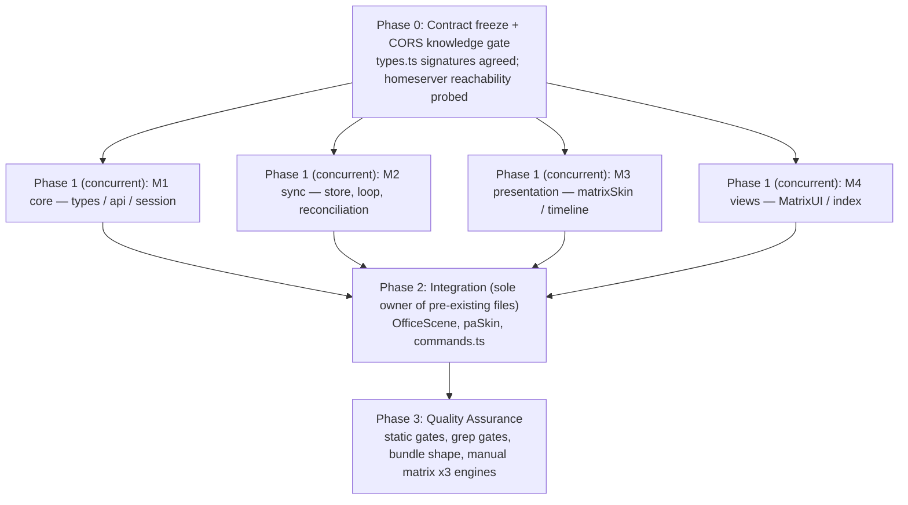
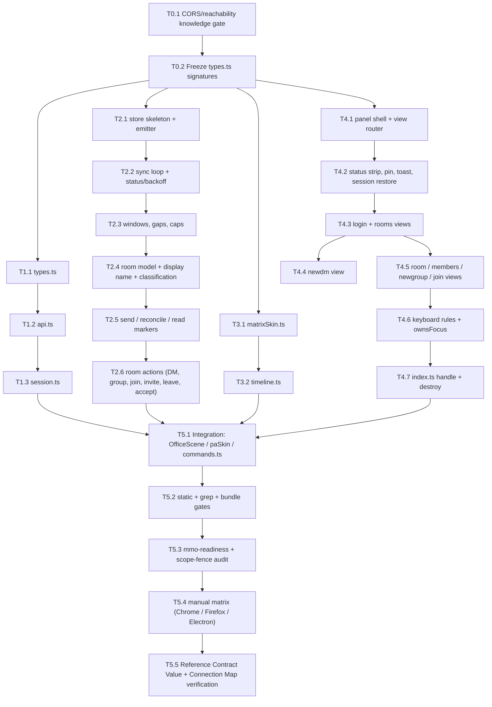

# Work Plan: Matrix (Element-style) Chat Client

- **Status**: Not started
- **Mode**: create
- **Date**: 2026-08-07
- **Owner**: eric.stampa@uponu.com
- **Design Doc**: `docs/design/matrix-chat-design.md`
- **PRD**: none (feature request captured verbatim in the Design Doc Overview / FR-1..FR-6)
- **ADR**: `docs/adr/ADR-0001-desktop-shell-and-cross-origin-auth.md` (prerequisite, inherited; **no new ADR** — reversing Transport Decision §1 or the E2EE position §2 would require one)
- **Test skeletons (integration)**: none — see *E2E Gap Check*

## Implementation Strategy

**Strategy B (implementation-first, contract-frozen) with a fan-out/fan-in shape.**
There is no automatable test lane for this feature: it is a browser-only UI talking to a third-party
homeserver over `fetch`, with no server component, no new Colyseus surface, and no test runner in the
client workspace. The correctness gates are therefore `tsc --noEmit`, `vite build` (plus a bundle-shape
assertion), `.claude/skills/mmo-readiness/check.sh`, a set of **grep gates** that make the
architectural rules checkable, and a scripted manual matrix.

**Approach (from Design Doc §6 "Disjoint ownership for parallel implementers")**: one frozen type
contract, then four concurrent workstreams over strictly disjoint new files, then a single integration
step that is the only thing touching pre-existing files.

```
        ┌─ M1 core (types/api/session) ─┐
Freeze ─┼─ M2 sync (store)              ─┼─→ INTEGRATION → QA
        ├─ M3 skin + timeline           ─┤
        └─ M4 UI (panel/router/index)   ─┘
```

M2/M3/M4 compile against **signatures written into their briefs**, not against M1's finished code.
A signature mismatch is the single most likely failure mode of a concurrent run, so every
cross-module symbol appears verbatim in *both* the producing and the consuming brief.

**Never break**: zone chat (`client/src/ui/chatUI.ts` — a separate surface, not to be merged or
repurposed), Mumble's pinned-dock behaviour, `--pa-side-panel-w` iframe docking, WASD/arrow world
movement, the F8 perf overlay, and the main-bundle size for users who never open the panel.

## Verification Strategy (from Design Doc)

- **Correctness definition**: a signed-in pixel-agents user can (1) log in to their homeserver with a
  session that survives reload and a visible sign-out; (2) see People/Groups/Invites with unread
  indicators; (3) read a live, back-paginating timeline and send into it; (4) start a DM by directory
  search **or** raw MXID; (5) create a group, join by alias/id, list members, invite, leave, and
  accept/decline invites; (6) with chrome that is token-for-token the existing pixel skin — **while**
  the main bundle, zone chat, world movement and the existing docks are unchanged.
- **Verification method**: static gates (`tsc`, `vite build`, bundle-shape check, grep gates,
  `mmo-readiness`) + a scripted manual matrix against a real homeserver in Chrome, Firefox and the
  Electron shell.
- **Verification timing**: static gates on every task; the manual matrix once at integration and once
  at QA.
- **Early verification point (before any UI work lands)**: prove that the target homeserver answers
  `GET /_matrix/client/versions` **from the game origin with CORS headers**, and from the Electron
  `app://bundle` origin. Success: a 200 with `Access-Control-Allow-Origin` satisfying both origins.
  Failure response: the feature still ships, but assumption **A-1** is known-broken for that
  deployment and the login error path (which must name CORS by hand) becomes the primary tested
  surface rather than an edge case. This is a *knowledge* gate, not a build gate — it does not block
  M1..M4, only the "it works end to end" claim.

## Proof Strategy

- **Proof obligation source**: each numbered requirement FR-1..FR-6 and NFR-1..NFR-4 in the Design
  Doc, plus the correctness rules that the adversarial review turned into hard requirements (room
  display name, `transaction_id` reconciliation, `m.direct` read-modify-write, invite-accept endpoint,
  members-with-invites, gappy-sync retention, remote-content escaping, `display:flex`, dock width).
- **Per-task rule**: every task records the observable it must produce and the failure mode it guards.
  Because there is no test lane, an observable is either a **grep/build artefact** (checkable by
  reading code or the build output) or a **named step in the manual matrix** — never "it looks right".

## Review Scope

Planned-files scope. Anything outside this list is out of scope for the change.

- **New (client, lazily-imported chunk)**: `client/src/matrix/types.ts`, `api.ts`, `session.ts`,
  `sync.ts`, `matrixSkin.ts`, `timeline.ts`, `MatrixUI.ts`, `index.ts`.
- **Edited (pre-existing, integration only)**: `client/src/scenes/OfficeScene.ts`,
  `client/src/ui/paSkin.ts`, `shared/src/commands.ts`.
- **Preserved unchanged (no-ripple, release gate)**: `client/src/ui/chatUI.ts`,
  `client/src/voice/MumbleUI.ts`, `client/src/ui/actionIframe.ts`, `client/src/net/room.ts`,
  `client/src/desktop/bridge.ts`, `client/index.html`, `client/vite.config.ts`,
  `client/package.json`, `pnpm-lock.yaml`, `pnpm-workspace.yaml`, all of `server/**`, all of
  `desktop/**`, all of `shared/**` except the single `CommandSpec`.

## Adopted Quality Assurance Mechanisms

| Mechanism | Enforces | Config | Covers | Status |
|-----------|----------|--------|--------|--------|
| `tsc --noEmit` (strict) | Type correctness across the new chunk and the three edited files | `tsconfig.base.json` + per-workspace `tsconfig.json` | project-wide | adopted |
| `vite build` | Client builds; the Matrix code lands in its **own** chunk | `client/vite.config.ts` (unchanged) | `client/` | adopted |
| Bundle-shape check (new, manual command) | NFR-1: main entry chunk grows ≤ ~5 KB; a separate `matrix-*.js` chunk exists | `ls -l client/dist/assets` before/after | `client/dist` | adopted |
| Grep gates (new, manual commands) | No static import of `client/src/matrix/**` from outside it; no remote value interpolated into `innerHTML`; no `state.update(`-shaped call | `grep` (see T5.2) | `client/src` | adopted |
| `.claude/skills/mmo-readiness/check.sh` | Architecture contract: no server-only deps in `client/dist`, no client simulation, no banned engine, `onMessage` guards | repo skill | repo | adopted |
| Manual matrix (Chrome / Firefox / Electron) | FR-1..FR-6 + every failure path | `docs/plans/matrix-chat-plan.md` T5.4 | end-to-end | adopted |
| Automated tests | — | — | — | **absent**, see E2E Gap Check |
| ESLint / CI pipeline | — | — | — | noted (none present in repo; not introduced) |

## E2E Gap Check

- **fixture-e2e**: absent — `e2eAbsenceReason.fixtureE2e`: the user journey (login → room list → room
  → send) is **not automatable in this environment**. There is no browser/Electron headless harness in
  the repo and no test runner in `client/`; introducing either is a larger change than the feature.
  Covered by the manual matrix (T5.4). **Gap check skipped for this lane** (reason carries a value).
- **service-integration-e2e**: absent — `e2eAbsenceReason.serviceE2e`: `no_controllable_service_dependency`.
  The only external service is the **user's own third-party homeserver**; the repo has no fixture
  homeserver and standing one up (Synapse + config) is out of scope. Covered by the manual matrix run
  against a real homeserver. **Gap check skipped for this lane** (reason carries a value).

No E2E gap warning is raised: both absences are intentional and communicated. **This raises the bar on
the static gates** — hence the grep gates and the bundle-shape check being promoted to adopted
mechanisms rather than nice-to-haves.

## Failure Mode Checklist

| Category | Applies? | Covering task(s) | Notes |
|----------|----------|------------------|-------|
| same-value (operation with identical before/after) | Yes | T2.3, T4.4 | Re-sending our own already-delivered event must **replace** the echo, not append a duplicate — `unsigned.transaction_id` first, `event_id` second. Re-rendering an unchanged timeline must not move `scrollTop` or drop focus (`applyOrder` diff). |
| no-op (action produces no observable change) | Yes | T1.3, T2.6 | Sign-out with an unreachable homeserver still clears local state (the `POST /logout` failure is ignored). `markRead` when already read sends nothing. |
| empty input | Yes | T1.2, T2.4, T4.2, T4.3 | Empty homeserver/user/password → inline validation, no request. Empty directory result → the raw-MXID row still offered (FR-4). Zero rooms → "No rooms yet." Zero renderable events → "No messages yet" / "🔒 encrypted" / "Failed — Retry", **never** a blank pane. Zero invites → the Invites tab is hidden, not empty. |
| invalid option | Yes | T1.2, T4.3 | `http://` homeserver outside localhost rejected; a non-`https` **discovered** `base_url` rejected identically; malformed MXID/alias rejected before the request; unknown `/matrix` argument → usage line. |
| missing config | Yes | T1.3, T3.1 | No stored session → `login` view (not an error). No `viewerIdentity` yet → the bar button is disabled, `/matrix` replies "Still connecting". |
| unavailable boundary | Yes | T2.2, T1.2 | Homeserver unreachable / CORS-rejected → named error that **says CORS**; mid-session loss → Reconnecting (backoff countdown) → Offline → auto-resume on `window online`. |
| shared-state dependency | Yes | T2.5, T2.6 | `m.direct` is a single shared account-data blob: every write is read-modify-write against a **fresh `GET`**, never against the sync cache, or one write destroys every other DM association. |
| rollback-only visibility | Yes | T2.2, T1.3 | An involuntary logout (`M_UNKNOWN_TOKEN` / `soft_logout`) is observable only through a subsequent request failing; it must clear storage and return to `login` with the "session expired" banner rather than looping. |
| missing-sort-key ordering | Yes | T2.4, T3.2 | Rooms sort unread-first then `lastTs` desc — rooms with **no** events (`lastTs === 0`) must sort last deterministically, not randomly. Timeline events with equal `origin_server_ts` break ties on `event_id`. |

## Design-to-Plan Traceability

Source DD path for every row: `docs/design/matrix-chat-design.md`.

### Technical requirements (DD sections)

| # | DD Item | Category | DD Section | Covering Task | Gap Status |
|---|---------|----------|-----------|---------------|------------|
| 1 | Hand-rolled CS-API slice; **no** `matrix-js-sdk`, no npm dependency | contract-change | §1 Transport Decision | T1.2, T5.2 | covered |
| 2 | One lazy chunk; nothing outside `client/src/matrix/` may statically import into it | contract-change | §1 Bundle & dynamic-import strategy | T4.5, T3.4, T5.2 | covered |
| 3 | No idle/autostart pre-boot path; load on first open (or a restored pin) | implementation-target | §1 "When the chunk loads" | T3.4, T3.5 | covered |
| 4 | Endpoint table incl. `/rooms/{id}/join`, `/members?membership=…`, `GET`+`PUT m.direct`; **no** `/profile`, **no** `/joined_members` | contract-change | §1 API surface used | T1.2 | covered |
| 5 | E2EE out of scope, detected via `m.room.encryption`, labelled, composer disabled, never a silent empty timeline | implementation-target | §2 | T2.4, T4.3, T4.4 | covered |
| 6 | Credentials in `localStorage` under exactly `pa-mx:<paUserId\|\|'_'>` (+ `pa-mx-pinned`); no server storage | contract-change | §3 | T1.3 | covered |
| 7 | `myUserId` startup race: bar button disabled until `viewerIdentity`; `_` is the decided open-dev value | implementation-target | §3 startup race | T3.1, T3.5 | covered |
| 8 | Logout (voluntary + involuntary) sequence: abort sync → best-effort `POST /logout` → clear key → drop memory → unpin → `login` | implementation-target | §3 Logout behaviour | T1.3, T2.2, T4.2 | covered |
| 9 | Zero Colyseus/schema/engine involvement; store named `store`, ingest named `applySync(...)` (mmo-readiness check 2) | verification | §4 World-Model Boundary | T2.1, T5.2 | covered |
| 10 | `/matrix` **registered in `shared/src/commands.ts`**, handled via `clientCommand`; no `extraCommands` | contract-change | §4 | T5.1 | covered |
| 11 | Four focus/keystroke guards incl. `blocked()` += `ownsFocus()` for WASD/arrows/C/M | contract-change | §4 Focus / keystroke isolation | T4.6, T5.1 | covered |
| 12 | Pinnable right dock; `applyDock()`; `--pa-dock-w` = panel width + 1.5rem (25.5 / 27.5 rem); one dock at a time | contract-change | §5.1 | T5.1 | covered |
| 13 | Matrix panel uses `display:'flex'`, never `show()`'s `'block'` | implementation-target | §5.1 | T5.1 | covered |
| 14 | Zone travel is a full reload; `sessionStorage` restores view + open room + composer draft | implementation-target | §5.1 | T4.2, T4.7 | covered |
| 15 | Seven-view router with an explicit back stack | implementation-target | §5.2 | T4.2 | covered |
| 16 | `normaliseHomeserverUrl` applied to typed **and** discovered URL; resolved origin shown pre-submit | contract-change | §5.3 `login` | T1.2, T4.3 | covered |
| 17 | DM classification: `m.direct` ∪ our-member-event `is_direct` ∪ `summary` counts ≤2 | contract-change | §5.3 `rooms` | T2.4 | covered |
| 18 | Accept invite → `POST /rooms/{id}/join` **+ `m.direct` merge when the invite was direct** | contract-change | §5.3 `rooms` | T2.6 | covered |
| 19 | Members list includes `membership=invite`, rendered as an "INVITED" group | implementation-target | §5.3 `members` | T2.6, T4.5 | covered |
| 20 | Leave behind `confirmDialog(msg,{danger:true})` (not `confirm()`) | implementation-target | §5.3 `members` | T4.5 | covered |
| 21 | Raw MXID always offered in `newdm`, even with an empty/absent directory | implementation-target | §5.3 `newdm` | T4.4 | covered |
| 22 | `join`: alias plain; raw room id carries `server_name`; error copy names the missing `via` | implementation-target | §5.3 `join` | T2.6, T4.5 | covered |
| 23 | Skin table; `.mx-av` tint from **existing** accents only; `.mx-toast` and `.mx-gap` owned | contract-change | §5.4 | T3.1 (skin), T4.2 | covered |
| 24 | One `paSkin.ts` rule changed: `body.pa-dock-pinned … :not(.pa-docked)` + `--pa-dock-w` | contract-change | §5.4 | T5.1 | covered |
| 25 | Status strip is the single source of connection truth; per-surface empty/loading/error copy; login error **names CORS** | implementation-target | §5.5 | T2.2, T4.2, T4.3 | covered |
| 26 | Timeline: only `m.room.message` + `m.room.encrypted`; grouping; day separators; relative time; redacted/edit/attachment handling | implementation-target | §5.6 | T3.2 | covered |
| 27 | Hard 400-element DOM cap trimmed from the far end; 24 px stick-to-bottom; **synchronous** prepend restore + `overflow-anchor:none` | contract-change | §5.6 | T3.2 | covered |
| 28 | Row key order: `unsigned.transaction_id` → `event_id` → new | contract-change | §5.6 | T2.5, T3.2 | covered |
| 29 | Remote-content rule (no remote string into `innerHTML`/`title`/`aria-label`/`href`/`style`); `esc`/`linkify` copied, `esc` extended with `'` | contract-change | §5.6 Remote-content rule | T3.2, T5.2 | covered |
| 30 | Keyboard table: Enter/Shift+Enter/Escape semantics, `stopPropagation` on Enter+Escape only, F8 untouched | implementation-target | §5.7 | T4.6 | covered |
| 31 | `role="log"` with `aria-live` scoped to the newest group; `aria-busy` during pagination | implementation-target | §5.8 | T3.2 | covered |
| 32 | Sync filter: `lazy_load_members`, `presence.not_types:["*"]`, `account_data.types:["m.direct"]`, no state type allowlist | contract-change | §6 Sync contract | T2.2 | covered |
| 33 | `roomDisplayName()` from `m.room.name` → `canonical_alias` → `summary.m.heroes` → room id; stripped-state variant for invites | contract-change | §6 Sync contract | T2.4 | covered |
| 34 | Gappy sync: replace only when at bottom/closed; otherwise retain + `.mx-gap` + new `prev_batch` | contract-change | §6 Sync contract | T2.3, T3.2 | covered |
| 35 | Store caps: 300 events/room, 15-min window eviction, 500-entry LRU name cache, txn map drained | contract-change | §6 Sync contract | T2.3 | covered |
| 36 | Backoff 1→30 s ±20 % jitter; `429` honours `retry_after_ms`; `M_UNKNOWN_TOKEN` → involuntary logout | implementation-target | §6 Sync contract | T2.2 | covered |
| 37 | Read markers debounced 1 s, only when open + visible + at bottom | implementation-target | §6 Sync contract | T2.5 | covered |
| 38 | Security: token never logged/in a URL; URL assertion + `redirect:'error'`; no `credentials:'include'` | verification | Security Considerations | T1.2, T5.2 | covered |
| 39 | Scope fence (no E2EE/media/threads/receipts/spaces/SSO/moderation/notifications/server-side) | verification | §7 | T5.3 | covered |

### Acceptance criteria (AC-001..AC-020)

| AC | Statement | Verification lane | Covering Task | Gap Status |
|----|-----------|-------------------|---------------|------------|
| AC-001 | Login with homeserver URL + user + password reaches the room list | manual | T1.2, T1.3, T4.3 / T5.4 | covered |
| AC-002 | Session survives a full reload without re-entering credentials | manual | T1.3, T3.4 / T5.4 | covered |
| AC-003 | Sign-out is visible, clears storage, and returns to `login` | manual + grep | T1.3, T4.2 / T5.4 | covered |
| AC-004 | Room list splits People / Groups / Invites; the Invites tab is hidden at zero | manual | T2.4, T4.3 / T5.4 | covered |
| AC-005 | Every DM shows a **person's name**, never `!roomid:server` | manual | T2.4 / T5.4 | covered |
| AC-006 | Unread counts appear and **clear** when the room is read | manual | T2.5 / T5.4 | covered |
| AC-007 | Opening a room shows scrollback; "Load earlier" paginates without moving the viewport | manual (Chrome **and** Firefox) | T2.3, T3.2 / T5.4 | covered |
| AC-008 | New messages appear live and stick to the bottom only when already at the bottom | manual | T2.2, T3.2 / T5.4 | covered |
| AC-009 | Sending shows an echo that resolves to exactly **one** row (no duplicate) | manual | T2.5, T3.2 / T5.4 | covered |
| AC-010 | A failed send goes `.failed` with a working Retry; the text is never lost | manual | T2.5, T3.2 / T5.4 | covered |
| AC-011 | New DM via directory search opens a working room | manual | T2.6, T4.4 / T5.4 | covered |
| AC-012 | New DM via raw `@user:server` works **even when the directory returns nothing** | manual | T4.4 / T5.4 | covered |
| AC-013 | Create a group (private and public) and it appears under Groups | manual | T2.6, T4.5 / T5.4 | covered |
| AC-014 | Join by `#alias:server`; a raw `!id:server` reports the missing `via` intelligibly | manual | T2.6, T4.5 / T5.4 | covered |
| AC-015 | Member list shows joined **and** invited; a fresh invite appears immediately | manual | T2.6, T4.5 / T5.4 | covered |
| AC-016 | Leave (confirmed) removes the room; accept/decline invite both work, and an accepted DM lands under **People** | manual | T2.6, T4.3 / T5.4 | covered |
| AC-017 | Every surface uses the pixel tokens; no `#14161c`/`#3a6df0`/`1px` chrome border anywhere in `client/src/matrix` | grep + visual | T3.1 / T5.2, T5.4 | covered |
| AC-018 | Main entry chunk grows ≤ ~5 KB; a separate Matrix chunk exists and is fetched only on first open | build artefact | T3.4 / T5.1 | covered |
| AC-019 | Zone chat, WASD/arrow movement, C/M hotkeys and F8 behave exactly as before, with and without the panel focused | manual | T4.6, T5.1 / T5.4 | covered |
| AC-020 | Works in Chrome, Firefox and the Electron shell (incl. `Origin: app://bundle` accepted, `localStorage` persisting across restart) | manual | T5.4 | covered |

No uncovered items.

## Reference Contract Values

Binding observable values copied from the Design Doc.

| # | Reference Contract Value | Type | DD Source | Covering Task |
|---|--------------------------|------|-----------|---------------|
| 1 | `localStorage` keys are exactly `pa-mx:<paUserId\|\|'_'>` and `pa-mx-pinned` — no `pa-mx-active`, no `pa-mx-autostart`, no per-homeserver dimension | state-lifecycle | §3 | T1.3, T5.2 |
| 2 | Sync filter literal: `{"room":{"state":{"lazy_load_members":true},"timeline":{"limit":20}},"presence":{"not_types":["*"]},"account_data":{"types":["m.direct"]}}` | contract value | §6 Sync contract | T2.2 |
| 3 | `txnId = 'pa' + Date.now().toString(36) + (counter++)`; retry reuses the **same** txnId | contract value | §6 Sync contract | T2.5 |
| 4 | Row key order is `unsigned.transaction_id` → `event_id` → new row (in that order) | ordering invariant | §5.6 | T2.5, T3.2 |
| 5 | `--pa-dock-w` = `25.5rem` (Mumble, 24 rem panel) / `27.5rem` (Matrix, 26 rem panel); the CSS `var()` fallback is `25.5rem` | contract value | §5.1, §5.4 | T5.1 |
| 6 | The Matrix panel's visible display value is `flex`, never `block` | state invariant | §5.1 | T3.2 |
| 7 | `.mx-av` tints come only from `#c51a1b #7c2634 #a86a2e #5aa348 #4998c0 #e7da00 #37342f #818586` | contract value | §5.4 | T3.1 |
| 8 | Every border on new chrome is `2px solid #0a0908` | contract value | §5.4 | T3.1, T5.2 |
| 9 | The login network-failure message **contains the word "CORS"** | derived-display | §5.5 | T1.2, T4.3 |
| 10 | Store caps: 300 events/room, 400 DOM elements, 500-entry LRU name cache, 15-minute window eviction | contract value | §6 Sync contract | T2.3, T3.2 |
| 11 | `m.direct` is written only after a fresh `GET …/account_data/m.direct` (404 ⇒ `{}`) | ordering/state invariant | §6 Sync contract | T2.6 |
| 12 | The store object is named `store` and its ingest method `applySync(...)` — never `state.update(` (mmo-readiness check 2) | naming invariant | §4 | T2.1, T5.2 |
| 13 | `/matrix` spec: `{ name:'matrix', group:'user', usage:'/matrix [@user:server]', summary:'Open the Matrix chat panel (optionally start a direct chat).' }` | contract value | §5.1 | T5.1 |
| 14 | The access token appears in no URL, no log, and no request to any origin other than the validated `hsBaseUrl`; authenticated calls use `redirect:'error'` | state-lifecycle negative | Security Considerations | T1.2, T5.2 |

## Connection Map

Serialized / cross-boundary contracts. All of them are **client ↔ homeserver** or **module ↔ module**;
none crosses into our server.

| # | Boundary | Producer (owner) | Consumer (owner) | Serialized Format | Consumer Parse Rule | Expected Signal | Covering Task(s) |
|---|----------|------------------|------------------|-------------------|---------------------|-----------------|------------------|
| 1 | login form → homeserver | `session.ts` (M1) | `POST /_matrix/client/v3/login` | JSON `{type:'m.login.password', identifier:{type:'m.id.user', user}, password, device_id?, initial_device_display_name:'pixel-agents'}` | 200 → `{user_id, access_token, device_id}` | `MxSession` persisted; `403 M_FORBIDDEN` → "Wrong user name or password."; status 0 → the CORS-naming message | T1.2, T1.3 |
| 2 | well-known → base URL | homeserver `/.well-known/matrix/client` | `normaliseHomeserverUrl` (M1) | JSON `{"m.homeserver":{"base_url":"…"}}` | **re-validated by the same function as typed input**; non-https (outside localhost) or unparseable → rejected | resolved origin displayed before credentials are submitted | T1.2 |
| 3 | sync loop → store | `MatrixApi.sync()` (M1) | `MatrixStore.applySync()` (M2) | `MxSyncResponse` (`rooms.join/invite/leave`, `account_data`, `next_batch`) | `summary` cached per room; `timeline.limited` branches on at-bottom; `account_data['m.direct']` reclassifies rooms | `rooms` / `timeline` / `status` events emitted | T2.2, T2.3, T2.4 |
| 4 | store → timeline view | `MatrixStore.timeline(roomId)` (M2) | `TimelineView.render()` (M3) | `MxEvent[]`, oldest→newest, may contain a synthetic `PA_GAP_TYPE` entry | keyed diff by `txnId ?? event_id`; unknown `type` values consumed silently | no duplicate rows; viewport unmoved unless at bottom | T2.3, T3.2 |
| 5 | composer → homeserver | `MatrixStore.send()` (M2) | `PUT …/send/m.room.message/{txnId}` | JSON `{msgtype:'m.text', body}` | 200 → `{event_id}`; reconciliation may already have happened via `unsigned.transaction_id` | exactly one rendered row per sent message | T2.5 |
| 6 | DM creation / invite accept → account data | `MatrixStore` (M2) | `GET` then `PUT …/user/{userId}/account_data/m.direct` | JSON `Record<mxid, roomId[]>` | 404 ⇒ `{}`; merge, never replace | the room appears under **People**, and no other DM association is lost | T2.6 |
| 7 | UI → host | `MatrixUI` / `index.ts` (M4) | `OfficeScene` (integration) | `MatrixClientHandle { isPinned, unpin(), ownsFocus(), openDm(mxid), destroy() }` | host owns pin arbitration + focus guards + teardown | one dock at a time; WASD blocked while panel-focused; `destroy()` on `pagehide` | T4.7, T5.1 |
| 8 | chat → UI | `ChatUI.clientCommand` (host) | `MatrixClientHandle.openDm` (M4) | `/matrix [@user:server]` | MXID matched against `/^@[^:\s]+:[^:\s]+$/` | panel opens; with an MXID, the DM flow runs | T5.1 |

## ADR Bindings

Source: `docs/adr/ADR-0001-desktop-shell-and-cross-origin-auth.md`.

| # | Binding Decision | Axis | Covering Task(s) |
|---|------------------|------|------------------|
| 1 | The renderer origin is `app://bundle` (standard + secure) — `localStorage` is durable there, so no desktop-specific credential path is needed | persistence | T1.3, T5.4 |
| 2 | Never derive a server URL from `window.location`; route server access through `isDesktop()`/`serverHttpOrigin()` | data_flow | T1.2 (by exclusion: the Matrix layer touches **neither**, and attaches no pixel-agents credential) |
| 3 | Keep secrets out of the bundle and off plaintext disk where the platform offers better | placement | T1.3 (noted as future `safeStorage` work; explicitly not v1) |
| 4 | Cross-origin requests from `app://bundle` are subject to the remote origin's CORS policy | contract_schema | T0.1, T5.4 |

## Phase Structure Diagram



## Task Dependency Diagram



---

## Phase 0: Contract freeze

Nothing may be written concurrently until the shared signatures are fixed. This phase is cheap and
prevents the only failure mode a four-way concurrent build has.

- [ ] **T0.1 — CORS / reachability knowledge gate (Early Verification Point)**
  - From the running client origin and from the Electron shell, `fetch('<hs>/_matrix/client/versions')`
    and record whether `Access-Control-Allow-Origin` admits each origin (`app://bundle` included).
  - **Proof Obligations**: assumption **A-1** confirmed or refuted for the target deployment *before*
    the manual matrix is scheduled.
  - **Failure response**: do **not** change the design. Escalate the deployment problem, and treat the
    login CORS error path (Reference Contract Value #9) as the primary tested surface.
  - **Completion**: result recorded. Non-blocking for T1–T4; blocking for the AC-020 claim.

- [ ] **T0.2 — Freeze `types.ts` signatures and the four module briefs**
  - Every cross-module symbol (exact TS signature) written into the producing **and** consuming brief.
    No module may invent a shared symbol afterwards.
  - **Proof Obligations**: guards the concurrent-build failure mode — a mismatched signature surfaces
    as a `tsc` error at integration instead of at review.
  - **Completion**: briefs issued. **BLOCKING PREREQUISITE for Phase 1.**

## Phase 1: The lazy chunk (four concurrent modules, disjoint files)

### M1 — core transport (`types.ts`, `api.ts`, `session.ts`)

- [ ] **T1.1 — `types.ts`: wire types + view models**
  - CS-API payload types and the internal view models. Exactly **one** runtime export (`MatrixError`);
    everything else is `interface`/`type`/`const`. `MxEvent` carries `unsigned.transaction_id`,
    `txnId` and `echo`; `MxRoom` carries `heroes`/`joinedCount`/`invitedCount`/`isDirect`/`encrypted`.
  - **Proof Obligations**: DD #33/#28 are *representable* — a missing `summary` or `transaction_id`
    field would make the correct behaviour unimplementable downstream.
  - **Completion**: `tsc --noEmit` clean; no import from outside `client/src/matrix/`.

- [ ] **T1.2 — `api.ts`: the fetch boundary**
  - One class over the endpoint table. `MatrixError` normalisation (status 0 ⇒ network/CORS),
    `retry_after_ms`, `AbortSignal`, absolute URLs from the validated base, the
    starts-with-`hsBaseUrl` assertion before attaching `Authorization`, and `redirect:'error'` on
    authenticated calls. Never `credentials:'include'`. Never logs a token.
  - **Reference Contract Values**: #14; #9 (the message text lives in `session.ts`, the status-0
    detection here).
  - **Proof Obligations**: DD #4 (correct endpoints), #38; unavailable-boundary failure mode.
  - **Completion**: `tsc` clean; grep shows no `credentials`, no `console.log` of a token.

- [ ] **T1.3 — `session.ts`: URL validation, discovery, login/logout, credential store**
  - `normaliseHomeserverUrl` used for **both** typed and discovered URLs; well-known discovery;
    login-flow probe (SSO-only detected); password login with `device_id` reuse; the two
    `localStorage` keys; involuntary-logout clearing; `describeError` (the CORS-naming copy).
  - **Reference Contract Values**: #1, #9.
  - **Proof Obligations**: DD #6/#8/#16; missing-config, invalid-option and no-op (logout with an
    unreachable homeserver still clears) failure modes.
  - **Completion**: `tsc` clean; grep confirms only the two key names exist.

### M2 — state (`sync.ts`)

- [ ] **T2.1 — Store skeleton, typed emitter, naming discipline**
  - `MatrixStore` with `on()/off()` returning unsubscribers. **The object is `store`; the ingest method
    is `applySync(...)`.** No DOM, no Colyseus, no `@pixel/shared` import.
  - **Reference Contract Value**: #12.
  - **Proof Obligations**: DD #9; mmo-readiness check 2 stays green.
  - **Completion**: `grep -nE '\b(os|officeState|state|sim)\.update\s*\(' client/src` finds nothing new.

- [ ] **T2.2 — `/sync` loop: filter, backoff, status, involuntary logout**
  - Exact filter literal; `timeout=0` then `since=…&timeout=30000` under one `AbortController`;
    backoff 1→30 s ±20 % jitter; `429` honours `retry_after_ms`; `navigator.onLine` + `online` event;
    `M_UNKNOWN_TOKEN`/`soft_logout` → involuntary logout.
  - **Reference Contract Value**: #2.
  - **Proof Obligations**: DD #32/#36; unavailable-boundary + rollback-only-visibility failure modes.
  - **Completion**: `tsc` clean; filter string byte-identical to Reference Contract Value #2.

- [ ] **T2.3 — Timeline windows: gappy sync, caps, pagination**
  - `limited:true` replaces only when the room is closed or at the bottom; otherwise retains the window
    and inserts a `PA_GAP_TYPE` entry carrying the new `prev_batch`. 300-event cap, 15-minute window
    eviction, 500-entry LRU name cache.
  - **Reference Contract Value**: #10.
  - **Proof Obligations**: DD #34/#35 — guards "a 40-second stall destroys 200 back-paginated events".
  - **Completion**: `tsc` clean; caps are named constants, greppable.

- [ ] **T2.4 — Room model: `roomDisplayName`, DM classification, invites, sort**
  - `summary` ingest; the four-step name resolution incl. the stripped-state variant for invites; the
    three-way `isDirect` rule; unread from `unread_notifications`; deterministic sort with
    `lastTs === 0` last.
  - **Proof Obligations**: DD #17/#33; AC-005; missing-sort-key failure mode.
  - **Completion**: `tsc` clean; no code path can produce a room id as a display name while a
    `m.room.name`, alias or hero exists.

- [ ] **T2.5 — Send, reconciliation, read markers**
  - Optimistic echo; **`unsigned.transaction_id` first**, then `event_id`, then new; 30 s → `.failed`;
    retry reuses the txnId; read markers debounced 1 s and only when open + visible + at bottom.
  - **Reference Contract Values**: #3, #4.
  - **Proof Obligations**: DD #28/#37; AC-006/009/010; same-value failure mode (no duplicate row).
  - **Completion**: `tsc` clean; the reconciliation function's branch order is literally
    `transaction_id` → `event_id` → new.

- [ ] **T2.6 — Room actions**
  - `createDm` (+ `m.direct` merge), `createGroup`, `joinRoom` (alias vs `!id via`), `acceptInvite`
    (`POST /rooms/{id}/join` + conditional `m.direct` merge), `declineInvite`, `invite`, `leave`,
    `members` (join **and** invite), `searchUsers`. Every `m.direct` write preceded by a fresh `GET`.
  - **Reference Contract Value**: #11.
  - **Proof Obligations**: DD #18/#19/#22; AC-011/013/014/015/016; shared-state-dependency failure mode.
  - **Completion**: `tsc` clean; grep shows no `putDirectMap` call that is not immediately preceded by
    a `getDirectMap`.

### M3 — presentation (`matrixSkin.ts`, `timeline.ts`)

- [ ] **T3.1 — `matrixSkin.ts`: the one injected stylesheet**
  - Idempotent `<style id="pa-mx-style">`, every selector scoped under `#pa-mx` / `#pa-matrix-panel` /
    `#pa-matrix-btn`. All borders `2px solid #0a0908`; `.mx-av` tints from the eight existing accents;
    `.mx-toast`, `.mx-gap`, `overflow-anchor:none`, the emoji font fallback on `.mx-txt`/`.nm`/`.mx-prev`.
  - **Reference Contract Values**: #7, #8.
  - **Proof Obligations**: AC-017; DD #23 — guards palette drift (FR-6).
  - **Completion**: `grep -nE '#14161c|#3a6df0|1px solid #(3a4150|2c323e)' client/src/matrix` empty;
    every `border:` in the file is `2px solid #0a0908`.

- [ ] **T3.2 — `timeline.ts`: the keyed, diffing renderer**
  - Grouping, day separators, relative time, copied `esc`/`linkify` (with `'` added), encrypted /
    redacted / attachment placeholders, `.mx-gap`, hard 400-element cap trimmed from the far end,
    24 px stick-to-bottom, **synchronous** prepend restore, `aria-live` scoped to the newest group,
    `aria-busy` during pagination.
  - **Reference Contract Values**: #4, #10.
  - **Proof Obligations**: DD #26/#27/#28/#29/#31; AC-007/008/009; the rule-8 prepend-parity bug.
  - **Completion**: `tsc` clean; the only `innerHTML` in the file is `.mx-txt` ← `linkify(...)`.

### M4 — views (`MatrixUI.ts`, `index.ts`)

- [ ] **T4.1 — Panel shell + explicit view router**
  - One `#pa-mx` root, seven `<section data-view>`, an explicit back stack, exactly one visible.
  - **Proof Obligations**: DD #15.
  - **Completion**: `tsc` clean.

- [ ] **T4.2 — Status strip, pin, toast, session restore**
  - `.mx-dot` + label as the single source of connection truth incl. the reconnect countdown;
    `pa-mx-pinned`; `toast()`; `sessionStorage` view/room/draft restore.
  - **Proof Obligations**: DD #14/#25; AC-003.
  - **Completion**: `tsc` clean.

- [ ] **T4.3 — `login` + `rooms` views**
  - Login with pre-submit resolved-origin display and the CORS-naming failure copy; People/Groups/
    Invites segments (Invites hidden at zero), filter, rows with avatar/preview/time/badge, invite
    Accept/Decline.
  - **Reference Contract Value**: #9.
  - **Proof Obligations**: AC-001/004/016; empty-input + invalid-option failure modes.
  - **Completion**: `tsc` clean.

- [ ] **T4.4 — `newdm` view**
  - 300 ms debounced directory search; **the raw-MXID row is always offered first when the input is a
    valid MXID**, including when the directory returns nothing or errors.
  - **Proof Obligations**: AC-012; DD #21 — guards a scoped/disabled directory breaking FR-4.
  - **Completion**: `tsc` clean.

- [ ] **T4.5 — `room`, `members`, `newgroup`, `join` views**
  - Room subhead + encrypted notice + composer (disabled when encrypted); members with an INVITED
    group and `confirmDialog(…,{danger:true})` on leave; group creation; join with the `via` copy.
  - **Proof Obligations**: AC-013/014/015/016; DD #19/#20/#22.
  - **Completion**: `tsc` clean.

- [ ] **T4.6 — Keyboard rules + `ownsFocus()`**
  - Enter sends / Shift+Enter newlines / Escape blurs→pops→closes; `stopPropagation` on **Enter and
    Escape only**; F8 never intercepted; composer is a `<textarea>`, never `contenteditable`.
  - **Proof Obligations**: DD #11/#30; AC-019.
  - **Completion**: `tsc` clean; grep shows no `input.keyboard` reference in `client/src/matrix`.

- [ ] **T4.7 — `index.ts`: the single export surface**
  - `createMatrixClient(mount, hooks): MatrixClientHandle`; wires skin + session + api + store + UI;
    `destroy()` aborts the sync, clears every timer/interval and removes every listener.
  - **Connection Map**: #7.
  - **Proof Obligations**: DD #2 — one export surface is what keeps the chunk separate.
  - **Completion**: `tsc` clean; `index.ts` is the only file in the directory exporting to the outside.

## Phase 2: Integration (the only step touching pre-existing files)

- [ ] **T5.1 — Wire the host: `OfficeScene.ts`, `paSkin.ts`, `shared/src/commands.ts`**
  - The eleven `OfficeScene` edits (MenuId, fields, bar button + panel, `display:'flex'` branch,
    `applyDock()`, `ensureMatrix()`, `clientCommand`, `canFocus`, `blocked()`, `viewerIdentity` gate,
    `pagehide` → `destroy()`), the one generalised `paSkin` dock rule, and the one `CommandSpec`.
  - **Reference Contract Values**: #5, #6, #13.
  - **Connection Map**: #7, #8.
  - **Proof Obligations**: DD #10/#11/#12/#13/#24; AC-018/019.
  - **Completion**: `tsc` clean across all workspaces; `vite build` succeeds; Mumble pin still works.

## Phase 3: Quality Assurance

- [ ] **T5.2 — Static + grep + bundle gates**
  - `pnpm -r run check-types`; `pnpm build`; then:
    - `grep -rn "matrix/" client/src --include=*.ts | grep -v '^client/src/matrix/'` → only the dynamic
      `import('../matrix/index.js')` and the type-only import in `OfficeScene.ts`;
    - `grep -rn "innerHTML" client/src/matrix` → only `.mx-txt` ← `linkify(...)`;
    - `grep -rnE '#14161c|#3a6df0' client/src/matrix` → empty;
    - `grep -rn "pa-mx" client/src/matrix` → only `pa-mx:` , `pa-mx-pinned`, `pa-mx-view`, `pa-mx-draft:`;
    - `ls -l client/dist/assets` → a distinct Matrix chunk; main entry grew ≤ ~5 KB vs the pre-change build.
  - **Reference Contract Values**: #1, #8, #12, #14.
  - **Completion**: every gate passes; the before/after main-chunk sizes are recorded (AC-018).

- [ ] **T5.3 — `mmo-readiness` + scope-fence audit**
  - Run `.claude/skills/mmo-readiness/check.sh`. Re-read §7 and confirm nothing out of scope shipped
    (no E2EE, media, threads, receipts, spaces, SSO, moderation, notifications, server-side anything).
  - **Proof Obligations**: DD #9/#39.
  - **Completion**: skill green; scope fence re-affirmed line by line.

- [ ] **T5.4 — Manual matrix (Chrome, Firefox, Electron)**
  - Happy path: login → room list → open room → scrollback → send → new DM by directory → new DM by
    raw MXID → create private group → create public group → invite → member list shows the invitee →
    leave → join by alias → accept invite (lands under People) → decline invite → reload (session
    restored) → sign out (session gone).
  - Failure path: kill the network mid-session (Reconnecting countdown → Offline → auto-recovery);
    revoke the token server-side (involuntary logout with the expired banner); open an encrypted room
    (labelled, composer disabled, per-message placeholders with real sender/time); send while offline
    (`.failed` + working Retry); force a gappy sync while scrolled up (`.mx-gap`, window retained).
  - Regression path: Enter focuses zone chat only when the composer is not focused; arrows/WASD/C/M do
    not move the avatar while the panel holds focus and **do** after clicking the canvas; F8 works;
    pin Matrix with Mumble pinned and vice versa (each unpins the other, no overlap); open an iframe
    action with a dock pinned; narrow below 56 rem; back-paginate a long room in **both** engines and
    confirm the viewport does not jump.
  - Desktop: `Origin: app://bundle` accepted by the homeserver; `localStorage` survives a restart.
  - **Completion**: all 20 ACs observed; any deviation logged and triaged before sign-off.

- [ ] **T5.5 — Verify Reference Contract Values, Connection Map and ADR Bindings**
  - Cross-check each value (#1–#14), each Connection Map signal and each ADR binding against the built
    code.
  - **Completion**: every binding observed; deviations escalated rather than absorbed.

---

## Progress Tracking

- Phase 0: T0.1 ☐ T0.2 ☐
- M1: T1.1 ☐ T1.2 ☐ T1.3 ☐
- M2: T2.1 ☐ T2.2 ☐ T2.3 ☐ T2.4 ☐ T2.5 ☐ T2.6 ☐
- M3: T3.1 ☐ T3.2 ☐
- M4: T4.1 ☐ T4.2 ☐ T4.3 ☐ T4.4 ☐ T4.5 ☐ T4.6 ☐ T4.7 ☐
- Phase 2: T5.1 ☐
- Phase 3: T5.2 ☐ T5.3 ☐ T5.4 ☐ T5.5 ☐

Resolution target (final phase): 20/20 ACs observed manually across Chrome + Firefox + Electron; all
static and grep gates green; zero regressions to zone chat, world movement, or the existing docks.
