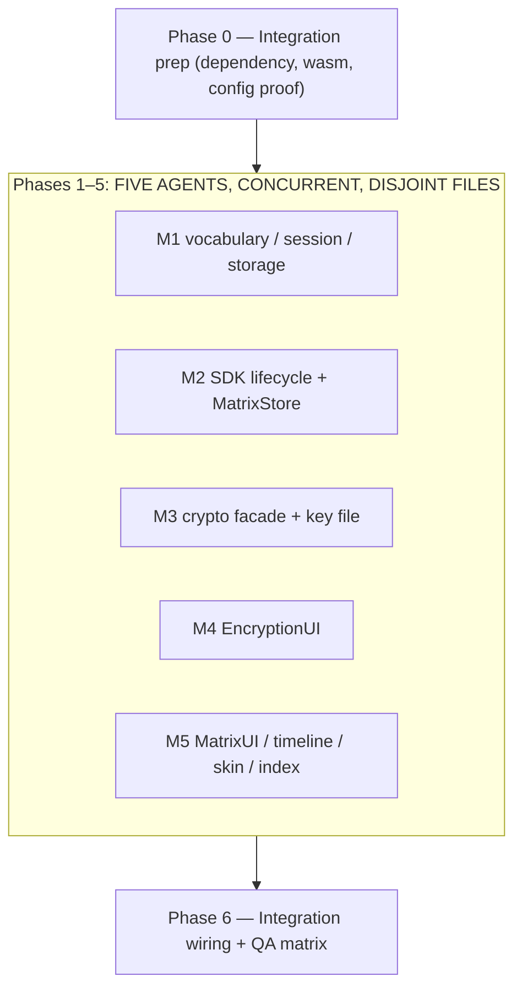
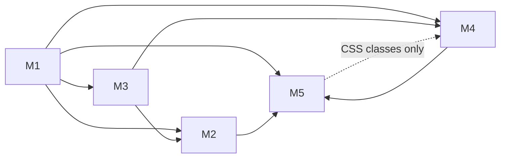

# Work Plan: Matrix E2EE — Official SDK Transport Swap

- **Status**: Not started
- **Mode**: modify (replaces the transport of an existing, uncommitted feature)
- **Date**: 2026-08-07
- **Owner**: eric.stampa@uponu.com
- **Design Doc**: `docs/design/matrix-e2ee-design.md`
- **Superseded design**: `docs/design/matrix-chat-design.md` §1, §2 (SUPERSEDED notes already in place)
- **Predecessor plan**: `docs/plans/matrix-chat-plan.md` (the feature this modifies)
- **Test skeletons**: none. This feature has **no automatable lane** in this repo — see *E2E Gap Check*.

## Implementation Strategy

**Strategy C (contract-first parallel build).** Five modules are built **concurrently by five agents in
one working tree**, coordinating only through TypeScript export signatures fixed in advance. The seam
between them is not discovered during implementation; it is frozen here, in this document, before any
agent starts. A signature mismatch is the single most likely way this run fails, so every cross-module
symbol appears **verbatim in both the producing and the consuming module's brief**.

Why parallel rather than the usual vertical slices: the change is a transport swap behind an existing,
already-shipped UI. The UI seam (recon A) and the SDK surface (recon B, re-verified against the
installed package during design review) are both fully known, so there is no discovery risk that
sequencing would buy down. What sequencing *would* cost is real: `store.ts` (620 LoC) and
`MatrixUI.ts` (1,725 LoC) are on the critical path of every other file.

**Hard partition rule.** No two modules may name the same file. `MatrixUI.ts` — the highest-contention
file in the feature — is owned by exactly one module (M5). The new Encryption/key-management view is a
**separate file in a separate module** (M4, `EncryptionUI.ts`), which M5 merely mounts through a
four-method handle; this was chosen over folding it into M5 because the seam is genuinely clean (the
view owns its own DOM subtree, takes a hooks object, and never reaches into the panel's router).

**Everything outside `client/src/matrix/` is integration**, performed once, by one agent, after or
alongside the modules: `client/package.json`, `client/vite.config.ts`, `client/src/scenes/OfficeScene.ts`,
`client/src/ui/paSkin.ts`, `desktop/**`, `server/**`. No module may touch any of them.

## Verification Strategy (from Design Doc §11)

- **Correctness definition**: (1) every member of the recon-A seam still exists with its exact
  signature, so the seven surviving views render unchanged; AND (2) encrypted rooms are readable and
  writable, with undecryptable events rendering an honest typed reason and never a blank row or the
  SDK's internal error string; AND (3) sign-out provably removes every named storage artifact.
- **Verification method**: `pnpm -r run check-types` + `pnpm build` as the mechanical gate (they catch
  every signature mismatch between the five modules, which is this plan's dominant failure mode);
  everything behavioural is a **manual matrix** across Chrome, Firefox and the Electron shell, run
  against a real homeserver and a real Element client.
- **Verification timing**: the typecheck gate runs at every module merge point; the manual matrix runs
  once, after integration, in the order given in §11 of the design (wasm-on-`app://` and CORS-from-
  `app://bundle` **first**, because they are ship/no-ship).
- **Early verification point (before any UI work is trusted)**: boot the panel against a real account
  and confirm (a) the wasm loads on `app://bundle`, and (b) an encrypted room renders *something honest*
  in every row. Failure of (a) triggers the §6.3 contingency (which also adds a manifest line);
  failure of (b) means §4.3's predicate dispatch was not implemented and is a blocking defect, not a
  polish item.

## Proof Strategy

- **Proof obligation source**: the design doc's numbered artifacts — §2.4's ten wipe steps, §4.3's
  taxonomy and predicate order, §4.7's two hard rules, §5.5's state table, §7's cross-environment
  matrix, §11's twelve verification items.
- **Per-task rule**: every task records the observable it must produce and the failure mode it guards.
  Three obligations are **irreversible if wrong** and are called out per-task in bold: never passing
  `setupNewCrossSigning`, gating `setupNewKeyBackup` on `getKeyBackupInfo() === null`, and deleting
  `pa-mx-ck:<ns>` *before* the databases.

## Review Scope

Planned-files scope, derived from Design Doc §3.4 and partitioned by owning module. **These lists are
exclusive: a path appears exactly once.**

| Module | Files owned |
|---|---|
| **M1 — vocabulary, session, storage** | `client/src/matrix/sdk.ts` (new), `client/src/matrix/types.ts` (rewrite), `client/src/matrix/sessionProbe.ts` (new), `client/src/matrix/session.ts` (rewrite), `client/src/matrix/storage.ts` (new), `client/src/matrix/api.ts` (**delete**) |
| **M2 — SDK lifecycle + MatrixStore** | `client/src/matrix/client.ts` (new), `client/src/matrix/store.ts` (new), `client/src/matrix/sync.ts` (**delete**) |
| **M3 — crypto facade + key file** | `client/src/matrix/crypto.ts` (new), `client/src/matrix/keyfile.ts` (new) |
| **M4 — encryption view** | `client/src/matrix/EncryptionUI.ts` (new) |
| **M5 — panel, timeline, skin, surface** | `client/src/matrix/MatrixUI.ts`, `client/src/matrix/timeline.ts`, `client/src/matrix/matrixSkin.ts`, `client/src/matrix/index.ts` |
| **Integration (single agent, not a module)** | `client/package.json`, `client/vite.config.ts` (expected: no change), `client/src/scenes/OfficeScene.ts` |

**Preserved unchanged (no-ripple, release gate)**: `server/**`, `desktop/**`, `shared/**`,
`client/src/ui/paSkin.ts`, `client/index.html`, `pnpm-workspace.yaml`, every non-Matrix client module.
`index.ts`'s **public** surface (`createMatrixClient(mount, hooks) -> MatrixClientHandle`) is
byte-identical before and after; only its internal wiring changes.

## Adopted Quality Assurance Mechanisms

| Mechanism | Enforces | Config | Covers | Status |
|-----------|----------|--------|--------|--------|
| `pnpm -r run check-types` (strict `tsc --noEmit`) | **the five-module contract** — every declared cross-module signature, every SDK call shape | `tsconfig.base.json` | project-wide | adopted (primary gate) |
| `pnpm build` (`vite build`) | the SDK + 7.8 MB wasm bundle and emit; the lazy-chunk boundary | `client/vite.config.ts` (unmodified) | `client/` | adopted |
| `.claude/skills/mmo-readiness/check.sh` | AGENTS invariants; check 3 (banned engines in any `package.json`) with the new dependency | repo skill | project-wide | adopted |
| Grep gates (Design §11.4) | deep imports confined to `sdk.ts`; no `setupNewCrossSigning`; no secret in `console.*`; no `window.location` in `client/src/matrix`; the two-hit host-import gate | manual / CI-able one-liners | `client/src/matrix`, `client/src` | adopted |
| Chunk gate (Design §11.3) | `matrix-js-sdk` appears in **no** chunk reachable without `import('../matrix/index.js')`; main entry grows ≤ ~2 kB | `client/dist` inspection after build | `client/` | adopted |
| Automated unit/integration tests | — | — | — | **noted (absent)** — see below |
| ESLint / CI pipeline | — | — | — | noted (none present in repo; not introduced here) |

## E2E Gap Check

- **fixture-e2e**: absent — `e2eAbsenceReason.fixtureE2e`: the user journey (sign in to a homeserver →
  open an encrypted room → import a key file → unlock 4S → sign out) is **not automatable in this
  environment**. There is no browser/Electron headless harness in this repo, the flow requires a live
  homeserver *and* a second real Matrix client (Element) for the interop gate, and the decisive
  assertions are visual (a row shows an honest reason) and storage-level (DevTools → Application).
  Covered by the manual matrix in Phase 6. **Gap check skipped for this lane** (reason carries a value).
- **service-integration-e2e**: absent — `e2eAbsenceReason.serviceE2e`: `no_real_service_dependency` **on
  our side**. This feature adds **zero** server endpoints, Colyseus messages, schema fields and
  `permissions.ts` capabilities (Design §8.3); the only remote service is the user's third-party
  homeserver, which is out of this repo's control. **Gap check skipped for this lane.**
- **`keyfile.ts` is the one module that *could* carry a unit test** (pure functions, no DOM, no SDK)
  and the repo has no client test runner. Introducing one for a single file is not proportionate; its
  correctness is instead proven by the **Element interop gate** (Design §11.5), which is a stronger
  test than any unit test we would have written — a round-trip against the reference implementation.
  This is a deliberate trade, recorded rather than glossed.

## Failure Mode Checklist

| Category | Applies? | Covering task(s) | Notes |
|----------|----------|------------------|-------|
| same-value (operation with identical before/after) | Yes | T5.2, T2.4 | Re-rendering a room whose `MxRoom` did not change must not rebuild message rows (keyed diffing) or scroll-jump; a `status` emit with an unchanged value must not storm the UI. |
| no-op (action produces no observable change) | Yes | T1.5, T2.6 | Deleting a non-existent IndexedDB database is a no-op by design; `start()` is idempotent; `release()` on an already-released Web Lock is a no-op. |
| empty input | Yes | T3.3, T4.3, T5.4 | Empty passphrase / empty recovery key / empty composer → inline validation, no SDK call; a key file containing an empty array → *"The file contained no keys."* not "Imported 0 keys." |
| invalid option | Yes | T3.3, T2.5 | Wrong file-passphrase → HMAC mismatch → *"That passphrase didn't open the file."*; a non-Element file → *"That doesn't look like an Element room-key export."*; unparsable join input → `MatrixError(0,'M_BAD_INPUT')`. |
| missing config | Yes | T2.2, T3.2 | No IndexedDB → memory-only crypto + warn banner, **never** no-crypto; no 4S on the account → `never-set-up`, not an error; no key backup → *"Not connected"*, not a failure. |
| unavailable boundary | Yes | T2.3, T2.6, T6.2 | Homeserver unreachable → `reconnecting` with a Retry link, never a hang; `deleteDatabase` blocked → 3 s timeout → the §2.4/9 banner, never a silent success; wasm fetch fails → `status='offline'` with a named reason. |
| shared-state dependency | Yes | T2.2, T1.5 | Two tabs share one IndexedDB origin — the Web Lock is the whole mitigation; two pixel-agents users share one profile — the namespace is (§2.7 is explicit about what that does and does not buy). |
| rollback-only visibility | Yes | T3.4 | A failed 4S unlock must leave the SDK's broker promise **unsettled** so the user gets another try; the only observable is that the pending operation has not failed. |
| missing-sort-key ordering | Yes | T2.4 | The room-list sort (unread first, then `lastTs` desc, `lastTs === 0` last by roomId) must be reimplemented exactly; rooms with no events are the degenerate case. |
| irreversible-side-effect | **Yes — new** | T3.2, T3.5, T1.5 | Three operations cannot be undone: resetting cross-signing, resetting a key backup, and deleting a crypto store. Two are **forbidden** (§5.4) and the third is gated behind a confirm dialog that states the consequence. |

## Design-to-Plan Traceability

Source DD path for every row: `docs/design/matrix-e2ee-design.md`.

### Technical Requirements (DD sections)

| # | DD Item | Category | DD § | Covering Task | Gap Status |
|---|---------|----------|------|---------------|------------|
| 1 | `sdk.ts` re-export shim; deep imports confined to one file; SDK `MatrixError` aliased | prerequisite | §1.1 | T1.1 | covered |
| 2 | `createClient` shape (validated `baseUrl`, `MemoryStore`, `timelineSupport`, `useAuthorizationHeader`, `cryptoCallbacks`) | implementation-target | §1.1 | T2.1 | covered |
| 3 | Boot order 1–6, incl. `pendingEventOrdering: Detached` and explicit `globalBlacklistUnverifiedDevices = false` | contract-change | §1.1 | T2.1, T2.2 | covered |
| 4 | `MemoryStore` for sync, IndexedDB for crypto only | verification | §1.2 | T2.1 | covered |
| 5 | `initRustCrypto({useIndexedDB, cryptoDatabasePrefix, storageKey})` + memory fallback | implementation-target | §1.3 | T2.2 | covered |
| 6 | `device_id`: new device on fresh login; reuse only on `soft_logout` | contract-change | §1.4 | T1.3, T2.3 | covered |
| 7 | Web Lock single-writer; no cross-tab handover; loud degrade when absent | implementation-target | §1.5 | T2.2 | covered |
| 8 | Namespace `ns` incl. the `pa-mx-nsgen` salt | implementation-target | §2.1 | T1.4 | covered |
| 9 | The exact key/database table | contract-change | §2.2 | T1.4, T1.5 | covered |
| 10 | Names are **derived**, not discovered (the `databases()` recorder is deleted) | contract-change | §2.3 | T1.5 | covered |
| 11 | Ten-step wipe, `pa-mx-ck` first, `clearStores({cryptoDatabasePrefix})`, 3 s timeouts, non-dismissable failure banner | implementation-target | §2.4 | T1.5, T2.6, T5.6 | covered |
| 12 | Boot drain + refusal + **"Start fresh" escape hatch** | implementation-target | §2.6 | T1.5, T2.2, T5.6 | covered |
| 13 | Requirement-F boundary at pixel-user switch, stated | verification | §2.7 | T6.5 | covered |
| 14 | Every seam member survives verbatim | contract-change | §3.1 | T2.4, T2.5, T5.1 | covered |
| 15 | Shape changes: `MatrixApi` dies, gaps die, `heroes` dies, `warning` replaces `encrypted`, `decryptError`/`decrypting` added | contract-change | §3.2 | T1.2, T2.4, T5.3 | covered |
| 16 | SDK→seam mapping incl. full `SyncState` and full `EventStatus` coverage | implementation-target | §3.3 | T2.3, T2.4, T2.5 | covered |
| 17 | `MatrixError.from()` at every store boundary | contract-change | §3.3 | T1.2, T2.5 | covered |
| 18 | Sends encrypt automatically; composer guard deleted | contract-change | §4.1 | T5.4 | covered |
| 19 | Late-key repaint via `Decrypted`; **no** retry-decryption button | implementation-target | §4.2 | T2.4, T5.3 | covered |
| 20 | §4.3 predicate dispatch + the corrected taxonomy + the `decrypting` state | contract-change | §4.3 | T2.4, T5.3 | covered |
| 21 | Room-list preview via the same predicates | implementation-target | §4.4 | T2.4 | covered |
| 22 | Encryption-state display: lock copy, banner only when wrong, mid-session flip | implementation-target | §4.5, §4.6 | T5.4 | covered |
| 23 | The two hard rules (never claim readable, never silently drop) | verification | §4.7 | T5.3, T6.3 | covered |
| 24 | `encryption` view: routing, 🔐 button + attention dot, three entry points | implementation-target | §5.1 | T4.1, T5.5 | covered |
| 25 | `cryptoState` machine, all seven states | contract-change | §5.2, §5.5 | T3.2, T4.2 | covered |
| 26 | C1 key-file envelope, byte-compatible with Element | implementation-target | §5.3 | T3.1 | covered |
| 27 | C1 import/export rows (Mumble-look, `<input type=file>`, `<a download>`) | implementation-target | §5.3 | T4.3 | covered |
| 28 | C1 import progress as a **discriminated union**; no fabricated counts | contract-change | §5.3 | T3.5, T4.3 | covered |
| 29 | C2 broker resolves `null`, never rejects | contract-change | §5.4 | T3.4 | covered |
| 30 | C2 unlock: recovery key **or** phrase, `checkKey`, `wrong-key` without settling | implementation-target | §5.4 | T3.4, T4.4 | covered |
| 31 | C2 `never-set-up`: **no** `setupNewCrossSigning`; `setupNewKeyBackup` gated on `getKeyBackupInfo()` | contract-change | §5.4 | T3.2 | covered |
| 32 | C2 backup: `loadSessionBackupPrivateKeyFromSecretStorage` before `restoreKeyBackup`; real counts | implementation-target | §5.4 | T3.5, T4.4 | covered |
| 33 | D device panel: id, fingerprint, trust, other devices, sign-out copy | implementation-target | §5.6 | T3.6, T4.5 | covered |
| 34 | SAS out of scope + the honest `VerificationRequestReceived` notice | verification | §5.7 | T4.5 | covered |
| 35 | `client/package.json` gains exactly one line; **no** workspace change | connection/setup | §6.1 | T0.1 | covered |
| 36 | **No `vite.config.ts` change** (proven); dev-server pre-bundling verified before deciding | verification | §6.2 | T0.2, T6.1 | covered |
| 37 | Wasm emission + MIME on Express and `app://`; the `initAsync` contingency and its manifest cost | verification | §6.3 | T0.3, T6.1 | covered |
| 38 | No vendoring script | verification | §6.4 | T0.3 | covered |
| 39 | Lazy-chunk boundary + the `OfficeScene` `session.js` defect fix | contract-change | §6.5 | T0.4, T6.6 | covered |
| 40 | Secret handling: never persisted, never logged, never a `value=` attribute, cleared on use, `Uint8Array` zeroed | verification | §8.1 | T3.3, T3.4, T4.3, T4.4, T6.4 | covered |
| 41 | Homeserver-URL trust unchanged; no `window.location`; no cookie/bearer to the homeserver | verification | §8.2 | T1.3, T6.4 | covered |
| 42 | Zero server surface; `mmo-readiness` naming rule | verification | §8.3 | T6.7 | covered |

### Acceptance Criteria → Requirements A–F

| AC | Requirement | Verification lane | Covering Task |
|----|-------------|-------------------|---------------|
| AC-001 `api.ts` and `sync.ts` are deleted; no file under `client/src/matrix/` performs a hand-rolled CS-API `fetch` except `session.ts`'s login/discovery | A | code read + grep | T1.1, T1.3, T2.7 |
| AC-002 every recon-A seam member exists with its exact signature; `index.ts`'s public surface is unchanged | A | `check-types` + code read | T2.4, T2.5, T5.1 |
| AC-003 an encrypted room's composer is enabled and a sent message arrives decrypted in Element | B | manual | T5.4, T6.3 |
| AC-004 no timeline row is ever blank, and no row ever contains `Unable to decrypt:` | B | manual + DOM grep | T2.4, T5.3, T6.3 |
| AC-005 a key file exported from Element imports here and makes UTD rows readable; a file exported here imports into Element | C1 | manual (interop gate) | T3.1, T4.3, T6.3 |
| AC-006 the recovery key **or** the security phrase unlocks 4S; a wrong one shows `wrong-key` and allows a retry | C2 | manual | T3.4, T4.4, T6.3 |
| AC-007 "Set up recovery" on an account that already has cross-signing and/or a key backup leaves both **unchanged** | C2 | manual (throwaway account first) | T3.2, T6.3 |
| AC-008 device id + ed25519 fingerprint + trust shown; other devices listed; sign-out works and states its consequence | D | manual | T3.6, T4.5 |
| AC-009 the wasm loads and an encrypted room is readable in Chrome, Firefox **and** the Electron `app://bundle` shell | E | manual ×3 | T6.1, T6.2 |
| AC-010 `matrix-js-sdk` appears in no chunk reachable without `import('../matrix/index.js')`; main entry grows ≤ ~2 kB | E | build inspection | T0.4, T6.6 |
| AC-011 sign-out removes **all** of: `pa-mx:<paUserId>`, `pa-mx-ck:<ns>`, both `pa-mx-crypto:<ns>::*` databases, `pa-mx-view`, every `pa-mx-draft:*` | F | manual (DevTools) | T1.5, T2.6, T6.5 |
| AC-012 a blocked delete produces the non-dismissable banner, never a silent success; a subsequent boot drains or offers "Start fresh" | F | manual (second tab holding a connection) | T1.5, T2.2, T5.6, T6.5 |

## Reference Contract Values

Values that **must** appear literally in the implementation. Copy them; do not retype from memory.

1. Dependency: `"matrix-js-sdk": "^42.1.0"` in `client/package.json` `dependencies`. Nothing else.
2. Session storage key: `` `pa-mx:${paUserId || '_'}` `` (unchanged from today).
3. Crypto storage key: `` `pa-mx-ck:${ns}` ``; namespace salt: `` `pa-mx-nsgen:${paUserId || '_'}` ``;
   pending wipes: `pa-mx-wipe-pending`; pin: `pa-mx-pinned`; view/drafts: `pa-mx-view`,
   `pa-mx-draft:<roomId>` (both `sessionStorage`).
4. Crypto database prefix: `` `pa-mx-crypto:${ns}` `` → databases `<prefix>::matrix-sdk-crypto` and
   `<prefix>::matrix-sdk-crypto-meta` (hardcoded in `lib/client.js:715`).
5. Web Lock name: `` `pa-mx-crypto:${ns}` `` (same string as the prefix), `mode: 'exclusive'`,
   `ifAvailable: true`.
6. `startClient` options: `{ initialSyncLimit: 20, lazyLoadMembers: true, threadSupport: false,
   pollTimeout: 30000, pendingEventOrdering: PendingEventOrdering.Detached }`.
7. Key-file header/footer: `-----BEGIN MEGOLM SESSION DATA-----` / `-----END MEGOLM SESSION DATA-----`;
   body layout `0x01 || salt[16] || iv[16] || rounds(BE u32) || AES-256-CTR ciphertext || HMAC-SHA-256[32]`;
   KDF `PBKDF2-HMAC-SHA-512`, 500 000 rounds, 64 bytes → `[0..32)` AES key, `[32..64)` HMAC key;
   AES-CTR `counter = iv`, `length = 64`; `iv[8] &= 0x7f` on export; base64 wrapped at 64 columns.
8. Export filename: `pixel-agents-matrix-keys-<localpart>-YYYY-MM-DD.txt`, localpart sanitised to
   `[a-z0-9._-]`.
9. Pixel design tokens (AGENTS.md; the deprecated blue palette is forbidden): font
   `'FS Pixel Sans', ui-monospace, monospace`; panel `#1c1a19`; raised `#242220`; inset `#262422`;
   deep-inset `#141312`; segment-on `#37342f`; border **always** `2px solid #0a0908`; bevel
   `inset 0 2px 0 #4a4744, inset 0 -3px 0 #050505`; text `#f1efec`/`#f5f3f0`; muted `#adb0b2`;
   dim `#818586`; link `#4998c0`; primary red `#c51a1b` (`#e2585a`/`#5c0f10`); danger `#7c2634`
   (`#b34a5a`/`#45111a`); warn `#a86a2e`; live `#7fbf6a`/`#5aa348`; highlight `#e7da00`; radius
   `0.35–0.45rem` buttons, `0.6rem` panels.
10. Forbidden SDK argument: `setupNewCrossSigning` — never passed, anywhere, with any value.
11. Conditional SDK argument: `setupNewKeyBackup: (await crypto.getKeyBackupInfo()) === null`.

## Connection Map

| # | Producer | Consumer | Carrier |
|---|---|---|---|
| 1 | M1 `types.ts` | M2, M3, M4, M5 | the entire seam vocabulary (`MxEvent`, `MxRoom`, `MatrixError`, …) |
| 2 | M1 `sdk.ts` | M2, M3 | every `matrix-js-sdk` symbol, incl. the deep crypto-api imports |
| 3 | M1 `storage.ts` | M2 | namespace derivation, storage key, the wipe and the drain |
| 4 | M1 `session.ts` | M2, M5 | `MxSession` load/save/clear, login/discovery, `describeError` |
| 5 | M1 `sessionProbe.ts` | **integration** (`OfficeScene.ts`, static import) | `hasMatrixSession(paUserId)` |
| 6 | M3 `crypto.ts` | M2 (`cryptoCallbacks`, `attach`), M4 (the whole facade), M5 (`cryptoState` only, via the store) | `MatrixCrypto` |
| 7 | M3 `keyfile.ts` | M4 | the Element envelope codec |
| 8 | M2 `client.ts` | M2 `store.ts` | `bootMatrixClient` → `MxClientBoot` |
| 9 | M2 `store.ts` | M5 | `MatrixStore` — the §4a–§4h contract plus two new events |
| 10 | M4 `EncryptionUI.ts` | M5 | `createEncryptionView(hooks) -> EncryptionViewHandle` |
| 11 | M5 `matrixSkin.ts` | M4 | the `.mx-*` CSS classes M4 is permitted to use (M4 injects **no** CSS) |
| 12 | M5 `index.ts` | **integration** (`OfficeScene.ts`, dynamic import) | `createMatrixClient` — unchanged |

## Phase Structure Diagram

Contract direction inside the parallel block (declared, not sequenced — every agent codes against the
signatures in this document, not against another agent's output):

---

## Phase 0: Integration prep

Runs first because every module typechecks against the installed SDK.

- [ ] **T0.1 — Install the dependency**
  - `pnpm add --filter @pixel/client matrix-js-sdk@^42.1.0`. Confirm the lockfile records
    `matrix-js-sdk@42.1.0` and `@matrix-org/matrix-sdk-crypto-wasm@18.4.0`, that **no** build script was
    blocked, and that no `pnpm-workspace.yaml` `allowBuilds` / `minimumReleaseAgeExclude` entry was
    needed.
  - **Proof Obligations**: exactly one line added to `client/package.json`; `pnpm-workspace.yaml`
    untouched (Reference #1).
  - **Completion**: install clean; `node_modules/.pnpm/matrix-js-sdk@42.1.0` present.

- [ ] **T0.2 — Prove the build config needs no change**
  - Do **not** edit `client/vite.config.ts`. Recon B's probe built the whole SDK + rust-crypto + the
    7.8 MB wasm against the unmodified config. Re-confirm after the modules land (T6.6), and add
    configuration **only** if a build actually fails, with a comment naming the failure.
  - Separately verify `pnpm dev:client`: esbuild pre-bundling is the one path the probe did not cover.
    If and only if dev breaks, add `optimizeDeps: { exclude: ['@matrix-org/matrix-sdk-crypto-wasm'] }`.
  - **Proof Obligations**: `git diff client/vite.config.ts` is empty at ship, or carries exactly one
    commented exclusion justified by an observed failure.

- [ ] **T0.3 — Verify `.wasm` serving on both origins (read-only)**
  - Express: `server/src/index.ts:216` is a bare `express.static(clientDist)`; serve-static → send →
    mime-db 1.54.0 maps `.wasm` → `application/wasm`. Confirm by fetching the emitted asset from a
    running server and reading the `Content-Type` header.
  - Electron: `desktop/src/main.ts:58` maps `'.wasm'` → `'application/wasm'` and `main.ts:421` registers
    `app://` as `{ standard: true, secure: true, supportFetchAPI: true, stream: true }`. Confirm by
    reading those lines and then by an actual load in the shell (T6.1).
  - **No vendoring script.** The wasm is inside the module graph; Vite fingerprints and URL-rewrites it.
  - **Proof Obligations**: both origins observed serving `application/wasm`; `server/**` and `desktop/**`
    diffs empty.

- [ ] **T0.4 — Record the pre-change bundle baseline**
  - Build once before the modules land and record the main entry chunk's size, so T6.6's ≤ ~2 kB growth
    gate is measured, not asserted.

---

## Phase 1 (M1): Vocabulary, session, storage

Owns `sdk.ts`, `types.ts`, `sessionProbe.ts`, `session.ts`, `storage.ts`, and **deletes** `api.ts`.

- [ ] **T1.1 — `sdk.ts`: the single deep-import boundary**
  - Re-export the root namespace and the crypto-api symbols; alias the SDK's own `MatrixError` to
    `SdkMatrixError`. No other file in the repo may contain the substring `matrix-js-sdk/lib`.
  - **Proof Obligations**: grep gate (Design §11.4) — one match, in this file.
- [ ] **T1.2 — `types.ts`: the seam vocabulary + `MatrixError.from()`**
  - Delete `PA_GAP_TYPE`, the five wire types, and `MxRoom.heroes`. Add `MxDecryptError`,
    `MxEvent.decrypting?`/`decryptError?`, `MxCryptoState`, `MxDeviceInfo`, `MxKeyImportResult`,
    `MxSecretRequest`. Add the static `MatrixError.from(e)`.
  - **Proof Obligations**: `from()` maps `SdkMatrixError` (`errcode`, `httpStatus`,
    `data.retry_after_ms`, `data.soft_logout`) and `ConnectionError` (→ `status: 0`); an already-`MatrixError`
    value passes through identically. Without this, `joinErrText`'s `instanceof` silently stops matching.
- [ ] **T1.3 — `session.ts`: keep the first-party login/discovery, drop `MatrixApi`**
  - Replace the two `MatrixApi` call sites with plain `fetch` against the **validated** base URL.
    `normaliseHomeserverUrl` still guards both the typed input and the discovered `base_url`.
    `loginWithPassword` no longer receives `deviceId` on a fresh login (§1.4). `describeError` runs
    `MatrixError.from()` at its head.
  - **Proof Obligations**: no `credentials: 'include'`; no `window.location`; https-only except
    `localhost`/`127.0.0.1`/`[::1]`; the five error strings recon A catalogued are byte-identical.
- [ ] **T1.4 — `storage.ts` part 1: namespace + storage key**
  - FNV-1a over `` `${paUserId||'_'} ${hsOrigin} ${mxUserId} ${nsgen}` ``; 32 random bytes via
    `crypto.getRandomValues`, base64 in `pa-mx-ck:<ns>`.
- [ ] **T1.5 — `storage.ts` part 2: the ten-step wipe and the drain**
  - **Irreversible-operation task.** `pa-mx-ck:<ns>` is removed **before** any database delete, so a
    surviving database is undecryptable. `clearStores` is called **with** `{ cryptoDatabasePrefix }`.
    Names are **derived**, never discovered — the `indexedDB.databases()` diff recorder is not
    implemented (it could delete arcade saves). 3 s timeout per delete; failures → `pa-mx-wipe-pending`
    and a non-silent result.
  - **Proof Obligations**: AC-011, AC-012; no-op on a non-existent database; the `startFresh` salt bump.
- [ ] **T1.6 — Delete `client/src/matrix/api.ts`**

---

## Phase 2 (M2): SDK lifecycle + MatrixStore

Owns `client.ts`, `store.ts`, and **deletes** `sync.ts`.

- [ ] **T2.1 — `client.ts`: `createClient` + boot order**
  - Boot order 1–6 exactly (§1.1). `MemoryStore`, `timelineSupport`, `useAuthorizationHeader`,
    `pendingEventOrdering: Detached`.
- [ ] **T2.2 — `client.ts`: Web Lock, `initRustCrypto`, memory fallback, wipe drain**
  - Lock → drain → `initRustCrypto` → explicit `globalBlacklistUnverifiedDevices = false` → `startClient`.
    No lock → `'locked-out'`. Pending wipe intersecting `ns` → `'wipe-pending'` with the "Start fresh"
    affordance. IndexedDB refused → `useIndexedDB: false` + `'memory'`, **never** no-crypto.
- [ ] **T2.3 — `store.ts`: status, reconnect, logged-out**
  - Full `SyncState` coverage incl. `Catchup`; `Stopped` keeps the prior status unless we initiated the
    sign-out. `HttpApiEvent.SessionLoggedOut` → `loggedOut {expired:true}`; soft-logout keeps the device.
- [ ] **T2.4 — `store.ts`: rooms, timeline, the §4.3 predicate dispatch**
  - **The highest-risk task in the plan.** Classification order is
    `isBeingDecrypted()` → `isDecryptionFailure()` → normal, plus the `m.bad.encrypted` belt-and-braces
    guard. `getType()` must not appear in any decryption branch.
- [ ] **T2.5 — `store.ts`: send/echo, room actions, `MatrixError.from` at every boundary**
  - Exhaustive `switch` over all six `EventStatus` members.
- [ ] **T2.6 — `store.ts`: `logout()` → the §2.4 sequence**
- [ ] **T2.7 — Delete `client/src/matrix/sync.ts`**

---

## Phase 3 (M3): Crypto facade + key file

Owns `crypto.ts`, `keyfile.ts`. **No DOM in either file.**

- [ ] **T3.1 — `keyfile.ts`: the Element envelope, both directions**
  - Verify HMAC **before** decrypting and before parsing any JSON. Zero derived key material after use.
  - **Proof Obligations**: AC-005 (the interop gate is the real test).
- [ ] **T3.2 — `crypto.ts`: the `cryptoState` machine and `never-set-up` bootstrap**
  - **Irreversible-operation task.** `setupNewCrossSigning` is never passed;
    `setupNewKeyBackup` only when `getKeyBackupInfo() === null`.
  - **Proof Obligations**: AC-007, run against a throwaway account first.
- [ ] **T3.3 — `crypto.ts`: import/export room keys**
- [ ] **T3.4 — `crypto.ts`: the 4S broker and unlock**
  - The broker resolves `null` on cancel/timeout and **never rejects**. A wrong key leaves the broker
    promise unsettled so the user gets another attempt.
- [ ] **T3.5 — `crypto.ts`: key backup**
  - `loadSessionBackupPrivateKeyFromSecretStorage()` then `checkKeyBackupAndEnable()` before
    `restoreKeyBackup()` is reachable. Progress is a discriminated union.
- [ ] **T3.6 — `crypto.ts`: device info**

---

## Phase 4 (M4): The encryption view

Owns `EncryptionUI.ts` only. Injects **no** CSS.

- [ ] **T4.1 — Shell, groups and the handle**
- [ ] **T4.2 — State rendering for all seven `cryptoState` values** (§5.5)
- [ ] **T4.3 — ROOM KEY FILE group** — Mumble-look row, `<input type="file">`, `<a download>` blob
- [ ] **T4.4 — RECOVERY + KEY BACKUP groups**
- [ ] **T4.5 — DEVICE groups + the SAS honesty notice**

---

## Phase 5 (M5): Panel, timeline, skin, surface

Owns `MatrixUI.ts`, `timeline.ts`, `matrixSkin.ts`, `index.ts`.

- [ ] **T5.1 — `MatrixUI.ts`: retarget the store seam** (`./store.js`, drop the `api` field)
- [ ] **T5.2 — `timeline.ts`: delete the gap machinery**
- [ ] **T5.3 — `timeline.ts`: render `decrypting` / `decryptError`; `opts.warning`**
- [ ] **T5.4 — `MatrixUI.ts`: un-gate the composer, retruth the lock copy**
- [ ] **T5.5 — `MatrixUI.ts`: the `encryption` view, the 🔐 button, routing**
- [ ] **T5.6 — `MatrixUI.ts`: boot states, the wipe banner, "Start fresh"**
- [ ] **T5.7 — `matrixSkin.ts`: add the new classes, reuse the rest**
- [ ] **T5.8 — `index.ts`: internal wiring only; the public surface is byte-identical**

---

## Phase 6: Integration wiring + QA (final)

Single agent. Every task here touches files **outside** `client/src/matrix/`, or nothing at all.

- [ ] **T6.1 — The two ship/no-ship cells first**: `WebAssembly.instantiateStreaming` on `app://bundle`,
  and a homeserver CORS preflight from `Origin: app://bundle`. Failure of the first → the §6.3
  contingency (which adds a pinned `@matrix-org/matrix-sdk-crypto-wasm` line to `client/package.json`).
- [ ] **T6.2 — Cross-environment matrix** (Design §7) across Chrome, Firefox and Electron, with
  Firefox's PBKDF2-SHA-512 / AES-CTR support tested explicitly and early.
- [ ] **T6.3 — Behavioural matrix**: AC-003 … AC-008, including the Element interop gate both
  directions, the late-key repaint with **no** user click, and every §5.5 state.
- [ ] **T6.4 — Secret-handling audit** (Design §8.1) — grep + DOM inspection.
- [ ] **T6.5 — Requirement F, as an explicit test** (AC-011, AC-012), including the second-tab variant.
- [ ] **T6.6 — `OfficeScene.ts` + bundle gates**: replace the dynamic `import('../matrix/session.js')`
  with the static `import { hasMatrixSession } from '../matrix/sessionProbe.js'`; re-run the chunk gate
  and the two-hit import gate.
- [ ] **T6.7 — Ship gates**: `pnpm -r run check-types`, `pnpm build`,
  `.claude/skills/mmo-readiness/check.sh` (no hard failures), and the regression list from the
  superseded plan (docked panel, zone-chat focus, WASD blocking, F8).

---

## Progress Tracking

| Phase | Tasks | Done | Status |
|---|---|---|---|
| 0 — Integration prep | 4 | 0 | Not started |
| 1 — M1 vocabulary/session/storage | 6 | 0 | Not started |
| 2 — M2 lifecycle + store | 7 | 0 | Not started |
| 3 — M3 crypto + key file | 6 | 0 | Not started |
| 4 — M4 encryption view | 5 | 0 | Not started |
| 5 — M5 panel/timeline/skin | 8 | 0 | Not started |
| 6 — Integration + QA | 7 | 0 | Not started |

**Do not commit or push.** Everything stays in the working tree (task instruction; AGENTS "Commits").
