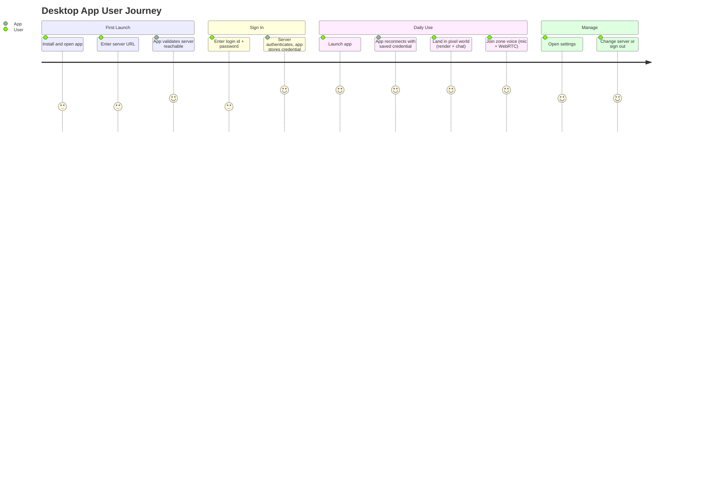
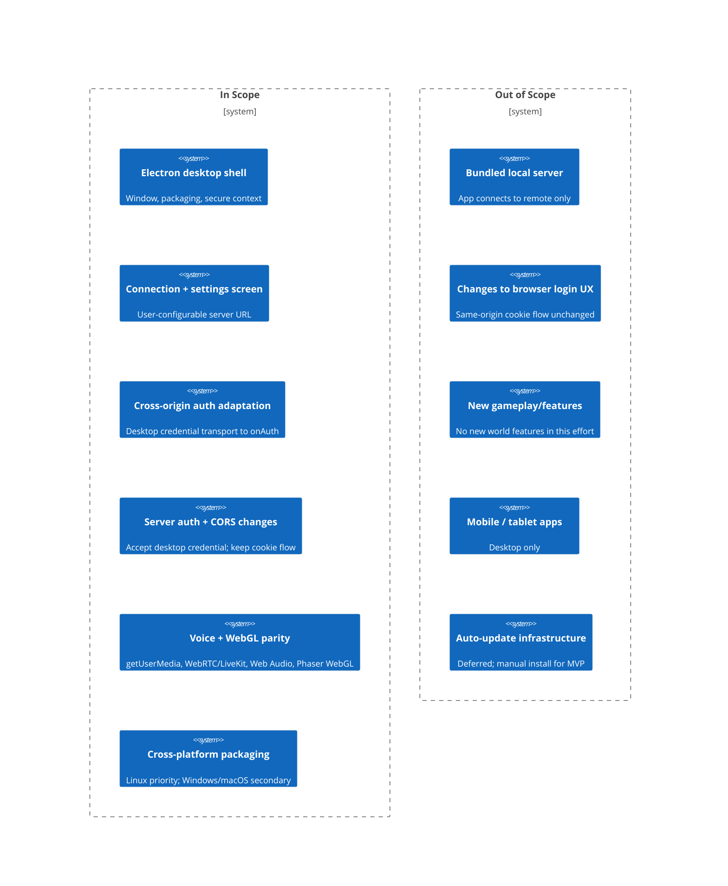

# PRD: Desktop Application (Electron)

- **Status**: Draft
- **Version**: 1.1.0
- **Date**: 2026-07-01
- **Owner**: eric.stampa@uponu.com
- **Operation Mode**: update

## Change History

| Version | Date | Author | Change |
|---------|------|--------|--------|
| 1.0.0 | 2026-07-01 | eric.stampa@uponu.com | Initial PRD for the Electron desktop application. |
| 1.1.0 | 2026-07-01 | eric.stampa@uponu.com | Resolve reviewer conditions: (1) confirm conference voice in-scope for desktop MVP parity by adding AC-021 under FR-4 and making all four of Success Metric 1's parity areas (sign-in, world rendering, zone voice, conference voice) traceable to acceptance criteria; (2) add an explicit "measured before release" (per release-candidate manual-test-matrix) timeframe to every Quantitative Metric. Hard constraint (existing browser cookie login unchanged) preserved. |

## Overview

### One-line Summary
Ship an installable desktop version of the pixel-agents web client (packaged with Electron) that connects to a user-configured remote server, with full voice/WebGL parity and without breaking the existing browser client.

### Background
Today pixel-agents is a browser-only experience. The client (Phaser 3 + Vite + TypeScript) is served **same-origin** by the server in production (`server/src/index.ts:89-91`), and every network target is derived from `window.location`:
`endpoint()` and `serverHttpOrigin()` in `client/src/net/room.ts` compute the Colyseus WebSocket and HTTP origins from the page's own origin. Authentication is a server-rendered HTML login page that sets an **HttpOnly; SameSite=Lax** session cookie (`pixel_stream_sid`, `server/src/auth.ts:16,81`); the Colyseus room re-validates that cookie in `onAuth` (`server/src/rooms/SimRoom.ts:190-198`), and the client redirects to the server-hosted login page via `window.location` (`redirectToLogin()` / `gotoLogout()` in `client/src/net/room.ts:39-46`).

A packaged desktop app loads from its own bundle origin (e.g. `app://` or `file://`), so:
- There is no server origin to derive from `window.location`.
- A `SameSite=Lax`, same-origin session cookie set by a browser navigation does not exist in, and is not sent from, the packaged app when it talks cross-origin to a remote server.

Users want a first-class installable client (a dedicated window, a launcher/taskbar entry, no browser chrome) that connects to their chosen server. This is valuable for operators who run pixel-agents on a remote host and want a durable, always-available client, and for repeated daily use where opening a browser tab and re-authenticating is friction. The desktop app must reuse the same rendering, voice, and game code; it must not fork the product.

This PRD defines **what to build** for the desktop application. Technology-selection rationale (Electron over Tauri) and the concrete auth transport design belong in the ADR and Design Doc that follow this PRD.

## User Stories

### Primary Users
- **Operator / self-hoster**: runs a pixel-agents server (often on a remote or headless host) and wants a dedicated desktop client pointed at it.
- **Daily participant (team member)**: joins the pixel world regularly for presence, chat, and voice; wants an app they launch like any other desktop program.
- **Admin**: an authenticated user holding elevated rights (created/marked via the admin token per `server/src/auth.ts:95-106`) who uses the same editing/admin features from the desktop app that exist in the browser.

Linux is the priority platform (it is the environment where bundled-Chromium parity for WebRTC/getUserMedia and WebGL matters most). Windows and macOS are secondary targets.

### User Stories
```
As an operator running pixel-agents on a remote server
I want to install a desktop app and point it at my server's URL
So that I get a dedicated, always-available client without a browser tab
```
```
As a daily participant
I want the desktop app to remember my server and keep me signed in across restarts
So that I can launch straight into the world without re-entering credentials each time
```
```
As a participant in a zone
I want voice chat, microphone capture, and the pixel world rendering to work exactly as in the browser
So that the desktop app is a full replacement, not a degraded version
```
```
As an existing browser user
I want the current same-origin login and gameplay to keep working unchanged
So that adding the desktop app never regresses my experience
```

### Use Cases
1. **First launch / server setup**: The user opens the freshly installed app, is shown a connection screen, enters a server URL (e.g. `https://pixel.example.com`), the app validates reachability, then proceeds to sign-in.
2. **Sign in from the desktop app**: The user authenticates against the remote server from within the app (login id + password, optionally the admin token to create/become admin — the same credential model as `server/src/auth.ts`), and the app persists the resulting credential so the next launch skips straight to the world.
3. **Daily use**: The user launches the app; it reconnects to the saved server with the stored credential and lands in the world, including zone voice auto-start if previously enabled (`ZoneVoice.autoStart()`, `client/src/voice/ZoneVoice.ts:191-198`).
4. **Switch server / sign out**: The user opens settings, changes the server URL or signs out; the app clears the session and returns to the connection/sign-in screen.
5. **Server temporarily down**: The app detects the server is unreachable (analogous to `isServerUp()` in `client/src/net/room.ts:21-28`) and shows a retry/reconnect state instead of a blank screen.

### User Journey Diagram


### Scope Boundary Diagram


## Functional Requirements

### Must Have (P1 - MVP)

- [ ] **FR-1: User-configurable server URL + connection screen**
  Provide a first-launch/settings screen where the user enters and saves the remote server URL. The app must derive all Colyseus WebSocket and HTTP targets from this configured URL instead of `window.location` (replacing the `window.location`-based logic in `endpoint()` / `serverHttpOrigin()`, `client/src/net/room.ts:6-18`), while the browser build continues to use `window.location`.
  - AC-001: Given a fresh install with no saved server, when the app launches, then a connection screen is shown before any world/game screen.
  - AC-002: Given the user enters a valid, reachable server URL and confirms, when the app checks reachability (a `/health` check equivalent to `isServerUp()`), then the app proceeds to the sign-in step; given the server is unreachable, then an error is shown and the user stays on the connection screen.
  - AC-003: Given a server URL was saved on a previous run, when the app launches, then it uses the saved URL without asking again (unless the user opens settings to change it).
  - AC-004: Given the app derives targets from the configured URL, when it connects, then the resulting Colyseus and HTTP origins match the configured server (verified: connection succeeds against a running server; no request is made to the packaged app origin as a server).

- [ ] **FR-2: Cross-origin authentication from the desktop app**
  Adapt authentication so a packaged-origin desktop app can authenticate against a remote server and have the Colyseus room's `onAuth` (`server/src/rooms/SimRoom.ts:190-198`) accept the connection. The credential model presented to the user is the existing one (login id + password; optional admin token to create/become admin, per `server/src/auth.ts:86-114`). The desktop app must persist the resulting credential so restarts do not require re-entry.
  - AC-005: Given the user enters valid credentials on the desktop sign-in screen, when they submit, then the app obtains a credential accepted by the remote server and lands in the world (a room join succeeds through `onAuth`).
  - AC-006: Given invalid credentials, when the user submits, then an authentication error is shown and the user is not connected (mirrors the browser "Invalid login id or password." failure in `server/src/auth.ts:110-113`).
  - AC-007: Given a valid credential was obtained, when the app is restarted, then it reconnects without prompting for credentials again, until the credential is invalidated or the user signs out.
  - AC-008: Given the user chooses "sign out", when they confirm, then the stored desktop credential is cleared and the app returns to the sign-in screen (desktop equivalent of `gotoLogout()`).
  - AC-009: Given a stored credential is rejected by the server (expired/invalid) on connect, when the app detects the auth failure (an auth error equivalent to `isAuthError()`, `client/src/net/room.ts:32-36`), then the app returns to the sign-in screen rather than looping or showing a blank world.

- [ ] **FR-3: Preserve the existing browser client unchanged (hard constraint)**
  The same-origin browser login flow — server-rendered login page, `pixel_stream_sid` HttpOnly SameSite=Lax cookie, cookie-based `onAuth` — must continue to work exactly as today. The desktop auth path is additive and runs in parallel.
  - AC-010: Given a browser user on the same origin as the server, when they sign in, are gated, play, and sign out, then the behavior is identical to before this change (cookie set/validated/cleared as in `server/src/auth.ts`; room join gated by cookie `onAuth`).
  - AC-011: Given the desktop auth changes are deployed, when a browser user with only the session cookie (no desktop credential) connects, then the room join still succeeds via the cookie path.
  - AC-012: Given server-side CORS/auth changes are made, when the browser client (same-origin) operates, then no new cross-origin prompt, CORS failure, or login regression occurs.

- [ ] **FR-4: Voice and rendering parity**
  Zone voice (`client/src/voice/ZoneVoice.ts`) and conference voice (`client/src/conference/LiveKitConference.ts`) must function in the desktop app: `navigator.mediaDevices.getUserMedia` microphone capture, LiveKit WebRTC connection, Web Audio graphs (gain/gate/proximity), speaker/mic device enumeration and selection, and Phaser WebGL rendering. The desktop app must run in a secure context so these APIs are available (the server already serves HTTPS/WSS when a cert is present, `server/src/index.ts:96-104`).
  - AC-013: Given the user joins zone voice in the desktop app, when they unmute, then a getUserMedia prompt/capture succeeds and the published mic track reaches other participants (verified by another client hearing them).
  - AC-014: Given remote participants are speaking, when the user is in a zone, then incoming audio plays through the Web Audio graph with master/per-peer/proximity volume behaving as in the browser.
  - AC-015: Given the user opens device pickers, when mics and speakers are enumerated (`Room.getLocalDevices`), then device selection and `setSinkId`-based output routing work in the desktop app.
  - AC-016: Given the pixel world loads, when rendered, then Phaser uses WebGL (or its documented fallback) and the world renders visually equivalent to the browser client.
  - AC-021: Given the user joins an in-world conference monitor (`LiveKitConference`, `client/src/conference/LiveKitConference.ts`), when they enable camera/mic (`setCameraEnabled`/`setMicrophoneEnabled`) and screen-share (`screenOn`), then video/audio publish and remote participant tiles render on the desktop app, matching the browser client (conference-voice parity).

- [ ] **FR-5: Cross-platform packaging (Linux priority)**
  Produce an installable desktop artifact. Linux is the priority platform and must be delivered in the MVP; Windows and macOS are secondary and may follow.
  - AC-017: Given the packaged Linux artifact, when installed and launched on a supported Linux desktop, then the app opens a window, reaches the connection screen, and can connect/sign-in/render/use voice against a running remote server.
  - AC-018: Given the desktop build, when built, then it reuses the existing client source (Phaser/Vite build output) rather than a separately maintained UI codebase.

### Should Have (P2)
- [ ] **FR-6: Reconnect / server-down handling**
  When the configured server is temporarily unreachable, show a reconnecting/retry state and recover when the server returns (desktop analog of the `isServerUp()` wait-out-a-restart flow, `client/src/net/room.ts:21-28`, used in `OfficeScene.ts:2477`).
  - AC-019: Given the server restarts while the app is open, when it comes back, then the app reconnects without requiring the user to re-enter the server URL or credentials.

- [ ] **FR-7: Secure credential storage**
  Persist the desktop credential using OS-provided secure storage rather than plaintext, so a stored session is protected at rest.
  - AC-020: Given a credential is stored after sign-in, when inspecting the app's on-disk data, then the credential is not stored in plaintext.

### Could Have (P3)
- [ ] **FR-8: Native window conveniences** — window title/icon, remember window size/position, single-instance launch, external links open in the system browser.
- [ ] **FR-9: In-app "change server" without full restart** — switching servers re-runs the connection/sign-in flow in place.

### Won't Have (this release)
- Bundled local server inside the desktop app: confirmed out of scope; the app connects to a user-configured remote server only.
- Auto-update infrastructure: deferred; MVP ships as a manual install.
- Mobile or tablet applications: desktop only.
- New gameplay, world, or editor features: this effort packages and adapts existing functionality; it does not add product features.
- Changes to the browser client's login UX: the same-origin cookie flow stays exactly as-is.

## Non-Functional Requirements

### Performance
- Rendering: maintain the browser client's frame-rate characteristics (Phaser WebGL); no perceptible regression versus the browser on the same hardware.
- Voice latency: perceived voice latency in the desktop app is on par with the browser client over the same network/server.
- Launch-to-world (returning user, healthy server): the app reaches the world within a few seconds of launch (reconnect + auto-start voice), gated by server reachability.

### Reliability
- A transient server outage must not require re-entering server URL or credentials once the server returns (see FR-6).
- A rejected/expired stored credential must lead deterministically back to the sign-in screen, never a blank world or an infinite retry loop (see AC-009).

### Security
- The packaged app must run in a secure context so getUserMedia/WebRTC/Web Audio are permitted.
- Stored credentials must use OS-level secure storage (see FR-7); no plaintext long-lived secrets on disk.
- Server-side CORS changes must be scoped so they enable the desktop origin without weakening the existing same-origin browser flow (see AC-012).
- The admin-token credential path must retain its current security properties (constant-time token comparison, no open self-registration) as implemented in `server/src/auth.ts`.

### Scalability
- The desktop client is one more client of the same server; it introduces no new server-side per-client scaling concern beyond the existing Colyseus/LiveKit load. Multiple desktop clients per user (different machines) should each maintain their own stored credential.

### Accessibility (UI present)
- Compliance target: WCAG 2.1 AA for the new connection/sign-in/settings screens (form labels, focus order, contrast) — the same standard applied to new UI.
- Target assistive technologies: keyboard operation (tab/enter through the connection and sign-in forms) and screen-reader-labeled inputs, consistent with the labeled inputs in the existing login form (`server/src/auth.ts:62-67`).
- Platform requirements: none for MVP (no app-store distribution in scope; manual install).
- Known constraints: the pixel world canvas itself (Phaser/WebGL game surface) inherits the browser client's existing accessibility characteristics and is out of scope to change here.

## Success Criteria

### Quantitative Metrics
1. Feature parity: 100% of the four core capability areas — sign-in (AC-005), world rendering (AC-016), zone voice (AC-013..AC-015), conference voice (AC-021) — function in the Linux desktop build, measured by executing the FR-1..FR-4 acceptance criteria against a running server, measured before release (as part of the pre-release manual test matrix; re-run on every desktop-build release candidate).
2. Browser non-regression: 0 regressions in the existing browser login/gameplay flow, measured by running AC-010..AC-012 (same-origin sign-in, gated play, sign-out, cookie `onAuth` join) against the updated server, measured before release (re-run on every release candidate that touches server auth/CORS).
3. Returning-user launch success: 100% of launches with a valid stored credential and a healthy server reach the world without a credential prompt, measured across a manual test matrix of at least 5 consecutive launches, measured before release (per release-candidate manual-test-matrix run).
4. Reconnect success: after a server restart with the app open, the app reconnects with no user re-entry in 100% of a minimum 3-restart manual test set (measures FR-6 / AC-019), measured before release (per release-candidate manual-test-matrix run).

### Qualitative Metrics
1. Users perceive the desktop app as a full replacement for the browser client, not a degraded version (voice and rendering feel equivalent).
2. First-launch setup (enter server URL, sign in) is understandable without documentation.

### UI Quality Metrics (UI present)
1. Connection/sign-in completion: a user can complete first-launch setup (valid server URL then valid credentials) end-to-end on the first attempt when inputs are correct; on incorrect input, a clear, recoverable error is shown for both the unreachable-server case (AC-002) and the bad-credentials case (AC-006).
2. Accessibility audit: the new connection/sign-in/settings screens pass a WCAG 2.1 AA audit for form labeling, keyboard operability, and contrast.

## Technical Considerations

### Dependencies
- Existing systems: Colyseus server + room `onAuth` (`server/src/rooms/SimRoom.ts`), Express auth/gate (`server/src/auth.ts`), single-port server serving client + Colyseus + `/feed` (`server/src/index.ts`), client network resolution (`client/src/net/room.ts`), voice stack (`client/src/voice/ZoneVoice.ts`, `client/src/conference/LiveKitConference.ts`), Phaser client bootstrap (`client/src/main.ts`).
- External services: LiveKit (WebRTC voice, `livekit-client` / `livekit-server-sdk`); Electron as the desktop shell (decision confirmed; rationale to be recorded in the ADR).
- Monorepo: pnpm workspace (`shared`, `server`, `client`); the desktop build must integrate as an additional build target that reuses the client's Vite output. There is no client test framework today (client verification is `tsc --noEmit` + `vite build`), so acceptance verification for the desktop app is primarily manual/integration against a running server.

### Constraints
- Client is served same-origin in production; the desktop bundle loads from a packaged origin with no `window.location` server origin (`server/src/index.ts:89-91`).
- `endpoint()` / `serverHttpOrigin()` derive targets from `window.location` and must be parameterized for the desktop build without altering browser behavior (`client/src/net/room.ts:6-18`).
- Auth is a server-rendered login page + HttpOnly SameSite=Lax cookie; a cross-origin packaged app cannot use this cookie flow (`server/src/auth.ts`), yet the room `onAuth` currently reads that cookie (`server/src/rooms/SimRoom.ts:190-198`).
- getUserMedia/WebRTC/Web Audio require a secure context; the server already supports HTTPS/WSS when a cert is present (`server/src/index.ts:96-104`).
- Server-side auth and CORS changes are in scope, but must not break the same-origin browser cookie flow (hard constraint).

### Assumptions
- The user's remote server is reachable from the desktop machine and, for voice, is served over a secure context (HTTPS/WSS) or otherwise satisfies WebRTC/getUserMedia secure-context requirements.
- The existing credential model (login id + password; admin token) is sufficient for desktop sign-in; no new identity provider is required for MVP.
- Bundled Chromium (Electron) provides WebRTC/getUserMedia and WebGL parity on Linux; this is the basis for the shell choice and will be validated against FR-4.

### Risks and Mitigation
| Risk | Impact | Probability | Mitigation |
|------|--------|-------------|------------|
| Cross-origin auth change inadvertently breaks the browser cookie flow | High | Medium | Treat browser non-regression (AC-010..012) as a release gate; keep the desktop credential path strictly additive alongside the cookie `onAuth` path |
| Broadened CORS weakens server security | Medium | Medium | Scope CORS to the specific desktop origin(s) and credential transport; document in the ADR/Design Doc; verify no new same-origin prompt/failure |
| WebRTC/getUserMedia unavailable due to non-secure context in the packaged app | High | Medium | Ensure the app runs in a secure context and connects to HTTPS/WSS servers; validate FR-4 early on Linux |
| Persisted credential stored insecurely | Medium | Low | Use OS-level secure storage (FR-7 / AC-020) |
| Desktop build diverges from the client codebase over time | Medium | Medium | Reuse the existing client Vite output as the single UI source (AC-018); avoid a forked UI |

## Undetermined Items

- [ ] **Desktop credential transport shape**: The exact mechanism by which the desktop app carries an accepted credential into Colyseus `onAuth` (e.g. a bearer token passed via room join options/headers that `onAuth` reads, versus a programmatically set cookie) is a Design/ADR decision. This PRD requires only that: (a) it reaches `onAuth` and is accepted (AC-005), (b) it is stored securely and survives restart (AC-007, AC-020), and (c) the existing cookie path remains valid in parallel (AC-011). Escalate to the ADR/Design Doc.
- [ ] **Packaging tool and artifact formats for Linux** (e.g. AppImage vs. deb/rpm vs. Flatpak): to be decided in the ADR/Design Doc; MVP requires at least one installable Linux artifact (AC-017).
- [ ] **Windows/macOS delivery timing**: secondary platforms are in scope conceptually but their release timing is a Work Plan decision, not an MVP gate.

*Discuss with user until this section is empty, then delete after confirmation.*

## Appendix

### References
- ADR (pending): Electron vs. Tauri desktop shell selection and cross-origin auth transport decision.
- Existing code: `client/src/net/room.ts`, `server/src/auth.ts`, `server/src/index.ts`, `server/src/rooms/SimRoom.ts` (`onAuth`), `client/src/voice/ZoneVoice.ts`, `client/src/conference/LiveKitConference.ts`, `client/src/main.ts`, `client/index.html`, `client/vite.config.ts`.
- Prior doc: `docs/skin-ids-refactor.md` (repo documentation style reference).

### Glossary
- **Packaged origin**: the origin a bundled desktop app loads from (e.g. `app://`/`file://`), distinct from the remote server origin.
- **Same-origin cookie flow**: the existing browser auth where the client is served by the server, so the `pixel_stream_sid` cookie is set and sent automatically.
- **onAuth**: the Colyseus room hook (`SimRoom.onAuth`) that authorizes a connection; currently reads the session cookie.
- **Zone voice / conference voice**: LiveKit-based WebRTC audio features in the client (`ZoneVoice`, `LiveKitConference`).
- **Secure context**: a browser/Chromium security state (HTTPS/localhost) required for getUserMedia, WebRTC, and related APIs.
